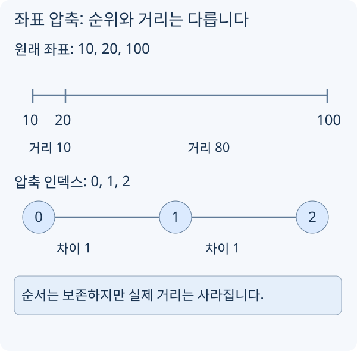

# 좌표 압축

좌표 압축은 값의 크기 자체는 크지만 서로 다른 값의 개수가 작을 때, 값을 `0..m-1` 또는 `1..m` 범위의 인덱스로 바꾸는 기법입니다. Fenwick Tree, Segment Tree, 스위프 라인, 오프라인 쿼리에서 자주 함께 쓰입니다.

## 값은 크지만 서로 다른 값의 개수는 작을 때

예를 들어 좌표가 `1`, `1,000,000,000`, `500,000,000`처럼 크면 좌표를 그대로 배열 인덱스로 쓸 수 없습니다. 하지만 실제로 등장한 값이 3개뿐이라면, 정렬 순서만 유지해서 아래처럼 바꿀 수 있습니다.

```text
원래 값: 1, 500000000, 1000000000
압축 값: 0, 1, 2
```

중요한 것은 **대소 관계를 보존한다**는 점입니다. 원래 값이 작을수록 압축 인덱스도 작습니다.

## 정렬 + unique

먼저 모든 값을 한 벡터에 모아 정렬하고 중복을 제거합니다.

```cpp
vector<int> values = a;
sort(values.begin(), values.end());
values.erase(unique(values.begin(), values.end()), values.end());
```

이제 `values[i]`는 압축 인덱스 `i`가 나타내는 원래 값입니다.

## lower_bound로 압축 인덱스 만들기

원래 값 `x`의 압축 인덱스는 `lower_bound`로 찾습니다.

```cpp
int compress(const vector<int>& values, int x) {
    return lower_bound(values.begin(), values.end(), x) - values.begin();
}
```

모든 `x`가 `values`에 들어 있다는 전제가 있어야 합니다. `lower_bound`는 없는 값에도 삽입 위치를 반환하므로, 끝에 도달했는지와 실제 값이 `x`인지 구분합니다. 온라인으로 새로운 값이 중간에 들어오는 문제라면, 먼저 모든 쿼리를 읽어 등장 가능한 값을 모으는 오프라인 처리가 필요할 수 있습니다.

## 압축한 값을 빈도 인덱스로 쓰기

역전쌍은 `i < j`인데 `a[i] > a[j]`인 쌍입니다. 왼쪽부터 읽으면서 [Fenwick Tree](https://h.readiz.com/learn/fenwick-tree)에 값별 등장 횟수를 저장하면 셀 수 있습니다.

현재 값의 압축 인덱스가 `r`이고 앞에서 `i`개를 읽었다면, 새 역전쌍은 `i - prefixSum(r)`개입니다. `prefixSum(r)`는 현재 값 **이하**의 개수이므로 같은 값끼리는 세지 않습니다. 답에 더한 뒤 `r`의 빈도를 1 올립니다.

`[3, 1, 3, 2]`를 읽으면 새로 생기는 쌍은 차례로 `0, 1, 0, 2`개, 총 3개입니다. 압축 인덱스가 0부터 시작하고 Fenwick API가 1부터 시작한다면 호출할 때 1을 더합니다.

## 구간 좌표 압축에서 주의할 점



[그림 크게 보기](https://blog.readiz.com/h-contest-lesson/lessons/coordinate-compression/lesson-assets/structure-trace.svg)

`[10,20)`과 `[20,100)`은 압축 후 각각 한 칸이지만 길이는 10과 80입니다. 길이·넓이를 합산할 때는 원본 좌표 간격을 함께 저장합니다.

구간 `[l, r]`을 다룰 때는 문제의 의미에 따라 `r + 1`도 같이 넣어야 할 수 있습니다. 예를 들어 차분 배열처럼 `[l, r]`에 더하고 `r + 1`에서 빼는 방식이면 `r + 1` 좌표가 반드시 필요합니다.

또 면적이나 길이를 계산하는 문제에서는 압축 인덱스 차이가 실제 거리와 다릅니다. 이때는 `values[i + 1] - values[i]`처럼 원래 좌표 간격을 곱해야 합니다.

## 시간 복잡도

| 작업 | 시간 |
| --- | --- |
| 값 수집 | `O(n)` |
| 정렬과 중복 제거 | `O(n log n)` |
| 값 하나 압축 | `O(log n)` |
| unordered map으로 미리 매핑 | 평균 `O(1)` |
| 메모리 | `O(n)` |
