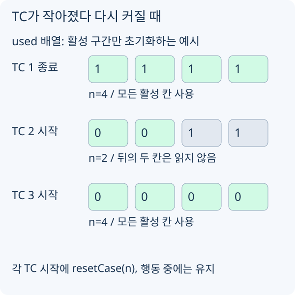

# 제출 계약과 상태 초기화

## 코드를 쓰기 전에 읽을 네 곳

1. 문제 설명: 무엇을 최소화/최대화하는가, 어떤 답이 무효인가.
2. 제공 `user.cpp`: 구현할 함수, 공개 API 선언, 인자와 반환값.
3. `main.cpp`의 호출부: 한 TC에 몇 번 호출하는가, 초기화 콜백은 언제 오는가.
4. 검증·채점부: 배열의 유효 범위, 호출 횟수·메모리·시간 제한, 점수 합산 방식.

채점 코드를 읽는 목적은 계약과 비용을 이해하는 것입니다. 내부 전역 변수나 비공개 심볼에 접근하거나 테스트 생성기의 미래 입력을 재생하는 방식으로 풀이하지 않습니다. 입력과 공개 API로 관측할 수 있는 정보만 사용합니다.

## `main` 대신 요구된 함수를 구현한다

[ORDERING](/practice/ORDERING)은 `build_path`가 `order[0..n-1]`에 결과를 써야 합니다. 표준 입력을 읽고 출력하는 프로그램이 아닙니다. `0`은 창고이며 맨 앞에 한 번만 들어가야 합니다.

```cpp compile-check snippet=ordering-baseline
void build_path(int n, const int points[][2], int order[]) {
    (void)points;
    for (int i = 0; i < n; ++i) order[i] = i;
}
```

이것은 **유효성 확인용 기준선**입니다. 통과 점수를 목표로 하는 경로 최적화 풀이는 다음 레슨에서 만듭니다. 무효 답이 발생한다면 탐색을 추가하기 전에 계약부터 고칩니다.

## 정적 배열은 TC 사이에 살아 있다

큰 버퍼는 지역 스택보다 전역/정적 배열로 둡니다. 단, 정적 배열이 0으로 채워지는 것은 프로그램 시작 시 한 번뿐입니다.

```cpp compile-check snippet=state-reset
namespace hc_example {
const int MAX_ITEM = 4000; // 예시 용량. 사용할 문제의 상한으로 다시 정한다.
static int used[MAX_ITEM];
static int itemCount;
static long long totalCost;

bool resetCase(int n) {
    if (n < 0 || n > MAX_ITEM) return false;
    itemCount = n;
    totalCost = 0;
    for (int i = 0; i < n; ++i) used[i] = 0;
    return true;
}
}
```

`resetCase`는 문제에서 보장한 **TC 시작 지점**에 호출합니다. 매 행동 콜백마다 부르면 누적 관측을 잃습니다. 반대로 시작 시 호출하지 않으면 이전 TC의 방문 기록이 섞입니다. 활성 구간 밖의 `used[n..MAX_ITEM-1]`는 읽지 않는 것이 이 예제의 계약입니다.



[그림 크게 보기](https://blog.readiz.com/h-contest-lesson/lessons/cpp-contest-basics/lesson-assets/case-reset.svg)

TC 크기를 `4 → 2 → 4`로 바꿔 검사합니다. 가운데 TC에서 남은 두 값은 오류가 아니지만, 마지막 TC가 시작될 때는 다시 활성 구간에 들어오므로 반드시 지워야 합니다.

배열 크기는 문제를 보며 계산합니다. 예를 들어 SCHEDULX의 비용은 작업별 한 숫자가 아니라 `cost[job][machine]`입니다. `cost[job]`를 쓰는 추상 예제를 그대로 옮길 수 없습니다. 원소가 4바이트인 `int`라면 `4000 × M` 배열은 약 `16000M`바이트이고, 같은 크기 복사본을 만들 때마다 그만큼 더 필요합니다.

## 정수 범위와 실행 비용

- 합·거리 누적·점수 차이는 `long long`부터 검토합니다. `int a, b`의 곱은 `1LL * a * b`처럼 **곱하기 전에** 확장합니다.
- `INF`는 가능한 실제 값보다 크게, 덧셈해도 범위를 넘지 않게 잡습니다. 도달 불가 상태에 무조건 비용을 더하지 않습니다.
- 배열을 반복해서 전부 비우면 초기화도 비용이 됩니다. 먼저 사용 구간만 초기화하고, 병목이 확인되면 방문 세대 번호나 변경 위치 목록을 검토합니다.
- 로컬 검증기의 `assert`, 출력, 표준 라이브러리는 제출 코드 바깥에 둡니다. h-contest 제출 정책은 `#include`, `#pragma`, 문자열 언어 연결 지정(`extern "C"` 등)을 거부합니다. 공개 API의 일반 `extern` 함수 선언은 별개입니다.
