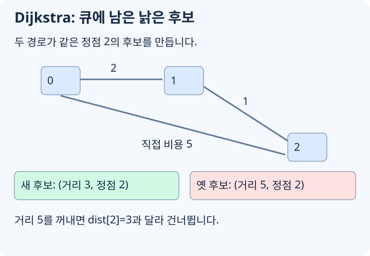

# Dijkstra 최단거리

Dijkstra 알고리즘은 **간선 가중치가 음수가 없는 그래프**에서, 한 시작 정점으로부터 다른 모든 정점까지의 최단거리를 구하는 알고리즘입니다. 한국어로는 보통 **다익스트라 알고리즘**이라고 부릅니다.

가장 대표적인 문제는 다음 형태입니다.

```text
정점과 가중치가 있는 간선이 주어진다.
시작 정점 s에서 각 정점 v까지의 최단거리 dist[v]를 구한다.
모든 간선의 가중치는 0 이상이다.
```

모든 경로를 직접 나열하면 경우의 수가 너무 많습니다. Dijkstra는 "지금까지 알려진 거리 중 가장 작은 정점은 이제 확정해도 된다"는 성질을 이용해 필요한 후보만 확장합니다.

## 최단거리 배열

`dist[v]`는 시작점에서 정점 `v`까지 현재까지 발견한 가장 짧은 거리입니다.

처음에는 시작점만 거리가 `0`이고, 나머지는 아직 모른다는 뜻으로 충분히 큰 값 `INF`를 넣습니다.

알고리즘이 진행되면서 더 짧은 경로를 발견하면 `dist` 값을 줄입니다. 이 작업을 보통 **relax**라고 부릅니다.

```text
u까지의 거리 + 간선 (u -> v)의 비용이
현재 dist[v]보다 작으면 dist[v]를 갱신한다.
```

## 가장 가까운 후보부터 본다

Dijkstra의 핵심 선택은 단순합니다.

```text
아직 확정하지 않은 정점 중 dist 값이 가장 작은 정점을 고른다.
```

이 정점을 `u`라고 합시다. 모든 간선 가중치가 0 이상이면, 아직 확정하지 않은 다른 정점을 거쳐 다시 `u`로 오는 경로가 더 짧아질 수 없습니다. 다른 후보들의 현재 거리도 `dist[u]` 이상이고, 거기에 0 이상의 간선을 더해도 `dist[u]`보다 작아질 수 없기 때문입니다.

그래서 `u`의 거리는 최단거리로 확정할 수 있습니다. 그다음 `u`에서 나가는 간선을 보며 이웃 정점의 거리를 갱신합니다.

## 작은 예시

다음 그래프에서 `0`번 정점에서 시작한다고 해봅시다.

```text
0 --2--> 1 --1--> 2
0 --5--> 2 --2--> 3
1 --4--> 3
```

초기 상태는 아래와 같습니다.

| 단계 | 확정 정점 | dist |
| --- | --- | --- |
| 시작 | 없음 | `[0, INF, INF, INF]` |
| 0 확정 | 0 | `[0, 2, 5, INF]` |
| 1 확정 | 0, 1 | `[0, 2, 3, 6]` |
| 2 확정 | 0, 1, 2 | `[0, 2, 3, 5]` |
| 3 확정 | 0, 1, 2, 3 | `[0, 2, 3, 5]` |

`2`번 정점의 처음 거리는 `0 -> 2`로 가는 `5`였습니다. 하지만 `1`을 확정한 뒤 `0 -> 1 -> 2` 경로를 발견하면서 `3`으로 줄어듭니다.

## 우선순위 큐 구현



[그림 크게 보기](https://blog.readiz.com/h-contest-lesson/lessons/dijkstra/lesson-assets/concept-trace.svg)

매번 아직 확정하지 않은 모든 정점을 훑어 최솟값을 찾으면 `O(V^2)`입니다. 간선이 많지 않은 그래프에서는 우선순위 큐를 써서 더 빠르게 구현합니다.

C++의 `priority_queue`는 기본이 max heap이므로, `greater`를 붙여 min heap처럼 사용합니다. 아래 코드는 방향 그래프이며, 무방향 간선이면 양쪽 인접 리스트에 모두 추가합니다.

> **코드 환경: 일반 C++17 학습용.** 헤더·STL을 허용하는 로컬 예제입니다. h-contest 제출에 옮길 때는 [공통 코드](https://h.readiz.com/learn/cpp-contest-basics)와 문제의 공개 API에 맞춰 필요한 부분을 바꿉니다.

```cpp
#include <functional>
#include <queue>
#include <vector>
using namespace std;

const long long INF = 4e18;

struct Edge {
    int to;
    long long cost;
};

vector<long long> dijkstra(const vector<vector<Edge>>& graph, int start) {
    int n = (int)graph.size();
    vector<long long> dist(n, INF);
    priority_queue<
        pair<long long, int>,
        vector<pair<long long, int>>,
        greater<pair<long long, int>>
    > pq;

    dist[start] = 0;
    pq.push({0, start});

    while (!pq.empty()) {
        auto [currentDist, u] = pq.top();
        pq.pop();

        if (currentDist != dist[u]) {
            continue;
        }

        for (const Edge& edge : graph[u]) {
            int v = edge.to;
            long long nextDist = currentDist + edge.cost;
            if (nextDist < dist[v]) {
                dist[v] = nextDist;
                pq.push({nextDist, v});
            }
        }
    }

    return dist;
}
```

`currentDist != dist[u]`인 항목을 건너뛰는 부분이 중요합니다. 같은 정점의 거리가 여러 번 줄어들면 우선순위 큐 안에 오래된 후보가 남을 수 있습니다. 큐에서 꺼냈을 때 현재 `dist`와 다르면 이미 더 좋은 경로가 발견된 것이므로 버립니다.

## 왜 음수 간선이 있으면 안 될까

Dijkstra는 가장 가까운 후보를 꺼내는 순간 그 거리를 확정합니다. 이 말은 "나중에 돌아오는 경로가 이 값을 더 줄일 수 없다"는 뜻입니다.

음수 간선이 있으면 이 전제가 깨집니다.

```text
0 -> 1 비용 2
0 -> 2 비용 5
2 -> 1 비용 -10
```

시작점이 `0`이면 처음에는 `dist[1] = 2`, `dist[2] = 5`입니다. Dijkstra는 `1`을 먼저 확정하려고 합니다. 하지만 실제로는 `0 -> 2 -> 1` 경로의 비용이 `-5`입니다. 나중에 더 짧아지는 길이 존재하므로, 확정 선택이 안전하지 않습니다.

다만 **위 코드 전체를 이 예시에 실행하면 `dist[1] = -5`를 반환합니다.** 방문한 정점을 막는 배열이 없어서 `1(거리 2) → 2(거리 5) → 1(거리 -5)` 순서로 다시 꺼내기 때문입니다. 이 예시는 현재 코드의 오답 예시가 아니라, 한 번 꺼낸 거리를 확정할 수 없다는 반례입니다. 목표가 `1`이라고 첫 pop에서 종료하면 `2`를 반환하여 틀립니다.

재삽입을 허용하면 음수 사이클이 없는 입력에서도 같은 정점을 여러 번 처리할 수 있어 아래의 Dijkstra 시간 보장이 사라집니다. 도달 가능한 음수 사이클이 있으면 거리 감소가 반복되어 종료도 보장되지 않습니다. 음수 간선이 있는 문제에는 Bellman-Ford를, DAG라면 위상 순서에 따른 완화를 사용합니다. 재삽입 구현과 확정 구현의 차이는 [Princeton의 Shortest Paths Q&A](https://algs4.cs.princeton.edu/44sp/)에서도 다룹니다.

## 시간 복잡도

우선순위 큐 구현의 시간 복잡도는 보통 아래처럼 봅니다.

```text
O((V + E) log V)
```

- `V`: 정점 수
- `E`: 간선 수

위 구현은 오래된 항목을 남기므로 힙 크기는 `O(E)`, 시간은 `O(V + E log(E + 1))`입니다. 단순 그래프에서는 `E <= V²`여서 위의 `log V` 표기로 쓸 수 있습니다. 입력이 아주 조밀해서 `E`가 `V^2`에 가까우면 단순 `O(V^2)` 구현이 더 편할 때도 있지만, 일반적인 문제에서는 우선순위 큐 구현을 기본으로 씁니다.

## 출발점이나 도착점이 여러 개인 경우

가장 가까운 출발점까지의 거리가 필요하면 모든 출발점의 거리를 0으로 두고 처음부터 힙에 함께 넣습니다. 이후 반복문은 같습니다.

모든 간선 비용이 비음수라는 전제에서, 목표 하나의 거리만 필요하면 오래된 후보를 거르는 검사 뒤에 `u == target`인지 확인하고 종료할 수 있습니다. 목표를 힙에 **넣은 순간**에는 아직 더 짧은 경로가 나타날 수 있으므로 종료하면 안 됩니다.

거리 합은 `long long`으로 계산합니다. `INF`는 가능한 실제 거리보다 크고 간선 비용을 더해도 정수 범위를 넘지 않도록 잡습니다.

## 경로 복원

거리뿐 아니라 실제 최단 경로도 필요하면, 거리를 갱신할 때 이전 정점을 저장합니다.

`parent`를 -1로 초기화하고, `dist[v]`를 줄이는 분기에서 `parent[v] = u`를 함께 기록합니다.

목표 정점 `target`에서 `parent`를 따라 시작점까지 거슬러 올라간 뒤 뒤집으면 경로가 됩니다.

```cpp
#include <algorithm>

vector<int> restorePath(int target, const vector<int>& parent) {
    vector<int> path;
    for (int v = target; v != -1; v = parent[v]) {
        path.push_back(v);
    }
    reverse(path.begin(), path.end());
    return path;
}
```

단, `dist[target] == INF`라면 시작점에서 도달할 수 없는 정점입니다. 이 경우에는 경로 복원을 하지 않거나 빈 경로로 처리합니다.

## 더 단순한 큐로 충분한 경우

모든 간선 비용이 1이면 [BFS](https://h.readiz.com/learn/bfs-dfs-grid), 0과 1만 있으면 [0-1 BFS](https://h.readiz.com/learn/zero-one-bfs)로 처리할 수 있습니다. 거리 순서를 유지하는 데 일반적인 최소 힙까지 필요하지 않기 때문입니다.

## 로컬 연습: 비음수 방향 그래프의 거리

시작점에서 각 정점까지의 최소 비용을 구하세요. 평행 간선과 비용 0인 간선도 허용합니다.

**입력:** N M S 뒤 M줄의 u v w. 1 <= N <= 200000, 0 <= M <= 400000, 0 <= w <= 10^9, 정점은 0-based입니다.

**출력:** 정점 번호순 최소 비용을 한 줄에 출력하고 도달 불가 정점은 -1로 표시합니다.

### 예시

```text exercise=dijkstra role=input
5 6 0
0 1 4
0 2 1
2 1 2
1 3 1
2 3 7
0 1 5
```

```text exercise=dijkstra role=output
0 3 1 4 -1
```

**확인 방법:** 0→2→1→3은 비용 4입니다. 작은 입력은 Bellman-Ford와 대조합니다. 큐에서 꺼낸 오래된 거리 후보를 건너뛰고, 모든 거리와 누적 비용은 long long으로 계산합니다. 제출용 전환에서는 고정 인접 리스트와 공통 최소 힙을 사용하되 성공한 완화마다 push할 공간을 확보합니다.
