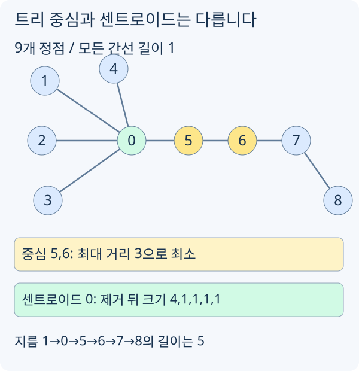

# 그래프와 트리 기본 성질

## 그래프 표현

인접 리스트의 `graph[u]`에는 `u`에서 갈 수 있는 정점을 저장합니다. 무방향 간선 `u-v`는 양쪽 목록에 넣고, 방향 간선 `u→v`는 `u`의 목록에만 넣습니다.

가중치가 있으면 이웃 정점 번호와 이동 비용을 함께 저장합니다.

인접 행렬은 `adj[u][v]`처럼 바로 확인할 수 있어서 편하지만, 메모리가 `O(n^2)`입니다. 정점 수가 크고 간선 수가 적은 일반적인 문제에서는 인접 리스트가 기본입니다.

| 표현 | 메모리 | 좋은 경우 |
| --- | --- | --- |
| 인접 리스트 | `O(V + E)` | 정점/간선이 큰 대부분의 문제 |
| 인접 행렬 | `O(V^2)` | 정점 수가 작고 두 정점 연결 여부를 자주 볼 때 |
| 간선 리스트 | `O(E)` | Kruskal처럼 간선을 정렬하거나 전체 간선을 훑을 때 |

연결된 영역을 직접 순회하는 구현은 [BFS/DFS](https://h.readiz.com/learn/bfs-dfs-grid)에 있습니다. [모임으로 나뉜 팀](/practice/TEAMSIZE)처럼 경로가 필요 없는 문제에서는 [Union-Find](https://h.readiz.com/learn/union-find)로 관계를 합칠 수도 있습니다.

## 트리의 기본 성질

정점이 `n`개인 무방향 그래프가 트리라면 항상 간선은 `n - 1`개입니다. 또 임의의 두 정점 사이에는 단순 경로가 정확히 하나만 있습니다.

간선 하나를 제거하면 두 컴포넌트로 나뉩니다. 입력이 트리인지 판정할 때는 간선 수 `n - 1`과 연결 여부를 함께 봐야 합니다. 간선 수만 같아도 일부 정점이 떨어져 있고 나머지에 사이클이 있을 수 있습니다.

## 트리를 루트 기준으로 보기

트리는 원래 루트가 없을 수 있습니다. 하지만 DFS/BFS를 시작할 정점을 하나 잡으면 부모, 깊이, subtree를 정의할 수 있습니다.

```cpp
void buildTree(
    int u,
    int parent,
    const vector<vector<int>>& tree,
    vector<int>& depth,
    vector<int>& subtreeSize
) {
    subtreeSize[u] = 1;
    for (int v : tree[u]) {
        if (v == parent) continue;
        depth[v] = depth[u] + 1;
        buildTree(v, u, tree, depth, subtreeSize);
        subtreeSize[u] += subtreeSize[v];
    }
}
```

`depth[root] = 0`으로 초기화하고 `buildTree(root, -1, ...)`를 호출합니다. 일자 트리는 재귀 깊이가 정점 수까지 늘어납니다. `parent`를 인자로 들고 다니면 방문 배열 없이도 부모로 되돌아가는 간선을 건너뛸 수 있습니다. 단, 입력이 트리가 아니라 일반 그래프라면 방문 배열이 필요합니다.

트리에서 subtree 크기는 많은 문제의 기본 재료입니다.

```text
subtreeSize[u] = u를 루트로 하는 부분트리의 정점 수
```

이 값으로 균형 잡힌 루트, 센트로이드, 간선을 끊었을 때 생기는 컴포넌트 크기 등을 계산합니다.

## 트리 구조를 이용하는 풀이

- 이어지는 지름과 센트로이드: 거리로 가장 먼 두 점과, 정점 수를 균형 있게 나누는 점을 구합니다.
- [최소 신장 트리](pages/mst-kruskal-prim.md): 간선을 골라 전체 연결 비용을 최소화합니다.

## 트리 지름

트리의 지름은 트리 안에서 가장 먼 두 정점 사이의 거리입니다. 간선 개수로 세기도 하고, 가중치가 있으면 가중치 합으로 세기도 합니다.

가중치가 없는 트리에서는 BFS 두 번으로 지름을 구할 수 있습니다.

```text
1. 아무 정점 A에서 BFS를 해서 가장 먼 정점 X를 찾는다.
2. X에서 다시 BFS를 해서 가장 먼 정점 Y를 찾는다.
3. dist[X][Y]가 트리의 지름이다.
```

트리에서는 경로가 유일하므로, 아무 곳에서 가장 먼 정점은 어떤 지름의 끝점이 됩니다.

```cpp
pair<int, int> farthest(int start, const vector<vector<int>>& tree) {
    int n = (int)tree.size();
    vector<int> dist(n, -1);
    queue<int> q;

    dist[start] = 0;
    q.push(start);

    while (!q.empty()) {
        int u = q.front();
        q.pop();

        for (int v : tree[u]) {
            if (dist[v] != -1) continue;
            dist[v] = dist[u] + 1;
            q.push(v);
        }
    }

    int best = start;
    for (int i = 0; i < n; ++i) {
        if (dist[i] > dist[best]) best = i;
    }
    return {best, dist[best]};
}

int treeDiameter(const vector<vector<int>>& tree) {
    if (tree.empty()) return 0;
    auto [x, ignored] = farthest(0, tree);
    auto [y, diameter] = farthest(x, tree);
    return diameter;
}
```

가중치가 있는 트리에서는 BFS 대신 DFS로 누적 거리를 계산하면 됩니다. 다만 두 번의 BFS/DFS로 지름 끝점을 찾는 알고리즘은 보통 간선 가중치가 비음수라는 조건에서 안전하게 사용합니다. 음수 간선까지 허용하면서 "가장 큰 경로 합"을 묻는다면 지름 공식처럼 끝점 두 번을 고르기보다 트리 DP로 최대 경로를 따로 계산하는 편이 안전합니다.

## 트리 중심과 센트로이드



[그림 크게 보기](https://blog.readiz.com/h-contest-lesson/lessons/graph-tree-basics/lesson-assets/structure-trace.svg)

이 트리의 중심 5·6은 가장 먼 정점까지의 거리를 최소화합니다. 센트로이드 0은 제거 후 가장 큰 컴포넌트가 4개이므로 `⌊9/2⌋` 이하가 됩니다. 5를 제거하면 0 쪽에 5개가 남아 센트로이드가 아닙니다.

트리 지름을 배우면 자주 헷갈리는 개념이 두 개 있습니다.

| 개념 | 기준 |
| --- | --- |
| 중심(center) | 모든 정점까지의 최대 거리가 최소가 되는 정점 |
| 센트로이드(centroid) | 제거했을 때 남는 컴포넌트 크기의 최댓값이 최소가 되는 정점 |

중심은 거리 기준이고, 센트로이드는 크기 기준입니다. 같은 정점일 수도 있지만 항상 같지는 않습니다.

센트로이드의 대표 성질은 아래와 같습니다.

```text
정점 c를 제거했을 때 생기는 모든 컴포넌트의 크기가 n / 2 이하이면
c는 트리의 센트로이드다.
```

트리의 센트로이드는 항상 1개 또는 2개 존재합니다. subtree 크기를 한 번 구하면 모든 정점이 센트로이드인지 확인할 수 있습니다.

```cpp
void findCentroids(
    int u,
    int parent,
    const vector<vector<int>>& tree,
    const vector<int>& subtreeSize,
    int n,
    vector<int>& centroids
) {
    int largestPart = n - subtreeSize[u];

    for (int v : tree[u]) {
        if (v == parent) continue;
        largestPart = max(largestPart, subtreeSize[v]);
        findCentroids(v, u, tree, subtreeSize, n, centroids);
    }

    if (largestPart <= n / 2) {
        centroids.push_back(u);
    }
}
```

`n - subtreeSize[u]`는 `u`의 부모 방향에 남는 컴포넌트 크기입니다. 자식 방향 컴포넌트들은 각 `subtreeSize[v]`입니다. 이 중 최댓값이 `n / 2` 이하이면 `u`를 루트로 삼아도 어느 한쪽이 절반을 넘지 않습니다.
