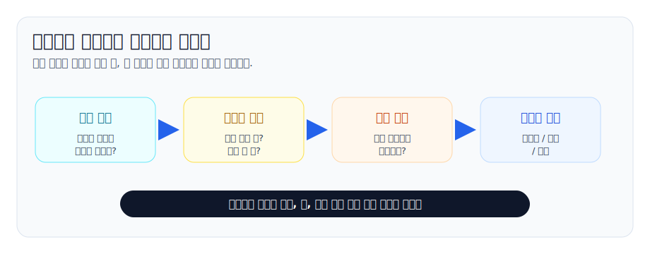
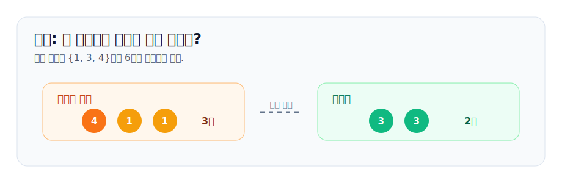
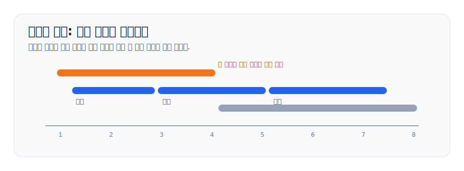
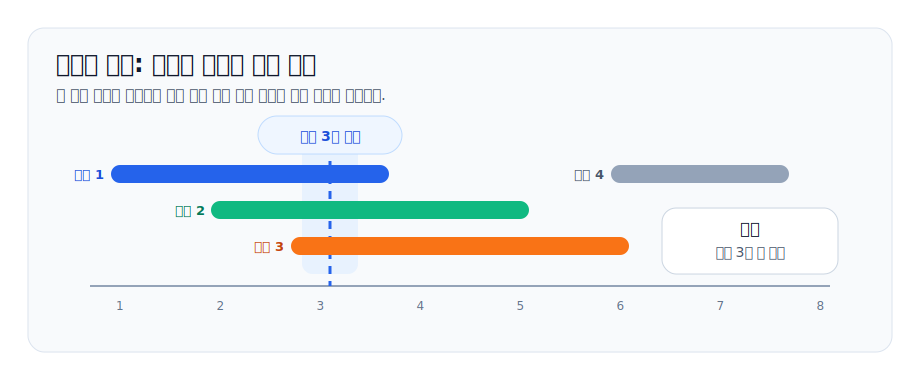
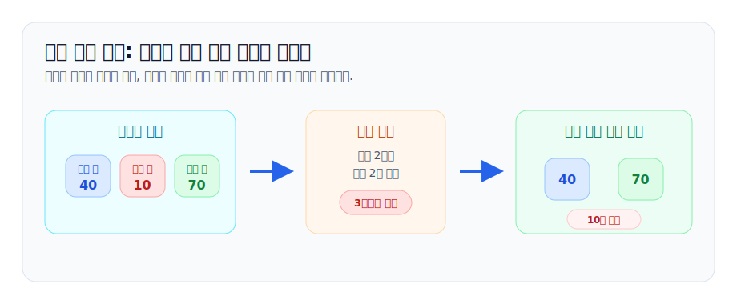
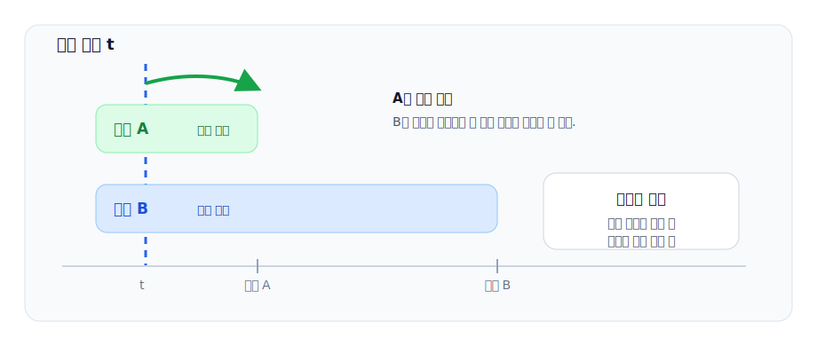
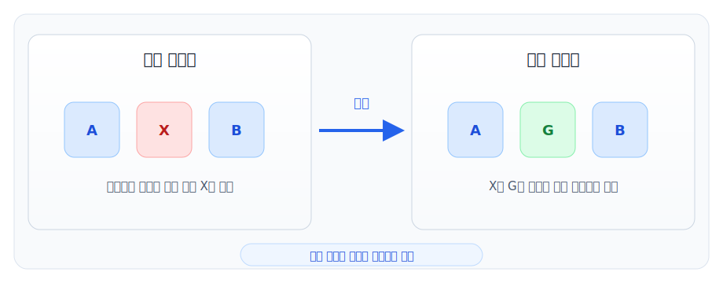
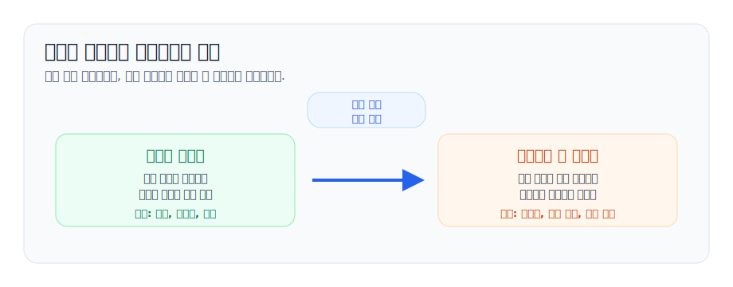

# 그리디 알고리즘

그리디 알고리즘은 답을 한 번에 완성하지 않고, 매 단계에서 하나의 선택을 확정하며 앞으로 나아가는 방법입니다. 보통 구현은 짧습니다. 어려운 부분은 구현이 아니라 다음 질문입니다.

> 지금 확정한 선택을 나중에 후회하지 않는다고 어떻게 말할 수 있을까?

이 문서는 그리디를 "감으로 빨리 고르는 기법"이 아니라 "현재 선택을 확정해도 되는 구조를 찾는 기법"으로 보는 연습입니다. 쉬운 예시에서 시작해서, 반례를 보고, 마지막에는 그리디 정당성을 설명하는 대표 패턴까지 연결합니다.

참고한 글: [탐욕 알고리즘 분석하기 (Correctness of Greedy Algorithms)](https://gazelle-and-cs.tistory.com/59), Gazelle and Computer Science, 2020-08-08. 이 글은 그리디 알고리즘의 정당성을 설명하는 방법으로 `Greedy stays ahead`(항상 앞서기), `Certificate argument`(증거 논증), `Exchange argument`(교환 논증)를 소개합니다.

세 이름은 뒤에서 예시와 함께 다시 나오지만, 먼저 대략적인 의미를 잡고 넘어가겠습니다.

- `Greedy stays ahead`(항상 앞서기): 그리디가 고른 해가 매 단계에서 어떤 최적해보다 뒤처지지 않는다는 불변식을 보이는 방식입니다.
- `Certificate argument`(증거 논증): 알고리즘이 만든 값이 피할 수 없는 하한이나 상한과 같다는 증거를 찾아 최적성을 보이는 방식입니다.
- `Exchange argument`(교환 논증): 어떤 최적해가 그리디 선택을 포함하지 않을 때, 그 선택을 그리디 선택으로 바꿔도 손해가 없음을 보여 최적해를 그리디 형태로 바꾸는 방식입니다.



## 1. 그리디가 하는 일

그리디는 보통 아래 형태를 가집니다.

1. 아직 처리하지 않은 후보 중에서 어떤 기준으로 하나를 고릅니다.
2. 그 선택을 답에 넣거나, 상태를 갱신합니다.
3. 선택을 되돌리지 않고 다음 단계로 갑니다.

예를 들어 "지금 남은 것 중 가장 작은 것", "가장 빨리 끝나는 것", "가장 마감이 빠른 것", "비용이 가장 작은 간선" 같은 기준이 자주 나옵니다. 하지만 기준이 그럴듯하다고 해서 항상 맞지는 않습니다.

그리디 풀이를 떠올렸다면 기준보다 먼저 확인할 것은 세 가지입니다.

- 현재 선택이 이후 선택지를 더 나쁘게 만들지 않는가?
- 현재 선택을 포함하는 최적해가 적어도 하나 존재한다고 말할 수 있는가?
- 선택 후 남는 문제가 원래 문제와 같은 형태인가?

이 세 질문 중 하나라도 막히면, 그리디가 아니라 동적 계획법, 그래프 탐색, 이분 탐색 같은 다른 접근이 필요할 수 있습니다.

## 2. 가장 쉬운 예시: 거스름돈

동전 단위가 `500, 100, 50, 10`이고 760원을 만들어야 한다고 해봅시다. 가장 큰 동전을 최대한 많이 쓰면 다음처럼 됩니다.

```text
760 = 500 + 100 + 100 + 50 + 10
```

한국 원화처럼 큰 단위가 작은 단위들을 안정적으로 대체하는 구조에서는 큰 동전을 먼저 쓰는 선택이 자연스럽습니다. 큰 동전을 쓰지 않고 작은 동전 여러 개로 대체해도 동전 수가 줄지 않기 때문입니다.

하지만 이 예시는 그리디의 위험성도 같이 보여줍니다. 동전 단위가 `{1, 3, 4}`이고 6원을 만든다면 가장 큰 동전부터 고르는 방법은 실패합니다.

```text
그리디: 4 + 1 + 1 = 3개
최적해: 3 + 3 = 2개
```



이 반례에서 중요한 점은 "큰 동전이 항상 좋다"는 교환이 불가능하다는 것입니다. `4`를 고른 순간 `3 + 3`이라는 더 좋은 조합을 막아 버립니다. 그래서 임의의 동전 체계에서 최소 동전 개수 문제는 보통 DP로 풀어야 합니다.

## 3. 초급 정석: 회의실 배정

회의들이 `[start, end)` 구간으로 주어지고, 회의실 하나에서 겹치지 않게 최대한 많은 회의를 골라야 합니다. 이 문제의 그리디 기준은 "끝나는 시간이 빠른 회의부터 고른다"입니다.

```text
끝나는 시간 오름차순 정렬
현재 마지막으로 선택한 회의와 겹치지 않으면 선택
```

왜 시작 시간이 빠른 회의가 아니라 끝나는 시간이 빠른 회의일까요? 목표가 많은 회의를 고르는 것이므로, 하나를 선택한 뒤 남는 시간을 최대한 넓게 남겨야 합니다. 빨리 끝나는 회의를 고르면 뒤에 붙일 수 있는 회의의 기회가 줄어들지 않습니다.



이 예시는 블로그 글의 `Greedy stays ahead` 패턴으로 설명하기 좋습니다. 그리디가 고른 `i`번째 회의의 종료 시각을 `g_i`, 어떤 최적해가 고른 `i`번째 회의의 종료 시각을 `o_i`라고 하면, 매 단계에서 `g_i <= o_i`임을 보일 수 있습니다. 즉, 그리디는 같은 개수만큼 회의를 골랐을 때 항상 최적해보다 늦게 끝나지 않습니다. 끝나는 시각에서 계속 앞서 있으므로, 최적해가 고를 수 있는 다음 회의를 그리디도 고를 기회가 있습니다.

핵심은 "그리디가 매 단계에서 최적해보다 뒤처지지 않는다"는 불변식을 잡는 것입니다.

## 4. 비슷하지만 다른 문제: 강의실 배정

이번에는 회의를 일부 고르는 것이 아니라, 모든 강의를 배정해야 합니다. 필요한 강의실 수를 최소화해야 합니다.

가장 직관적인 풀이는 시작 시간 순서로 강의를 보면서, 이미 끝난 강의실이 있으면 그 방을 재사용하고, 없으면 새 방을 여는 것입니다. 구현에서는 현재 사용 중인 강의실의 종료 시각을 최소 힙에 넣습니다.

```cpp
sort(classes.begin(), classes.end()); // start 오름차순
priority_queue<int, vector<int>, greater<int>> ends;

for (auto [start, end] : classes) {
    if (!ends.empty() && ends.top() <= start) {
        ends.pop();
    }
    ends.push(end);
}

answer = ends.size();
```



이 문제는 블로그 글의 `Certificate argument`로 설명할 수 있습니다. 어떤 시각에 동시에 진행 중인 강의가 `k`개라면, 강의실은 최소 `k`개 필요합니다. 이것은 어떤 알고리즘도 피할 수 없는 하한입니다.

위 알고리즘이 새 강의실을 열어야 하는 순간에는 기존 강의실의 강의들이 모두 아직 끝나지 않았습니다. 즉, 그 시각에 동시에 진행되는 강의 수가 실제로 현재 방 개수만큼 존재합니다. 알고리즘이 만든 방 개수와 피할 수 없는 하한이 같아지는 순간이 있으므로, 더 적은 방으로는 불가능하다는 "증거"가 됩니다.

## 5. 중급 예시: 마감이 있는 과제 선택

각 과제는 하루가 걸리고, 마감일과 점수가 있습니다. 마감일 안에 할 수 있는 과제들의 점수 합을 최대로 만들고 싶습니다.

단순히 마감일이 빠른 과제부터 하면 점수가 큰 과제를 놓칠 수 있습니다. 단순히 점수가 큰 과제부터 하면 마감이 촉박한 과제를 놓칠 수 있습니다. 이때 쓰기 좋은 관점은 "일단 후보에 넣고, 불가능해지는 순간 가장 손해가 작은 것을 버린다"입니다.

```cpp
sort(tasks.begin(), tasks.end(), byDeadline);
priority_queue<int, vector<int>, greater<int>> pickedScores;

for (auto [deadline, score] : tasks) {
    pickedScores.push(score);
    if ((int)pickedScores.size() > deadline) {
        pickedScores.pop(); // 지금까지 고른 것 중 점수가 가장 작은 과제를 포기
    }
}
```



마감일 `d`까지는 최대 `d`개의 과제만 할 수 있습니다. 그보다 많이 골랐다면 반드시 하나를 버려야 하고, 그 순간에는 점수가 가장 작은 것을 버리는 것이 항상 손해가 가장 작습니다. 이 방식은 "선택 집합을 유지하면서 제약을 넘을 때만 가장 약한 선택을 제거한다"는 그리디 패턴입니다.

## 6. 실전 연결: 검수 게이트 예약

이제 후보가 시간에 따라 생기고 사라지는 예약 문제를 봅니다. 요청마다 처리 가능한 시작 시각 `startTime`과 마감 시각 `deadline`이 있고, 한 시각에는 요청 하나만 처리할 수 있습니다. 목표는 가능한 많은 요청을 처리하는 것입니다.

이 문제에서는 시간이 흐르면서 후보가 생깁니다. 현재 시각에 처리 가능한 요청 중에서는 deadline이 가장 빠른 요청을 먼저 처리합니다.

```text
1. startTime 순서로 요청을 본다.
2. 현재 시각까지 시작된 요청을 후보에 넣는다.
3. 후보 중 deadline이 가장 빠른 요청을 처리한다.
4. 이미 deadline이 지난 요청은 버린다.
```



이 선택은 교환 논증으로 설명할 수 있습니다. 현재 시각 `t`에 처리할 수 있는 두 요청 `A`, `B`가 있고 `deadline[A] <= deadline[B]`라고 합시다. 어떤 최적 배정이 `t`에 `B`를 처리하고 나중에 `A`를 처리한다면, 두 요청의 처리 시각을 바꿔도 처리 개수는 줄지 않습니다.

- `A`는 원래 현재 시각 `t`에 처리할 수 있습니다.
- `B`는 `A`보다 마감이 늦거나 같으므로, `A`가 처리되던 나중 시각에도 처리할 수 있습니다.
- 따라서 `t`에 `A`를 먼저 처리하도록 최적해를 바꿔도 손해가 없습니다.

이런 식으로 최적해를 조금씩 그리디의 선택과 같게 바꿔도 답이 나빠지지 않음을 보이면, 그리디 선택을 확정해도 됩니다.

## 7. 세 가지 정당성 패턴

블로그 글은 그리디 알고리즘을 분석하는 대표 기법으로 아래 세 가지를 소개합니다. 실제 문제를 풀 때도 이 셋 중 하나로 설명이 되는지 확인하면 좋습니다.

| 패턴 | 판단 질문 | 대표 예 |
| --- | --- | --- |
| 항상 앞서기 | 더 늦지 않나? | 회의 선택 |
| 증거 논증 | 하한과 같나? | 강의실 수 |
| 교환 논증 | 손해 없나? | 검수 예약 |

세 패턴은 서로 완전히 분리된 공식이 아닙니다. 같은 문제도 관점에 따라 여러 방식으로 설명할 수 있습니다. 중요한 것은 그리디 선택을 "좋아 보인다"에서 멈추지 않고, 최적해와의 관계로 설명하는 것입니다.



## 8. 더 어려운 그리디 예시들

아래 문제들은 구현만 보면 정렬, 힙, 집합 관리처럼 익숙해 보이지만, 정당성은 훨씬 더 추상적인 구조를 요구합니다.

### 최소 신장 트리

Kruskal 알고리즘은 가중치가 작은 간선부터 보면서 사이클을 만들지 않는 간선을 고릅니다. "가장 싼 간선부터"라는 말은 단순하지만, 왜 안전한지는 절단 성질로 설명합니다. 어떤 정점 집합과 바깥을 가르는 절단을 생각했을 때, 그 절단을 건너는 가장 싼 간선은 어떤 최소 신장 트리에도 포함되도록 바꿀 수 있습니다. 한 간선의 선택이 전체 그래프 연결 구조와 사이클 조건에 영향을 주기 때문에, 회의실 배정보다 증명 레벨이 올라갑니다.

### 허프만 코딩

문자의 등장 빈도가 주어졌을 때 전체 인코딩 길이가 최소가 되도록 prefix code tree를 만드는 문제입니다. 가장 빈도가 낮은 두 문자를 먼저 묶는 선택이 그리디입니다. 어려운 점은 답이 단순한 순서가 아니라 트리라는 것입니다. 최적 트리에서 가장 깊은 두 잎을 빈도 낮은 문자로 바꿔도 손해가 없다는 교환 논증과, 두 문자를 하나의 합쳐진 문자로 줄이는 귀납 구조가 함께 필요합니다.

### Dijkstra 최단거리

간선 가중치가 음수가 없을 때, 아직 확정하지 않은 정점 중 현재 거리가 가장 작은 정점을 확정합니다. 이 역시 "가장 가까운 것부터"라서 쉬워 보이지만, 음수 간선이 없다는 조건이 핵심입니다. 아직 처리하지 않은 경로가 나중에 돌아와서 더 짧아질 수 없다는 사실을 보여야 하므로, 그리디 선택의 안전성이 입력 조건에 강하게 의존합니다.

### 매트로이드 그리디

어떤 원소들을 고르되 독립성 조건을 깨면 안 되는 추상 구조가 있습니다. 이 구조가 매트로이드이면, 가중치가 큰 원소부터 가능한 것만 고르는 단순한 그리디가 최적이 됩니다. 여기서는 특정 문제 하나의 반례를 피하는 수준을 넘어, "작은 독립 집합은 큰 독립 집합의 어떤 원소를 받아 확장할 수 있다"는 교환 공리가 핵심입니다. 그리디가 통하는 이유 자체를 구조로 일반화한 예시입니다.

### 그리디처럼 보이지만 DP가 되는 경우

가중치가 있는 회의 선택 문제는 끝나는 시간이 빠른 회의부터 고르면 틀립니다. 회의 하나의 가치가 크면 짧은 회의 여러 개보다 나을 수 있기 때문입니다. 이 문제는 정렬과 이분 탐색을 쓰지만, 핵심은 `i번째 회의를 선택할지 말지`를 비교하는 DP입니다. 겉모양이 그리디와 비슷해도 교환 논증이 깨지면 정확한 풀이가 다른 방향으로 가는 좋은 예입니다.

## 9. 그리디에서 휴리스틱으로 넘어가는 지점

정확한 그리디 알고리즘은 "지금 고른 것을 확정해도 최적해 하나는 여전히 남아 있다"는 말을 할 수 있어야 합니다. 이 말을 못 하면 같은 코드라도 더 이상 정확한 그리디가 아니라 휴리스틱에 가까워집니다.



다음 신호가 보이면 그리디 증명을 멈추고 휴리스틱 설계로 관점을 바꾸는 편이 낫습니다.

- **교환이 깨진다.** 지금 선택한 하나를 나중 선택 하나와 바꾸는 정도로는 상태를 복구할 수 없습니다. 한 선택이 여러 자원, 여러 마감, 여러 미래 선택을 동시에 바꿉니다.
- **남은 문제가 같은 형태가 아니다.** 선택 후 남는 부분문제가 원래 문제와 비슷하지 않으면, "앞으로도 같은 기준을 반복하면 된다"는 말이 약해집니다.
- **목표가 여러 개다.** 점수, 안정성, 시간, 위험도처럼 서로 충돌하는 목표가 섞이면 하나의 정렬 기준으로 최적성을 설명하기 어렵습니다.
- **작은 반례가 쉽게 나온다.** 기준을 조금만 바꿔도 손으로 만든 작은 입력에서 깨진다면, 그 기준은 정확한 알고리즘이 아니라 좋은 초기 선택 규칙일 가능성이 큽니다.
- **최적성보다 제한 시간 안의 좋은 답이 중요하다.** 일부 최적화/대회형 문제는 정확한 최적해보다 빠르게 좋은 해를 만드는 것이 목표입니다.

이때도 그리디가 버려지는 것은 아닙니다. 역할이 바뀝니다.

| 구분 | 정확한 그리디 | 휴리스틱 속 그리디 |
| --- | --- | --- |
| 선택 | 답으로 확정 | 초기해/후보 |
| 기준 | 증명 가능한 한 기준 | 점수식과 탐색 |
| 검증 | 최적해와의 관계 | 사례별 성능 |
| 실패 시 | 다른 정확 풀이 | 기준 조정 |

예를 들어 "가장 빨리 끝나는 회의"는 회의실 배정에서는 정확한 그리디 기준입니다. 하지만 복잡한 제약이 붙어 "이동 시간, 준비 시간, 중요도, 여러 회의실"이 동시에 들어가면 한 번의 지역 선택이 전체 배치를 크게 흔듭니다. 이때는 가장 빨리 끝나는 회의를 고르는 기준을 초기해 생성, 후보 정렬, beam search의 우선순위, local search의 개선 후보로 쓰는 식으로 바꾸게 됩니다.

정리하면, 그리디의 핵심 질문은 "지금 확정해도 되는가"이고, 휴리스틱의 핵심 질문은 "지금 고르면 대체로 좋은 출발점이 되는가"입니다. 두 질문을 구분하면 그리디 증명에 실패했을 때도 자연스럽게 다음 설계로 넘어갈 수 있습니다.

## 10. 그리디 풀이를 설계하는 순서

문제에서 그리디 냄새가 난다면 다음 순서로 접근해 보세요.

1. 선택 단위를 정합니다.
   - 회의 하나를 고르는가?
   - 작업 하나를 배정하는가?
   - 간선 하나를 추가하는가?
2. 정렬 기준이나 우선순위 기준을 세웁니다.
   - 빨리 끝나는 것
   - 마감이 빠른 것
   - 비용이 작은 것
   - 가치가 큰 것
3. 반례를 먼저 찾아봅니다.
   - "시작 시간이 빠른 회의부터"처럼 그럴듯하지만 틀린 기준을 직접 깨봅니다.
   - 작은 입력 3개에서 6개 정도로 손으로 반례를 만들 수 있으면 그리디는 틀린 것입니다.
4. 정당성 패턴을 고릅니다.
   - 항상 앞서 있음을 보일 수 있으면 "항상 앞서기"
   - 답의 하한과 내가 만든 답이 같음을 보일 수 있으면 "증거 논증"
   - 최적해의 선택을 내 선택으로 바꿀 수 있으면 "교환 논증"
5. 자료구조를 붙입니다.
   - 정렬만 필요한가?
   - 후보 중 최솟값/최댓값을 계속 꺼내야 하므로 힙이 필요한가?
   - 선택 집합에서 가장 약한 원소를 버려야 하는가?

## 11. 자주 나오는 구현 패턴

### 정렬 후 한 번 훑기

회의실 배정처럼 한 번 선택한 뒤 현재 끝 시각만 관리하면 되는 문제에 적합합니다.

```cpp
sort(items.begin(), items.end(), byGreedyKey);
for (auto item : items) {
    if (canTake(item)) {
        take(item);
    }
}
```

### 정렬 + 우선순위 큐

후보가 시간에 따라 추가되고, 후보 중 최솟값이나 최댓값을 계속 골라야 할 때 씁니다.

```cpp
sort(events.begin(), events.end(), byStartTime);
priority_queue<int, vector<int>, greater<int>> pq;

while (hasEvent || !pq.empty()) {
    addAvailableEvents();
    removeExpiredEvents();
    takeBestCandidate();
}
```

### 선택 집합 유지

일단 고른 뒤 제약을 넘으면 가장 손해가 작은 것을 버리는 패턴입니다.

```cpp
sort(items.begin(), items.end(), byConstraint);
priority_queue<int, vector<int>, greater<int>> chosen;

for (auto item : items) {
    chosen.push(value(item));
    if (violatesConstraint()) {
        chosen.pop();
    }
}
```
