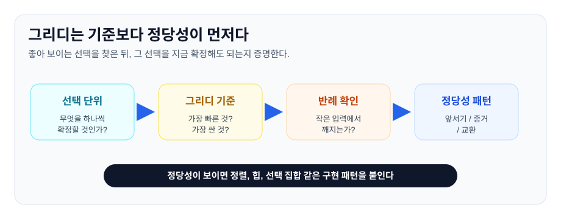
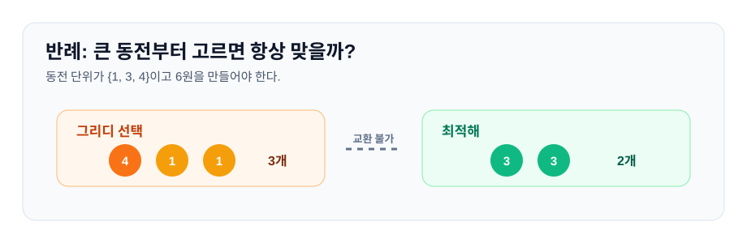
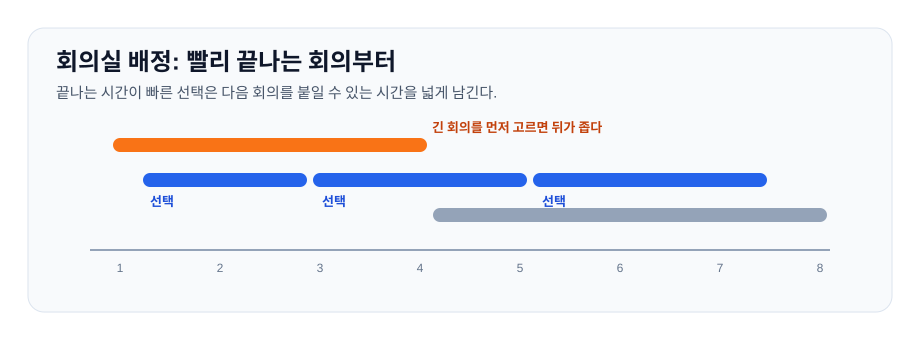
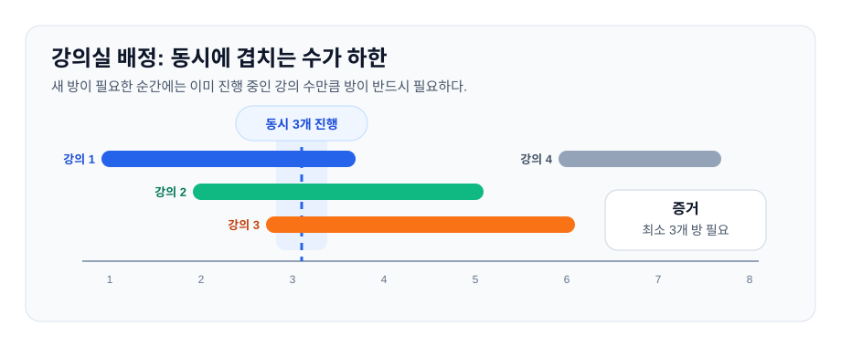
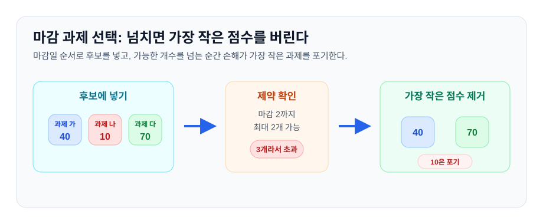
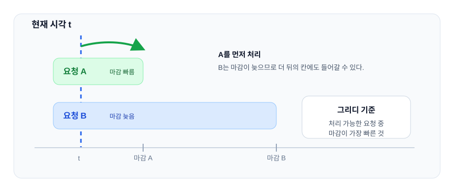

# 그리디 알고리즘

그리디 알고리즘은 답을 한 번에 완성하지 않고, 매 단계에서 하나의 선택을 확정하며 앞으로 나아가는 방법입니다. 보통 구현은 짧습니다. 어려운 부분은 구현이 아니라 다음 질문입니다.

> 지금 확정한 선택을 나중에 후회하지 않는다고 어떻게 말할 수 있을까?

이 문서는 그리디를 "감으로 빨리 고르는 기법"이 아니라 "현재 선택을 확정해도 되는 구조를 찾는 기법"으로 보는 연습입니다. 쉬운 예시에서 시작해서, 반례를 보고, 마지막에는 그리디 정당성을 설명하는 대표 패턴까지 연결합니다.

참고한 글: [탐욕 알고리즘 분석하기 (Correctness of Greedy Algorithms)](https://gazelle-and-cs.tistory.com/59), Gazelle and Computer Science, 2020-08-08. 이 글은 그리디 알고리즘의 정당성을 설명하는 방법으로 `Greedy stays ahead`(항상 앞서기), `Certificate argument`(증거 논증), `Exchange argument`(교환 논증)를 소개합니다.

세 이름은 뒤에서 예시와 함께 다시 나오지만, 먼저 대략적인 의미를 잡고 넘어가겠습니다.

- `Greedy stays ahead`(항상 앞서기): 그리디가 고른 해가 매 단계에서 어떤 최적해보다 뒤처지지 않는다는 불변식을 보이는 방식입니다.
- `Certificate argument`(증거 논증): 알고리즘이 만든 값이 피할 수 없는 하한이나 상한과 같다는 증거를 찾아 최적성을 보이는 방식입니다.
- `Exchange argument`(교환 논증): 어떤 최적해가 그리디 선택을 포함하지 않을 때, 그 선택을 그리디 선택으로 바꿔도 손해가 없음을 보여 최적해를 그리디 형태로 바꾸는 방식입니다.



## 그리디가 하는 일

그리디는 보통 아래 형태를 가집니다.

1. 아직 처리하지 않은 후보 중에서 어떤 기준으로 하나를 고릅니다.
2. 그 선택을 답에 넣거나, 상태를 갱신합니다.
3. 선택을 되돌리지 않고 다음 단계로 갑니다.

예를 들어 "지금 남은 것 중 가장 작은 것", "가장 빨리 끝나는 것", "가장 마감이 빠른 것", "비용이 가장 작은 간선" 같은 기준이 자주 나옵니다. 하지만 기준이 그럴듯하다고 해서 항상 맞지는 않습니다.

그리디 풀이를 떠올렸다면 기준보다 먼저 확인할 것은 세 가지입니다.

- 현재 선택이 이후 선택지를 더 나쁘게 만들지 않는가?
- 현재 선택을 포함하는 최적해가 적어도 하나 존재한다고 말할 수 있는가?
- 선택 후 남는 문제가 원래 문제와 같은 형태인가?

이 세 질문 중 하나라도 막히면, 그리디가 아니라 동적 계획법, 그래프 탐색, 이분 탐색 같은 다른 접근이 필요할 수 있습니다.

## 가장 쉬운 예시: 거스름돈

동전 단위가 `500, 100, 50, 10`이고 760원을 만들어야 한다고 해봅시다. 가장 큰 동전을 최대한 많이 쓰면 다음처럼 됩니다.

```text
760 = 500 + 100 + 100 + 50 + 10
```

한국 원화처럼 큰 단위가 작은 단위들을 안정적으로 대체하는 구조에서는 큰 동전을 먼저 쓰는 선택이 자연스럽습니다. 큰 동전을 쓰지 않고 작은 동전 여러 개로 대체해도 동전 수가 줄지 않기 때문입니다.

하지만 이 예시는 그리디의 위험성도 같이 보여줍니다. 동전 단위가 `{1, 3, 4}`이고 6원을 만든다면 가장 큰 동전부터 고르는 방법은 실패합니다.

```text
그리디: 4 + 1 + 1 = 3개
최적해: 3 + 3 = 2개
```



이 반례에서 중요한 점은 "큰 동전이 항상 좋다"는 교환이 불가능하다는 것입니다. `4`를 고른 순간 `3 + 3`이라는 더 좋은 조합을 막아 버립니다. 그래서 임의의 동전 체계에서 최소 동전 개수 문제는 보통 DP로 풀어야 합니다.

## 초급 정석: 회의실 배정

회의들이 `[start, end)` 구간으로 주어지고, 회의실 하나에서 겹치지 않게 최대한 많은 회의를 골라야 합니다. 이 문제의 그리디 기준은 "끝나는 시간이 빠른 회의부터 고른다"입니다.

```text
끝나는 시간 오름차순 정렬
현재 마지막으로 선택한 회의와 겹치지 않으면 선택
```

왜 시작 시간이 빠른 회의가 아니라 끝나는 시간이 빠른 회의일까요? 목표가 많은 회의를 고르는 것이므로, 하나를 선택한 뒤 남는 시간을 최대한 넓게 남겨야 합니다. 빨리 끝나는 회의를 고르면 뒤에 붙일 수 있는 회의의 기회가 줄어들지 않습니다.



이 예시는 블로그 글의 `Greedy stays ahead` 패턴으로 설명하기 좋습니다. 그리디가 고른 `i`번째 회의의 종료 시각을 `g_i`, 어떤 최적해가 고른 `i`번째 회의의 종료 시각을 `o_i`라고 하면, 매 단계에서 `g_i <= o_i`임을 보일 수 있습니다. 즉, 그리디는 같은 개수만큼 회의를 골랐을 때 항상 최적해보다 늦게 끝나지 않습니다. 끝나는 시각에서 계속 앞서 있으므로, 최적해가 고를 수 있는 다음 회의를 그리디도 고를 기회가 있습니다.

## 비슷하지만 다른 문제: 강의실 배정

이번에는 회의를 일부 고르는 것이 아니라, 모든 강의를 배정해야 합니다. 필요한 강의실 수를 최소화해야 합니다.

가장 직관적인 풀이는 시작 시간 순서로 강의를 보면서, 이미 끝난 강의실이 있으면 그 방을 재사용하고, 없으면 새 방을 여는 것입니다. 구현에서는 현재 사용 중인 강의실의 종료 시각을 최소 힙에 넣습니다.

```cpp
sort(classes.begin(), classes.end()); // start 오름차순
priority_queue<int, vector<int>, greater<int>> ends;

for (auto [start, end] : classes) {
    if (!ends.empty() && ends.top() <= start) {
        ends.pop();
    }
    ends.push(end);
}

answer = ends.size();
```



이 문제는 블로그 글의 `Certificate argument`로 설명할 수 있습니다. 어떤 시각에 동시에 진행 중인 강의가 `k`개라면, 강의실은 최소 `k`개 필요합니다. 이것은 어떤 알고리즘도 피할 수 없는 하한입니다.

위 알고리즘이 새 강의실을 열어야 하는 순간에는 기존 강의실의 강의들이 모두 아직 끝나지 않았습니다. 즉, 그 시각에 동시에 진행되는 강의 수가 실제로 현재 방 개수만큼 존재합니다. 알고리즘이 만든 방 개수와 피할 수 없는 하한이 같아지는 순간이 있으므로, 더 적은 방으로는 불가능하다는 "증거"가 됩니다.

## 중급 예시: 마감이 있는 과제 선택

각 과제는 하루가 걸리고, 마감일과 점수가 있습니다. 마감일 안에 할 수 있는 과제들의 점수 합을 최대로 만들고 싶습니다.

단순히 마감일이 빠른 과제부터 하면 점수가 큰 과제를 놓칠 수 있습니다. 단순히 점수가 큰 과제부터 하면 마감이 촉박한 과제를 놓칠 수 있습니다. 이때 쓰기 좋은 관점은 "일단 후보에 넣고, 불가능해지는 순간 가장 손해가 작은 것을 버린다"입니다.

```cpp
sort(tasks.begin(), tasks.end(), byDeadline);
priority_queue<int, vector<int>, greater<int>> pickedScores;

for (auto [deadline, score] : tasks) {
    pickedScores.push(score);
    if ((int)pickedScores.size() > deadline) {
        pickedScores.pop(); // 지금까지 고른 것 중 점수가 가장 작은 과제를 포기
    }
}
```



마감일 `d`까지는 최대 `d`개의 과제만 할 수 있습니다. 그보다 많이 골랐다면 반드시 하나를 버려야 하고, 그 순간에는 점수가 가장 작은 것을 버리는 것이 항상 손해가 가장 작습니다. 이 방식은 "선택 집합을 유지하면서 제약을 넘을 때만 가장 약한 선택을 제거한다"는 그리디 패턴입니다.

## 실전 연결: 검수 게이트 예약

[검수 게이트 예약](/practice/INSPECTION)은 후보가 시간에 따라 생기고 사라지는 문제입니다. 요청마다 처리 가능한 시작 시각 `startTime`과 마감 시각 `deadline`이 있고, 한 시각에는 요청 하나만 처리할 수 있습니다. 목표는 가능한 많은 요청을 처리하는 것입니다.

이 문제에서는 시간이 흐르면서 후보가 생깁니다. 현재 시각에 처리 가능한 요청 중에서는 deadline이 가장 빠른 요청을 먼저 처리합니다.

```text
1. startTime 순서로 요청을 본다.
2. 현재 시각까지 시작된 요청을 후보에 넣는다.
3. 후보 중 deadline이 가장 빠른 요청을 처리한다.
4. 이미 deadline이 지난 요청은 버린다.
```



이 선택은 교환 논증으로 설명할 수 있습니다. 현재 시각 `t`에 처리할 수 있는 두 요청 `A`, `B`가 있고 `deadline[A] <= deadline[B]`라고 합시다. 어떤 최적 배정이 `t`에 `B`를 처리하고 나중에 `A`를 처리한다면, 두 요청의 처리 시각을 바꿔도 처리 개수는 줄지 않습니다.

- `A`는 원래 현재 시각 `t`에 처리할 수 있습니다.
- `B`는 `A`보다 마감이 늦거나 같으므로, `A`가 처리되던 나중 시각에도 처리할 수 있습니다.
- 따라서 `t`에 `A`를 먼저 처리하도록 최적해를 바꿔도 손해가 없습니다.

## 점수를 개선하는 초기해로 쓰기

회의마다 보상이 다르면 가장 빨리 끝나는 회의를 고르는 증명은 더 이상 보상 합을 보장하지 않습니다. 예를 들어 `[0, 2)`의 보상이 1, `[0, 3)`의 보상이 100이면 종료 시각 기준은 첫 회의를 골라 실패합니다.

최적화 문제에서는 이런 기준을 초기해로 쓴 뒤 선택을 바꾸며 점수를 높일 수 있습니다. [ORDERING 사례](https://h.readiz.com/learn/heuristic/ordering-route-improvement)에서는 가까운 점부터 잇는 초기 경로에서 시작해, 두 간선의 연결을 바꾸어 길이를 줄입니다.

## 시간 복잡도

대부분의 그리디 풀이는 정렬 한 번과 선형 스캔으로 끝나거나, 후보 관리를 위해 우선순위 큐를 붙입니다.

| 패턴 | 시간 |
| --- | --- |
| 정렬 후 한 번 훑기 | `O(n log n)` |
| 정렬 + 우선순위 큐 | `O(n log n)` |
| 이미 정렬된 입력의 단순 선택 | `O(n)` |
