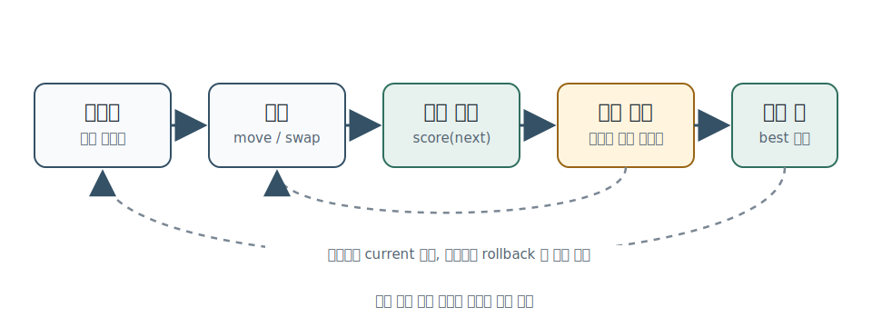
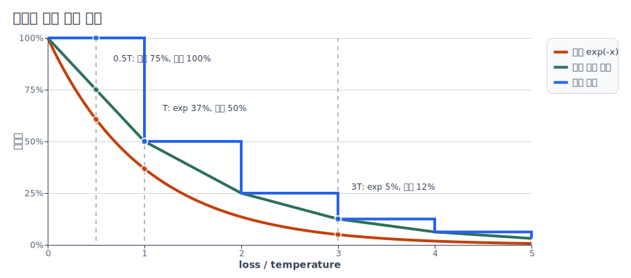
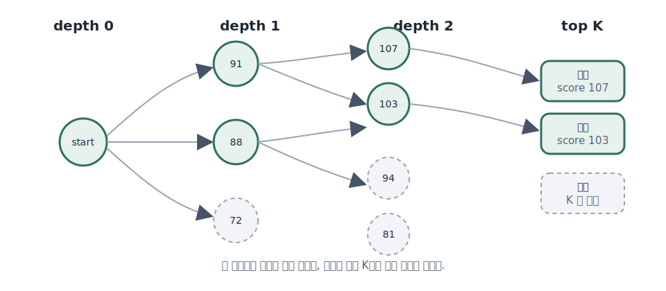

# 휴리스틱 알고리즘

휴리스틱 알고리즘은 항상 최적해를 보장하지는 않지만, 제한 시간 안에 **충분히 좋은 답**을 만들기 위한 방법입니다.

정확한 알고리즘은 보통 이렇게 말할 수 있어야 합니다.

```text
이 선택을 해도 최적해를 놓치지 않는다.
따라서 답이 항상 맞다.
```

반대로 휴리스틱은 보통 이렇게 말합니다.

```text
이 기준으로 시작하면 좋은 해가 자주 나온다.
이웃 해를 계속 시험하면 더 나은 해로 개선될 가능성이 높다.
제한 시간 안에서 여러 번 시도해 가장 좋은 해를 고른다.
```

그래서 휴리스틱의 핵심은 증명보다 **설계, 실험, 개선**입니다. 알고리즘 대회에서는 최적화 문제, 스케줄링, 배치, 경로 구성, 시뮬레이션형 문제에서 자주 등장합니다.

이 글의 코드는 일부 대회 환경처럼 **STL과 C 헤더를 쓸 수 없다고 가정**합니다. 그래서 `vector`, `sort`, `priority_queue`, `chrono`, `rand`, `exp`, `pow`, `printf`를 쓰지 않습니다. 대신 고정 크기 배열, 직접 만든 swap, 직접 만든 난수, 고정 반복 횟수 기반 시간 관리를 사용합니다.

## 1. 언제 휴리스틱을 쓰는가

다음 신호가 보이면 정확한 알고리즘만으로는 접근하기 어려울 수 있습니다.

- 가능한 답의 수가 너무 많아 완전 탐색이 불가능합니다.
- 그리디 기준을 세워도 작은 반례가 쉽게 나옵니다.
- DP 상태가 너무 커서 메모리나 시간이 맞지 않습니다.
- 목표가 하나의 정답 여부가 아니라 점수를 최대화하거나 비용을 최소화하는 것입니다.
- 입력 크기가 크고, 문제에서 부분 점수나 상대 점수를 줍니다.

이때 목표는 "항상 최적인 답"이 아니라 "시간 안에 높은 점수를 얻는 답"입니다. 휴리스틱은 틀린 답을 대충 내는 기법이 아니라, 답의 표현과 점수 함수를 정해 두고 더 좋은 답을 반복해서 찾는 엔지니어링에 가깝습니다.

## 2. 휴리스틱 풀이의 기본 구조

대부분의 휴리스틱 풀이는 아래 네 부분으로 나눌 수 있습니다.

| 단계 | 역할 |
| --- | --- |
| 표현 | 답을 어떤 배열과 값으로 들고 있을지 정한다 |
| 점수 함수 | 현재 답이 얼마나 좋은지 계산한다 |
| 초기해 | 빠르게 그럴듯한 첫 답을 만든다 |
| 개선 | 조금 바꾼 답을 시험하며 더 좋은 답으로 이동한다 |

예를 들어 여러 작업을 여러 기계에 배정하는 문제라면 답은 `machineOf[job] = machine` 배열이 될 수 있습니다. 점수 함수는 가장 바쁜 기계의 작업량, 기계 간 불균형, 마감 위반 penalty 같은 값을 계산합니다. 초기해는 입력 순서대로 가장 여유 있는 기계에 넣는 방식으로 만들 수 있고, 개선은 작업 하나를 다른 기계로 옮기거나 두 작업의 배정을 바꾸는 식으로 진행합니다.



그림처럼 휴리스틱은 `현재 답 -> 작은 변경 -> 점수 비교 -> 채택/복구`를 빠르게 반복합니다. 중요한 점은 이 루프를 돌리기 전에 상태 표현과 점수 함수가 안정적이어야 한다는 것입니다.

## 3. 제약형 코드의 기본 도구

STL과 C 헤더를 못 쓰면 먼저 기본 도구를 직접 준비해야 합니다. 아래 함수들은 뒤쪽 예시에서 계속 씁니다.

```cpp
const int MAX_TASKS = 2000;
const int MAX_MACHINES = 64;
const int ITERATION_LIMIT = 1500000;
const long long SCORE_SCALE = 1000000LL;
const long long NEG_INF = -(1LL << 60);

int minInt(int a, int b) {
    return a < b ? a : b;
}

long long absLong(long long x) {
    return x < 0 ? -x : x;
}

void swapInt(int& a, int& b) {
    int t = a;
    a = b;
    b = t;
}
```

난수도 `rand()` 없이 직접 만듭니다. 여기서는 이 프로젝트의 여러 문제에서 반복해서 쓰는 LCG 형태를 그대로 씁니다.

```cpp
static unsigned long long seed = 5;

static int pseudo_rand(void) {
    seed = seed * 25214903917ULL + 11ULL;
    return (int)((seed >> 16) & 0x3fffffff);
}

int randomInt(int bound) {
    if (bound <= 0) return 0;
    return pseudo_rand() % bound;
}

void shuffleArray(int a[], int n) {
    for (int i = n - 1; i > 0; --i) {
        int j = randomInt(i + 1);
        swapInt(a[i], a[j]);
    }
}
```

제출 환경에서 seed를 고정하면 결과가 재현되어 디버깅하기 쉽습니다. 여러 seed를 시험하고 싶다면 `seed` 초기값만 바꾸면 됩니다.

## 4. 상태 표현: 배열로 답을 든다

이 글에서는 `N`개 작업을 `M`개 기계에 배정하고, 가장 바쁜 기계의 작업량을 줄이는 문제를 예시로 씁니다. 문제와 상태는 고정 배열로 표현합니다.

```cpp
struct Problem {
    int taskCount;
    int machineCount;
    int cost[MAX_TASKS];
};

struct State {
    int machineOf[MAX_TASKS];
    int load[MAX_MACHINES];
};

void clearState(const Problem& p, State& s) {
    for (int i = 0; i < p.taskCount; ++i) {
        s.machineOf[i] = -1;
    }
    for (int m = 0; m < p.machineCount; ++m) {
        s.load[m] = 0;
    }
}

void copyState(const Problem& p, State& dst, const State& src) {
    for (int i = 0; i < p.taskCount; ++i) {
        dst.machineOf[i] = src.machineOf[i];
    }
    for (int m = 0; m < p.machineCount; ++m) {
        dst.load[m] = src.load[m];
    }
}
```

`machineOf`만 있으면 각 작업이 어디에 배정됐는지 알 수 있습니다. `load`는 점수 계산을 빠르게 하기 위해 함께 들고 있습니다. 이렇게 같은 정보를 두 형태로 들면 속도는 빨라지지만, 갱신을 빼먹으면 상태가 깨집니다. 그래서 초반에는 검증 함수를 같이 둡니다.

```cpp
int isValidState(const Problem& p, const State& s) {
    int actual[MAX_MACHINES];

    for (int m = 0; m < p.machineCount; ++m) {
        actual[m] = 0;
    }

    for (int i = 0; i < p.taskCount; ++i) {
        int m = s.machineOf[i];
        if (m < 0 || m >= p.machineCount) return 0;
        actual[m] += p.cost[i];
    }

    for (int m = 0; m < p.machineCount; ++m) {
        if (actual[m] != s.load[m]) return 0;
    }

    return 1;
}
```

## 5. 점수 함수를 먼저 만든다

휴리스틱에서 가장 먼저 안정적으로 만들어야 하는 것은 점수 함수입니다. 최소화 문제라도 내부에서는 보통 "클수록 좋은 점수"로 바꿔 두면 비교가 단순합니다. 아래 예시는 `makespan`을 줄이고, 같은 `makespan`이면 기계 부하가 더 균형 잡힌 상태를 선호합니다.

```cpp
long long scoreState(const Problem& p, const State& s) {
    if (!isValidState(p, s)) return NEG_INF;

    long long total = 0;
    long long maxLoad = 0;

    for (int m = 0; m < p.machineCount; ++m) {
        long long load = s.load[m];
        total += load;
        if (load > maxLoad) maxLoad = load;
    }

    long long average = total / p.machineCount;
    long long imbalance = 0;
    for (int m = 0; m < p.machineCount; ++m) {
        imbalance += absLong((long long)s.load[m] - average);
    }

    return -maxLoad * SCORE_SCALE - imbalance;
}
```

점수 함수에서 조심할 점은 네 가지입니다.

- 문제의 실제 채점 방식과 내부 점수 함수가 같은 방향을 보는가?
- 금지된 답을 만들었을 때 충분히 큰 penalty를 주는가?
- 한 번의 변경 후 점수를 빠르게 갱신할 수 있는가?
- 점수가 같은 답 사이에서 어떤 답을 더 선호할지 정했는가?

처음에는 전체 점수를 다시 계산하는 함수가 있는 편이 안전합니다. 나중에 병목이 보이면 변경된 부분만 갱신하는 함수를 추가합니다. 증분 갱신부터 만들면 빠르지만, 작은 실수가 전체 탐색을 잘못된 방향으로 보낼 수 있습니다.

## 6. 초기해 만들기

좋은 초기해는 이후 탐색의 출발점을 높여 줍니다. 초기해는 반드시 복잡할 필요가 없습니다. 아래 코드는 작업 순서를 한 번 섞은 뒤, 현재 load가 가장 작은 기계에 작업을 넣습니다.

```cpp
void makeInitialState(const Problem& p, State& s, int randomized) {
    int order[MAX_TASKS];
    clearState(p, s);

    for (int i = 0; i < p.taskCount; ++i) {
        order[i] = i;
    }
    if (randomized) {
        shuffleArray(order, p.taskCount);
    }

    for (int k = 0; k < p.taskCount; ++k) {
        int task = order[k];
        int bestMachine = 0;

        for (int m = 1; m < p.machineCount; ++m) {
            if (s.load[m] < s.load[bestMachine]) {
                bestMachine = m;
            }
        }

        s.machineOf[task] = bestMachine;
        s.load[bestMachine] += p.cost[task];
    }
}
```

초기해를 여러 번 만들 수 있다면 `randomized = 1`로 seed마다 다른 출발점을 얻을 수 있습니다. 반대로 디버깅 중에는 `randomized = 0`으로 고정해 같은 결과를 재현하는 편이 좋습니다.

## 7. 지역 탐색

지역 탐색은 현재 답을 조금 바꾼 이웃 답을 만들어 보고, 더 좋으면 그 답으로 이동하는 방식입니다.

대표적인 변경은 아래처럼 작습니다.

```text
1. 원소 하나를 다른 위치로 옮긴다.
2. 원소 두 개를 서로 바꾼다.
3. 구간 하나를 뒤집는다.
4. 일부 선택을 지우고 다시 채운다.
```

작업 배정 예시에서는 작업 하나를 다른 기계로 옮기는 연산을 먼저 만들 수 있습니다.

```cpp
struct Move {
    int task;
    int fromMachine;
    int toMachine;
};

Move makeRandomMove(const Problem& p, const State& s) {
    Move mv;
    mv.task = randomInt(p.taskCount);
    mv.fromMachine = s.machineOf[mv.task];
    mv.toMachine = mv.fromMachine;

    if (p.machineCount >= 2) {
        while (mv.toMachine == mv.fromMachine) {
            mv.toMachine = randomInt(p.machineCount);
        }
    }

    return mv;
}

void applyMove(const Problem& p, State& s, const Move& mv) {
    if (mv.fromMachine == mv.toMachine) return;

    int taskCost = p.cost[mv.task];
    s.machineOf[mv.task] = mv.toMachine;
    s.load[mv.fromMachine] -= taskCost;
    s.load[mv.toMachine] += taskCost;
}

void rollbackMove(const Problem& p, State& s, const Move& mv) {
    Move undo;
    undo.task = mv.task;
    undo.fromMachine = mv.toMachine;
    undo.toMachine = mv.fromMachine;
    applyMove(p, s, undo);
}
```

이제 현재 답을 직접 바꿔 본 뒤, 나빠졌으면 되돌릴 수 있습니다.

```cpp
void improveByHillClimb(const Problem& p, State& current, State& best, long long& bestScore) {
    long long currentScore = scoreState(p, current);
    copyState(p, best, current);
    bestScore = currentScore;

    for (int iter = 0; iter < ITERATION_LIMIT; ++iter) {
        Move mv = makeRandomMove(p, current);
        applyMove(p, current, mv);

        long long nextScore = scoreState(p, current);

        if (nextScore >= currentScore) {
            currentScore = nextScore;

            if (currentScore > bestScore) {
                copyState(p, best, current);
                bestScore = currentScore;
            }
        } else {
            rollbackMove(p, current, mv);
        }
    }
}
```

이 방식은 이해하기 쉽지만, 한 번 주변에서 더 좋은 답이 없어지면 멈추기 쉽습니다. 이것을 지역 최적이라고 부릅니다.

## 8. 나쁜 이동도 가끔 받아들이기

지역 최적을 벗어나려면 가끔은 점수가 조금 나빠지는 이동도 받아들여야 합니다. 대표적인 방법이 simulated annealing, 즉 담금질 기법입니다.

아이디어는 간단합니다.

- 초반에는 나쁜 이동도 어느 정도 받아들여 넓게 탐색합니다.
- 시간이 지날수록 점점 보수적으로 바뀝니다.
- 후반에는 거의 좋은 이동만 받아들여 답을 다듬습니다.

보통 담금질 설명에서는 나빠진 정도를 `loss = currentScore - nextScore`라고 두고 아래 확률로 이동을 받아들입니다.

```text
accept_probability = exp(-loss / temperature)
```

헤더를 쓸 수 있는 일반 C++ 환경이라면 이 식을 그대로 구현하는 것이 정석입니다.

```cpp
#include <cmath>

const int PROBABILITY_SCALE = 1 << 16;

int acceptMoveStandard(long long diff, double temperature) {
    if (diff >= 0) return 1;
    if (temperature <= 0.0) return 0;

    double probability = std::exp((double)diff / temperature);
    return randomInt(PROBABILITY_SCALE) < (int)(probability * PROBABILITY_SCALE);
}
```

여기서 `diff = nextScore - currentScore`이므로 나쁜 이동에서는 `diff`가 음수입니다. 따라서 `std::exp(diff / temperature)`는 `exp(-loss / temperature)`와 같습니다.

이 식에서 중요한 것은 그래프의 모양입니다. `loss / temperature`가 커질수록 채택 확률이 빠르게 작아져야 합니다. 다만 이 글의 나머지 예시는 일부 대회 환경처럼 `cmath`를 쓸 수 없다고 가정하므로, 실전 구현에서는 사람이 외우고 조정하기 쉬운 대체 규칙을 씁니다.

```text
accept_probability = 2^(-loss / temperature)
```

이 규칙에서는 손해가 온도만큼 커질 때마다 채택률이 절반이 됩니다. 원본 `exp(-x)`와 정확히 같은 숫자는 아니지만, 차이는 온도에 상수배를 곱해 어느 정도 흡수할 수 있습니다. 중요한 것은 상수를 맞추는 것이 아니라, 온도가 현재 move의 점수 손해 스케일과 맞아야 한다는 점입니다.

| `loss / temperature` | 원본 `exp(-x)` | 선형 보정 근사 | 보정 없음 |
| --- | --- | --- | --- |
| 0 | 100% | 100% | 100% |
| 0.5 | 61% | 75% | 100% |
| 1 | 37% | 50% | 50% |
| 1.5 | 22% | 37% | 50% |
| 2 | 14% | 25% | 25% |
| 3 | 5% | 12% | 12% |
| 5 | 1% 이하 | 3% | 3% |



헤더 없는 근사는 같은 온도에서는 더 넓게 움직입니다. 보정이 없으면 `0.5T`처럼 중간 손해도 이전 단계와 같은 확률로 받아들입니다. 선형 보정은 이 중간 구간을 완만하게 내려 주는 역할을 합니다. 전체적인 차이는 온도 스케일로 조정하면 됩니다. 같은 실제 채택률을 원하면 온도를 더 작게 잡으면 됩니다. 따라서 SA 튜닝의 핵심은 수식의 상수보다 `START_TEMP`, `END_TEMP`, 반복 횟수, move 크기입니다.

### 실전 구현: 헤더 없이 쓰는 근사

확률 눈금은 `PROBABILITY_SCALE = 1 << 16`으로 둡니다. `threshold`는 이 눈금 안에서 채택 기준을 나타내고, 마지막에는 `randomInt(PROBABILITY_SCALE)`와 비교합니다.

구현은 두 단계입니다. 먼저 `loss`가 `temperature`를 한 번 넘을 때마다 확률을 절반으로 줄입니다. 마지막에 남은 `loss`는 현재 확률과 다음 절반 확률 사이를 선형으로 보정합니다.

```cpp
const int PROBABILITY_SCALE = 1 << 16;

int acceptMove(long long diff, long long temperature) {
    if (diff >= 0) return 1;
    if (temperature <= 0) return 0;

    long long loss = -diff;
    long long whole = loss / temperature;
    long long remain = loss % temperature;

    int highChance = PROBABILITY_SCALE;
    while (whole > 0 && highChance > 0) {
        highChance >>= 1;
        --whole;
    }

    if (highChance == 0) return 0;

    int lowChance = highChance >> 1;
    long long highWeight = temperature - remain;
    long long lowWeight = remain;

    // 더 정밀하게 쓰기 위해 highChance와 lowChance 사이를 선형으로 보정한다.
    int threshold = (int)(((long long)highChance * highWeight
        + (long long)lowChance * lowWeight) / temperature);

    return randomInt(PROBABILITY_SCALE) < threshold;
}
```

`remain == 0`이면 `highChance`를 그대로 쓰고, `remain`이 `temperature`에 가까워질수록 `lowChance`에 가까워집니다. 보정식을 빼면 더 단순하지만, `loss < temperature`인 모든 이동이 같은 확률로 처리됩니다. 이 한 줄을 넣으면 작은 손해와 큰 손해를 조금 더 자연스럽게 구분할 수 있습니다.

예를 들어 `loss == temperature`이면 약 50%만 받아들입니다. `loss == 3 * temperature`이면 확률을 세 번 절반으로 줄였으므로 약 12%만 받아들입니다. `loss`가 그 사이에 있으면 확률도 중간값으로 내려갑니다.

| `loss` | 채택률 |
| --- | --- |
| `0` | 약 100% |
| `temperature / 2` | 약 75% |
| `temperature` | 약 50% |
| `temperature + temperature / 2` | 약 37% |
| `2 * temperature` | 약 25% |
| `3 * temperature` | 약 12% |

### 온도는 어떻게 잡는가

점수 함수의 절댓값보다 더 중요한 값은 **나쁜 move 하나가 보통 얼마나 손해를 내는지**입니다. 초기 점수가 `-100000000`인지 `-5000`인지는 점수 설계에 따라 달라집니다. 반면 `작업 하나를 옮겼을 때 보통 3000점 정도 나빠진다`는 값은 온도를 정하는 데 직접 쓸 수 있습니다.

수렴 속도를 잘 모르는 상태에서는 먼저 현재 해 주변의 나쁜 move를 몇 번 샘플링합니다. 실제 상태는 되돌리면서 손해만 잽니다.

```cpp
long long estimateTypicalLoss(const Problem& p, State& state) {
    const int SAMPLE_COUNT = 512;
    long long baseScore = scoreState(p, state);
    long long lossSum = 0;
    int lossCount = 0;

    for (int i = 0; i < SAMPLE_COUNT; ++i) {
        Move mv = makeRandomMove(p, state);
        applyMove(p, state, mv);

        long long nextScore = scoreState(p, state);
        if (nextScore < baseScore) {
            lossSum += baseScore - nextScore;
            ++lossCount;
        }

        rollbackMove(p, state, mv);
    }

    if (lossCount == 0) return 1;

    long long typicalLoss = lossSum / lossCount;
    if (typicalLoss < 1) typicalLoss = 1;
    return typicalLoss;
}
```

그다음 시작 온도와 끝 온도를 이 손해 기준으로 잡습니다.

```cpp
long long startTemperatureFromLoss(long long typicalLoss) {
    return typicalLoss * 3;
}

long long endTemperatureFromLoss(long long typicalLoss) {
    long long value = typicalLoss / 5;
    return value > 0 ? value : 1;
}

long long temperatureAt(int iter, long long startTemp, long long endTemp) {
    long long left = ITERATION_LIMIT - iter;
    if (left < 0) left = 0;

    return endTemp + (startTemp - endTemp) * left / ITERATION_LIMIT;
}
```

이 값들은 정답이 아니라 출발점입니다.

| 값 | 처음 잡는 기준 | 의미 |
| --- | --- | --- |
| `typicalLoss` | 나쁜 move 손해의 평균 | 점수 변화의 기본 단위 |
| `START_TEMP` | `typicalLoss * 2`에서 `typicalLoss * 5` | 초반에 보통 손해를 자주 받아들임 |
| `END_TEMP` | `typicalLoss / 5`에서 `typicalLoss / 20` | 후반에 보통 손해를 거의 거절 |
| 반복 횟수 | 로컬 최악 입력에서 시간 여유를 두고 측정 | 환경 차이를 감안해 제한보다 짧게 |
| move 크기 | 후반에도 의미 있는 작은 변경 | 너무 큰 move만 있으면 수렴이 거칠어짐 |

초기 점수를 기준으로 온도를 잡을 수도 있지만, 그 경우에는 점수 함수가 안정적인 스케일을 가져야 합니다. 예를 들어 점수가 항상 `0`에서 `1,000,000` 사이이고 move 하나가 전체 점수의 작은 비율만 바꾸는 문제라면 `START_TEMP = initialScore / 1000` 같은 거친 출발점도 가능합니다. 하지만 일반적으로는 초기 점수보다 move 손해 샘플이 더 믿을 만합니다.

튜닝할 때는 채택률을 봅니다.

- 초반에도 나쁜 move를 거의 안 받으면 `START_TEMP`가 너무 낮습니다.
- 후반에도 답이 계속 크게 흔들리면 `END_TEMP`가 너무 높거나 move가 너무 큽니다.
- 초반 점수는 잘 흔들리는데 최고 점수가 안 오르면 move 종류가 부족할 수 있습니다.
- seed마다 편차가 크면 한 번 깊게 도는 것보다 여러 restart가 나을 수 있습니다.

```cpp
void improveByAnnealing(const Problem& p, State& current, State& best, long long& bestScore) {
    long long typicalLoss = estimateTypicalLoss(p, current);
    long long startTemp = startTemperatureFromLoss(typicalLoss);
    long long endTemp = endTemperatureFromLoss(typicalLoss);
    long long currentScore = scoreState(p, current);

    copyState(p, best, current);
    bestScore = currentScore;

    for (int iter = 0; iter < ITERATION_LIMIT; ++iter) {
        Move mv = makeRandomMove(p, current);
        applyMove(p, current, mv);

        long long nextScore = scoreState(p, current);
        long long diff = nextScore - currentScore;
        long long temp = temperatureAt(iter, startTemp, endTemp);

        if (acceptMove(diff, temp)) {
            currentScore = nextScore;

            if (currentScore > bestScore) {
                copyState(p, best, current);
                bestScore = currentScore;
            }
        } else {
            rollbackMove(p, current, mv);
        }
    }
}
```

이 정도로 시작한 뒤 입력 묶음별 점수와 초반/중반/후반 채택률을 보고 조정합니다. SA는 한 번에 맞히는 공식이라기보다, 점수 변화 스케일을 재고 그 스케일에 맞춰 온도를 움직이는 절차입니다.

## 9. Beam Search

Beam Search는 답 하나만 들고 가는 대신, 좋아 보이는 후보 여러 개를 동시에 유지하는 방법입니다.

```text
현재 후보 목록을 가지고 있다.
각 후보에서 다음 선택들을 만들어 낸다.
점수가 높은 후보 K개만 남긴다.
이 과정을 끝까지 반복한다.
```



STL 없이 구현할 때는 고정 크기 배열과 선택 정렬 일부만으로 충분합니다. 아래 코드는 전체 구조를 보여 주는 골격입니다. `makeBranches`와 `applyBranch`는 문제마다 달라지는 부분입니다.

```cpp
const int BEAM_SIZE = 24;
const int BRANCH_SIZE = 6;
const int POOL_SIZE = BEAM_SIZE * BRANCH_SIZE;
const int MAX_DEPTH = 256;

struct Branch {
    int value;
};

struct Candidate {
    int depth;
    int choice[MAX_DEPTH];
    long long score;
};

Candidate beam[BEAM_SIZE];
Candidate pool[POOL_SIZE];
int beamCount = 0;
int poolCount = 0;

void swapCandidate(Candidate& a, Candidate& b) {
    Candidate t = a;
    a = b;
    b = t;
}

void addCandidateToPool(const Candidate& c) {
    if (poolCount < POOL_SIZE) {
        pool[poolCount] = c;
        ++poolCount;
    }
}

void keepTopBeam() {
    int limit = poolCount < BEAM_SIZE ? poolCount : BEAM_SIZE;

    for (int i = 0; i < limit; ++i) {
        int best = i;
        for (int j = i + 1; j < poolCount; ++j) {
            if (pool[j].score > pool[best].score) {
                best = j;
            }
        }
        if (best != i) {
            swapCandidate(pool[i], pool[best]);
        }
        beam[i] = pool[i];
    }

    beamCount = limit;
}
```

Beam Search의 핵심은 후보 점수입니다. 아직 완성되지 않은 답을 비교해야 하므로, 지금까지의 점수뿐 아니라 앞으로 좋아질 가능성까지 어느 정도 반영해야 합니다.

```cpp
int makeBranches(const Candidate& c, Branch branches[]) {
    int count = 0;

    for (int v = 0; v < BRANCH_SIZE; ++v) {
        branches[count].value = v;
        ++count;
    }

    return count;
}

Candidate applyBranch(const Candidate& c, const Branch& b) {
    Candidate next = c;
    next.choice[next.depth] = b.value;
    ++next.depth;

    next.score += 1000 - b.value * 10; // 실제 문제에서는 평가식으로 바꾼다.
    return next;
}

void runBeamSearch(int targetDepth) {
    Candidate start;
    start.depth = 0;
    start.score = 0;

    beam[0] = start;
    beamCount = 1;

    for (int depth = 0; depth < targetDepth && depth < MAX_DEPTH; ++depth) {
        poolCount = 0;

        for (int i = 0; i < beamCount; ++i) {
            Branch branches[BRANCH_SIZE];
            int branchCount = makeBranches(beam[i], branches);

            for (int b = 0; b < branchCount; ++b) {
                Candidate next = applyBranch(beam[i], branches[b]);
                addCandidateToPool(next);
            }
        }

        keepTopBeam();
    }
}
```

`BEAM_SIZE`가 크면 탐색은 넓어지지만 느려지고, 작으면 빨라지지만 한 번 잘못 고른 후보를 놓치기 쉽습니다. 완성 전 후보의 점수가 부정확한 문제라면 beam을 조금 넓게 잡는 편이 안전합니다.

## 10. 무작위성과 재시도

휴리스틱은 한 번 실행한 결과만 믿기 어렵습니다. 같은 알고리즘이라도 seed, 초기해, 변경 연산 순서에 따라 결과가 달라질 수 있습니다.

그래서 제한 시간이 허락하면 여러 번 재시도합니다.

```cpp
void solveWithRestarts(const Problem& p, State& answer) {
    State current;
    State bestOfRun;
    State globalBest;
    long long globalBestScore = NEG_INF;

    for (int restart = 0; restart < 20; ++restart) {
        seed = 5ULL + (unsigned long long)restart * 1000003ULL;

        makeInitialState(p, current, 1);

        long long runScore;
        improveByAnnealing(p, current, bestOfRun, runScore);

        if (runScore > globalBestScore) {
            copyState(p, globalBest, bestOfRun);
            globalBestScore = runScore;
        }
    }

    copyState(p, answer, globalBest);
}
```

재시도를 쓸 때는 각 시도에 너무 긴 시간을 쓰지 않도록 조절해야 합니다. 좋은 답 하나를 깊게 개선하는 전략과, 여러 답을 얕게 훑는 전략 중 어느 쪽이 나은지는 문제마다 다릅니다.

## 11. 시간 관리

STL과 C 헤더를 못 쓰면 `chrono`나 `clock`을 쓸 수 없습니다. 그런 환경에서는 두 가지 방식 중 하나를 택합니다.

| 방식 | 설명 |
| --- | --- |
| 고정 반복 횟수 | 로컬에서 반복 횟수를 보수적으로 튜닝하고 제출 코드에서는 그 횟수만 돈다 |
| 제공 시간 함수 | 문제 템플릿이나 채점 환경이 `elapsedMillis()` 같은 함수를 제공하면 그 함수만 호출한다 |

제공 시간 함수가 없다면 아래처럼 반복 횟수로 제어합니다.

```cpp
int shouldStopByIteration(int iter) {
    return iter >= ITERATION_LIMIT;
}

void improveWithIterationBudget(const Problem& p, State& current, State& best, long long& bestScore) {
    long long currentScore = scoreState(p, current);
    copyState(p, best, current);
    bestScore = currentScore;

    for (int iter = 0; !shouldStopByIteration(iter); ++iter) {
        Move mv = makeRandomMove(p, current);
        applyMove(p, current, mv);

        long long nextScore = scoreState(p, current);
        if (nextScore >= currentScore) {
            currentScore = nextScore;
            if (currentScore > bestScore) {
                copyState(p, best, current);
                bestScore = currentScore;
            }
        } else {
            rollbackMove(p, current, mv);
        }
    }
}
```

반복 횟수는 로컬에서 충분히 여유 있게 잡아야 합니다. 실제 제한이 2초라면 로컬 최악 입력에서 1.6초에서 1.8초 정도에 끝나는 값을 쓰는 편이 안전합니다. 입출력, 최종 답 구성, 환경 차이 때문에 시간을 꽉 채우면 시간 초과가 날 수 있습니다.

## 12. 실험 로그를 남긴다

휴리스틱은 감으로만 튜닝하면 쉽게 길을 잃습니다. 제출 코드에서는 출력 형식을 망치면 안 되므로 로그를 제거해야 하지만, 로컬 실험에서는 최소한 아래 값을 비교하는 것이 좋습니다.

- seed
- 초기해 점수
- 최종 점수
- 최고 점수가 나온 반복 번호
- 반복 횟수
- 사용한 파라미터

예를 들어 `START_TEMP`, `END_TEMP`, `BEAM_SIZE`, 변경 연산 비율을 바꿨다면 같은 입력 묶음에서 평균 점수와 최악 점수를 비교합니다. 한두 케이스에서만 좋아진 파라미터는 전체 성능을 망칠 수 있습니다.

## 13. 자주 쓰는 개선 연산

| 연산 | 설명 | 잘 맞는 문제 |
| --- | --- | --- |
| swap | 두 원소의 위치를 바꾼다 | 순열, 방문 순서 |
| insert | 원소 하나를 빼서 다른 위치에 넣는다 | 작업 순서, 라우팅 |
| reverse | 구간을 뒤집는다 | 경로, 순회 |
| reassign | 원소 하나의 배정 대상을 바꾼다 | 스케줄링, 그룹 배정 |
| destroy/repair | 일부를 지우고 다시 채운다 | 제약이 많은 배치 |

좋은 개선 연산은 답을 충분히 다양하게 바꾸면서도, 점수 계산이 너무 비싸지 않아야 합니다.

예를 들어 순열 문제에서 `reverse` 연산은 배열만으로도 구현할 수 있습니다.

```cpp
void reverseRange(int a[], int left, int right) {
    while (left < right) {
        swapInt(a[left], a[right]);
        ++left;
        --right;
    }
}
```

두 작업의 배정을 바꾸는 연산은 다음처럼 만들 수 있습니다.

```cpp
void swapAssignedMachines(const Problem& p, State& s, int taskA, int taskB) {
    int machineA = s.machineOf[taskA];
    int machineB = s.machineOf[taskB];
    if (machineA == machineB) return;

    s.load[machineA] -= p.cost[taskA];
    s.load[machineB] -= p.cost[taskB];

    s.machineOf[taskA] = machineB;
    s.machineOf[taskB] = machineA;

    s.load[machineB] += p.cost[taskA];
    s.load[machineA] += p.cost[taskB];
}
```

## 14. 정확한 알고리즘과 같이 쓰기

휴리스틱은 정확한 알고리즘과 반대편에 있는 기법이 아닙니다. 오히려 자주 섞어 씁니다.

- 그리디로 초기해를 만듭니다.
- DFS로 작은 부분만 정확히 다시 최적화합니다.
- DP로 한 구간을 재배치합니다.
- 최단거리 알고리즘으로 이동 비용을 미리 계산합니다.
- 배열 기반 세그먼트 트리나 Union-Find로 상태 검사를 빠르게 합니다.

즉, 큰 문제 전체는 휴리스틱으로 다루고, 그 안의 작은 부분은 정확한 알고리즘으로 처리할 수 있습니다. STL을 못 쓰더라도 이 관점은 그대로입니다. 필요한 자료구조만 고정 배열로 직접 구현하면 됩니다.

## 15. 자주 나는 실수

- 점수 함수가 실제 목표와 다릅니다.
- invalid 답에 대한 penalty가 약해서 금지된 답이 좋아 보입니다.
- 한 가지 seed에서만 튜닝하고 일반화됐다고 착각합니다.
- 탐색 연산이 너무 커서 좋은 답 근처를 세밀하게 보지 못합니다.
- 탐색 연산이 너무 작아서 지역 최적에서 빠져나오지 못합니다.
- 반복 횟수나 시간 제한을 너무 꽉 채워 TLE가 납니다.

## 16. 확인 질문

휴리스틱 문제를 풀 때는 아래를 먼저 정리합니다.

1. 답을 어떤 배열과 보조 값으로 표현할 것인가?
2. 점수 함수는 실제 채점 방식과 같은 방향인가?
3. invalid 상태를 확실히 낮은 점수로 밀어내는가?
4. 빠르게 만들 수 있는 초기해가 있는가?
5. 이웃 답을 어떻게 만들고, 나빠졌을 때 어떻게 되돌릴 것인가?
6. 나쁜 이동을 받아들일 필요가 있는가?
7. 고정 반복 횟수와 seed를 어떻게 정할 것인가?
8. 파라미터를 어떤 입력 묶음으로 비교할 것인가?

이 질문들이 정리되면, 휴리스틱은 막연한 감이 아니라 반복해서 개선할 수 있는 실험 가능한 풀이가 됩니다.
