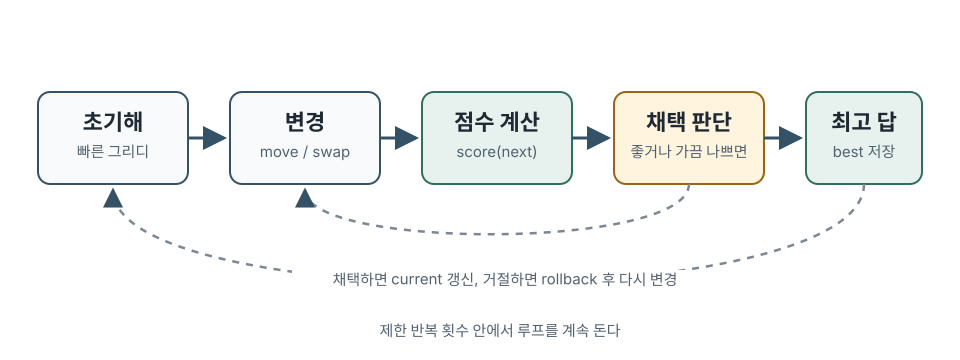

# 휴리스틱 알고리즘: 문제 모델링과 점수 함수

## 언제 휴리스틱을 쓰는가

다음 신호가 보이면 정확한 알고리즘만으로는 접근하기 어려울 수 있습니다.

- 가능한 답의 수가 너무 많아 완전 탐색이 불가능합니다.
- 그리디 기준을 세워도 작은 반례가 쉽게 나옵니다.
- DP 상태가 너무 커서 메모리나 시간이 맞지 않습니다.
- 목표가 하나의 정답 여부가 아니라 점수를 최대화하거나 비용을 최소화하는 것입니다.
- 입력 크기가 크고, 문제에서 부분 점수나 상대 점수를 줍니다.

점수를 비교하기 전에 답이 문제의 제약을 만족해야 합니다. 탐색 중 제약 위반을 허용하더라도 최종 답의 유효성은 별도로 검사합니다.

## 휴리스틱 풀이의 기본 구조

대부분의 휴리스틱 풀이는 아래 네 부분으로 나눌 수 있습니다.

| 단계 | 역할 |
| --- | --- |
| 표현 | 답을 어떤 배열과 값으로 들고 있을지 정한다 |
| 점수 함수 | 현재 답이 얼마나 좋은지 계산한다 |
| 초기해 | 빠르게 그럴듯한 첫 답을 만든다 |
| 개선 | 조금 바꾼 답을 시험하며 더 좋은 답으로 이동한다 |

예를 들어 여러 작업을 여러 기계에 배정하는 문제라면 답은 `machineOf[job] = machine` 배열이 될 수 있습니다. 점수 함수는 가장 바쁜 기계의 작업량, 기계 간 불균형, 마감 위반 penalty 같은 값을 계산합니다. 초기해는 입력 순서대로 가장 여유 있는 기계에 넣는 방식으로 만들 수 있고, 개선은 작업 하나를 다른 기계로 옮기거나 두 작업의 배정을 바꾸는 식으로 진행합니다.



## 제약형 코드의 기본 도구

STL과 C 헤더를 못 쓰면 먼저 기본 도구를 직접 준비해야 합니다. 아래 함수들은 뒤쪽 예시에서 계속 씁니다.

```cpp
const int MAX_TASKS = 2000;
const int MAX_MACHINES = 64;
const int ITERATION_LIMIT = 1500000;
const long long SCORE_SCALE = 1000000LL;
const long long NEG_INF = -(1LL << 60);

int minInt(int a, int b) {
    return a < b ? a : b;
}

long long absLong(long long x) {
    return x < 0 ? -x : x;
}

void swapInt(int& a, int& b) {
    int t = a;
    a = b;
    b = t;
}
```

난수도 `rand()` 없이 직접 만듭니다. 여기서는 이 프로젝트의 여러 문제에서 반복해서 쓰는 LCG 형태를 그대로 씁니다.

```cpp
static unsigned long long seed = 5;

static int pseudo_rand(void) {
    seed = seed * 25214903917ULL + 11ULL;
    return (int)((seed >> 16) & 0x3fffffff);
}

int randomInt(int bound) {
    if (bound <= 0) return 0;
    return pseudo_rand() % bound;
}

void shuffleArray(int a[], int n) {
    for (int i = n - 1; i > 0; --i) {
        int j = randomInt(i + 1);
        swapInt(a[i], a[j]);
    }
}
```

제출 환경에서 seed를 고정하면 결과가 재현되어 디버깅하기 쉽습니다. 여러 seed를 시험하고 싶다면 `seed` 초기값만 바꾸면 됩니다.

## 상태 표현: 배열로 답을 든다

이 글에서는 `N`개 작업을 `M`개 기계에 배정하고, 가장 바쁜 기계의 작업량을 줄이는 문제를 예시로 씁니다. 문제와 상태는 고정 배열로 표현합니다.

```cpp
struct Problem {
    int taskCount;
    int machineCount;
    int cost[MAX_TASKS];
};

struct State {
    int machineOf[MAX_TASKS];
    int load[MAX_MACHINES];
};

void clearState(const Problem& p, State& s) {
    for (int i = 0; i < p.taskCount; ++i) {
        s.machineOf[i] = -1;
    }
    for (int m = 0; m < p.machineCount; ++m) {
        s.load[m] = 0;
    }
}

void copyState(const Problem& p, State& dst, const State& src) {
    for (int i = 0; i < p.taskCount; ++i) {
        dst.machineOf[i] = src.machineOf[i];
    }
    for (int m = 0; m < p.machineCount; ++m) {
        dst.load[m] = src.load[m];
    }
}
```

`machineOf`만 있으면 각 작업이 어디에 배정됐는지 알 수 있습니다. `load`는 점수 계산을 빠르게 하기 위해 함께 들고 있습니다. 이렇게 같은 정보를 두 형태로 들면 속도는 빨라지지만, 갱신을 빼먹으면 상태가 깨집니다. 그래서 초반에는 검증 함수를 같이 둡니다.

```cpp
int isValidState(const Problem& p, const State& s) {
    int actual[MAX_MACHINES];

    for (int m = 0; m < p.machineCount; ++m) {
        actual[m] = 0;
    }

    for (int i = 0; i < p.taskCount; ++i) {
        int m = s.machineOf[i];
        if (m < 0 || m >= p.machineCount) return 0;
        actual[m] += p.cost[i];
    }

    for (int m = 0; m < p.machineCount; ++m) {
        if (actual[m] != s.load[m]) return 0;
    }

    return 1;
}
```

## 점수 함수를 먼저 만든다

휴리스틱에서 가장 먼저 안정적으로 만들어야 하는 것은 점수 함수입니다. 최소화 문제라도 내부에서는 보통 "클수록 좋은 점수"로 바꿔 두면 비교가 단순합니다. 아래 예시는 `makespan`을 줄이고, 같은 `makespan`이면 기계 부하가 더 균형 잡힌 상태를 선호합니다.

```cpp
long long scoreState(const Problem& p, const State& s) {
    if (!isValidState(p, s)) return NEG_INF;

    long long total = 0;
    long long maxLoad = 0;

    for (int m = 0; m < p.machineCount; ++m) {
        long long load = s.load[m];
        total += load;
        if (load > maxLoad) maxLoad = load;
    }

    long long average = total / p.machineCount;
    long long imbalance = 0;
    for (int m = 0; m < p.machineCount; ++m) {
        imbalance += absLong((long long)s.load[m] - average);
    }

    return -maxLoad * SCORE_SCALE - imbalance;
}
```

탐색용 평가값에 균형 보너스나 penalty를 섞더라도, 최종 답은 실제 채점 점수로 비교합니다.

전체 점수를 재계산하는 함수를 남겨 두면, 변경 부분만 갱신하는 차분 평가가 같은 값을 내는지 대조할 수 있습니다.
