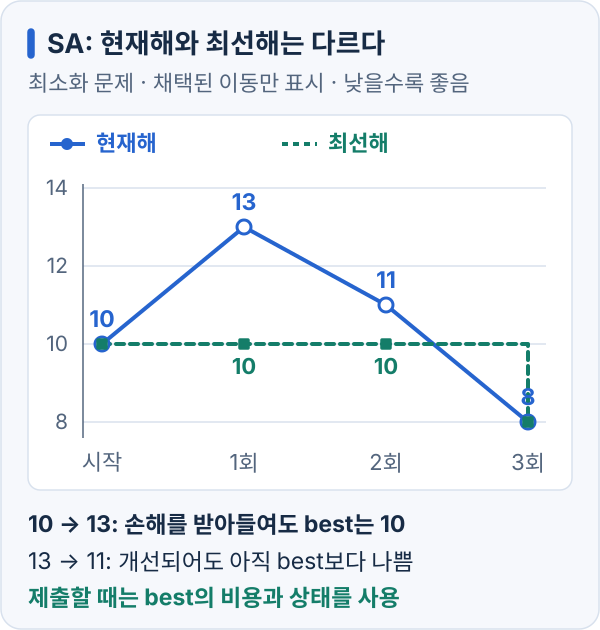

# 휴리스틱 알고리즘: 초기해와 지역 탐색

## 초기해와 개선 연산

[ORDERING](ordering-route-improvement.md)에서는 번호 순서로 나열해도 유효한 답입니다. 가까운 배송지를 차례로 고르면 매 단계의 이동은 짧아도, 이미 선택한 경로를 뒤집어야 전체 비용이 더 줄어드는 경우가 있습니다. 이것이 초기해 구성과 지역 탐색을 나누는 이유입니다.

2-opt는 현재 경로의 한 구간을 뒤집습니다. 비용이 줄면 채택하고, 나빠지면 원래 순열로 되돌립니다. 가능한 모든 2-opt 이동을 보아도 줄어드는 이동이 없으면 **그 연산에 대한 지역 최적**입니다. 전역 최적이라는 뜻은 아닙니다. 한 원소를 다른 위치로 옮기는 insertion이나 여러 원소를 제거해 다시 넣는 repair에는 개선 여지가 남을 수 있습니다.

## 한 번 나빠진 뒤 더 좋아지는 경로

맨해튼 거리를 쓰는 다음 여섯 점을 봅니다. 창고는 0이며 마지막 점에서 돌아오지 않습니다.

| 번호 | 좌표 |
| --- | --- |
| 0 | (18, 8) |
| 1 | (17, 4) |
| 2 | (18, 12) |
| 3 | (9, 4) |
| 4 | (2, 12) |
| 5 | (12, 19) |

시작 경로는 `0 → 1 → 3 → 4 → 2 → 5`이고 비용은 `5 + 8 + 15 + 16 + 13 = 57`입니다.

창고를 제외한 모든 2-opt 이웃의 비용은 다음과 같습니다. 구간의 위치는 0부터 셉니다.

| 뒤집는 구간 | 새 비용 | 뒤집는 구간 | 새 비용 |
| --- | ---: | --- | ---: |
| `[1,2]` | 73 | `[2,4]` | 63 |
| `[1,3]` | 65 | `[2,5]` | 69 |
| `[1,4]` | 63 | `[3,4]` | 63 |
| `[1,5]` | 69 | `[3,5]` | 60 |
| `[2,3]` | 73 | `[4,5]` | 58 |

어느 이웃도 57 이하가 아니므로 좋은 이동만 받는 탐색은 멈춥니다. 그런데 아래 두 이동을 이어 붙이면 비용이 줄어듭니다.

1. 시작 경로 `0 1 3 4 2 5`, 비용 **57**.
2. `[1,3]`을 뒤집은 경로 `0 4 3 1 2 5`, 비용 **65**.
3. 이어 `[1,4]`를 뒤집은 경로 `0 2 1 3 4 5`, 비용 **53**.

첫 이동에서 손해 8을 받아들이면 다음 이동은 비용을 12 줄입니다. SA는 이런 이동이 제안됐을 때 처음의 손해도 받아들일 가능성을 남깁니다. 이 특정 두 이동이 항상 제안되거나 전역 최적에 도달한다는 보장은 없습니다.

## 나쁜 이동을 받아들이는 확률

Simulated Annealing(SA)은 더 나쁜 이웃도 확률적으로 받아들입니다. 최소화 문제에서 `loss = 새 비용 - 현재 비용`이라고 두면, 비용이 줄거나 같은 이동은 채택하고 `loss > 0`인 이동은 다음 확률로 채택합니다.

```text
P(accept) = exp(-loss / T), T > 0
```

| 손해 크기 | 채택 확률 |
| --- | ---: |
| `0.5T` | 약 61% |
| `T` | 약 37% |
| `2T` | 약 14% |
| `3T` | 약 5% |

온도 `T`를 내리면 같은 손해를 덜 받아들입니다. `T`는 전체 점수보다 **이동 한 번의 비용 차이**에 맞춥니다. 예를 들어 보통 손해가 3000이라면 `T = 3000`에서 그 크기의 이동을 약 37% 받아들입니다. 초기해 주변의 이동을 샘플링해 손해를 측정하되, 측정 후 상태를 되돌립니다.

움직이는 상태 `current`와 지금까지 가장 좋은 상태 `best`는 따로 둡니다. 나쁜 이동을 채택해도 `best`는 유지하며, 제출할 답은 실제 비용이 가장 작은 `best`입니다. `T = 0`에서는 나쁜 이동을 거절해 0으로 나누지 않도록 처리합니다.



[그림 크게 보기](https://blog.readiz.com/h-contest-lesson/lessons/heuristic/lesson-assets/current-best.svg)

비용 `10 → 13` 이동은 확률적으로 채택된 경우를 가정합니다. 이후 `13 → 11`을 받아들였다는 이유로 `best`까지 11로 덮어쓰면 이전의 더 좋은 답 10을 잃습니다. `best`에는 비용뿐 아니라 그 비용을 만드는 순열·배치도 함께 복사합니다.

[SA: 온도·나쁜 이동·최선해 보존 실험하기](https://blog.readiz.com/h-contest-lesson/demos/index.html?demo=annealing)

온도와 비용 증가량을 바꾸며 채택 확률을 확인하고, 같은 난수 예제의 진행을 따라가 보세요. 나쁜 이동을 받아들여 current가 커져도 best는 보존해야 합니다. 이 데모는 채택 규칙을 보여 주는 작은 예제이며, 실제 문제에서 어떤 온도나 냉각 일정이 좋은지를 보장하지 않습니다.

## ORDERING에 붙이는 구현

먼저 [배송 순서 개선](ordering-route-improvement.md)의 완성 코드를 복사하고, 그 코드의 `build_path` 이름만 `build_initial_path`로 바꿉니다. 그러면 동일한 nearest neighbor + 2-opt 초기해를 여러 탐색 방식에서 재사용할 수 있습니다. [공통 코드의 `random` 블록](https://h.readiz.com/learn/cpp-common-library)도 한 번 붙인 뒤 아래 코드를 추가합니다.

**코드 환경: h-contest 제출 확장용.** 표준 헤더·STL 없이 공개 거리 API만 사용합니다. `1 <= n <= 100`, 유효한 초기 순열, `attempts >= 0`, 유한한 `startTemperature >= endTemperature >= 0`을 전제로 합니다. `order[]`에는 최선해를 보존하고 작업 배열 `current[]`만 흔듭니다.

```cpp snippet=ordering-sa
namespace ordering_sa {
struct Stats {
    int bestCost;
    int currentCost;
    int accepted;
    int acceptedWorse;
};

// x >= 0. No math header: reduce x, evaluate a short series, then square.
double expNegative(double x) {
    if (x >= 32.0) return 0.0;
    int halves = 0;
    while (x > 0.5) { x *= 0.5; ++halves; }
    double sum = 1.0, term = 1.0;
    for (int k = 1; k <= 12; ++k) {
        term *= -x / k;
        sum += term;
    }
    for (int k = 0; k < halves; ++k) sum *= sum;
    return sum;
}

int delta(int n, const int order[], int left, int right) {
    int a = order[left - 1], b = order[left], c = order[right];
    int change = get_dist(a, c) - get_dist(a, b);
    if (right + 1 < n) {
        int d = order[right + 1];
        change += get_dist(b, d) - get_dist(c, d);
    }
    return change;
}

Stats improve(int n, int order[], int attempts, unsigned seed,
              double startTemperature, double endTemperature) {
    int current[100];
    for (int i = 0; i < n; ++i) current[i] = order[i];
    int initialCost = get_path_dist(order, n);
    Stats stats = {initialCost, initialCost, 0, 0};
    if (n <= 2 || attempts == 0) return stats;

    hc::Random rng;
    rng.reset(seed);
    for (int step = 0; step < attempts; ++step) {
        int left = 1 + (int)rng.below((unsigned)(n - 1));
        int right = 1 + (int)rng.below((unsigned)(n - 2));
        if (right >= left) ++right;
        if (left > right) { int temp = left; left = right; right = temp; }

        double progress = attempts == 1 ? 0.0 : (double)step / (attempts - 1);
        double temperature = startTemperature
                           + (endTemperature - startTemperature) * progress;
        int change = delta(n, current, left, right);
        // Consume one draw on every proposal, including improvements.
        double u = (rng.next() >> 8) / 16777216.0;
        bool accept = change <= 0;
        if (!accept && temperature > 0.0) {
            accept = u < expNegative(change / temperature);
        }
        if (!accept) continue;

        reverse_range(current, left, right);
        stats.currentCost += change;
        ++stats.accepted;
        if (change > 0) ++stats.acceptedWorse;
        if (stats.currentCost < stats.bestCost) {
            stats.bestCost = stats.currentCost;
            for (int i = 0; i < n; ++i) order[i] = current[i];
        }
    }
    return stats;
}
}
```

`expNegative`는 `exp(-x)`의 수치 근사입니다. `x`를 0.5 이하로 줄여 12차 Taylor 합을 구하고 제곱해 되돌립니다. `x >= 32`에서는 0을 반환하며, 생략한 함수값은 `exp(-32) ≈ 1.27×10^-14` 이하입니다. 난수 `u`도 24비트 격자의 값이므로 수식의 연속 확률을 유한 정밀도로 구현한 것입니다. 로컬에서는 `<cmath>`의 `exp(-x)`와 비교하지만 그 헤더는 제출 코드에 넣지 않습니다.

다음 wrapper가 실제 제출 함수입니다. 모든 TC에서 풀이 난수를 다시 초기화하며 채점기 난수나 비공개 상태를 읽지 않습니다.

```cpp snippet=ordering-sa-entry
void build_path(int n, const int points[][2], int order[]) {
    build_initial_path(n, points, order);
    ordering_sa::improve(n, order, 30000, 20260922u, 128.0, 1.0);
}
```

온도는 시도 횟수에 따라 128에서 1까지 선형으로 낮춥니다. 이 상수들은 비교를 시작하기 위한 설정입니다. 0과 0을 넣으면 같은 후보 생성·난수 소비 규칙에서 좋은 이동과 같은 비용의 이동만 받는 hill climbing이 됩니다. 둘의 난수열을 같게 해도 현재 경로가 달라진 뒤의 비용 변화까지 같아지는 것은 아닙니다.

거절한 이동은 배열을 바꾸기 전에 판정하므로 undo가 필요 없습니다. 후보 점수 계산을 위해 먼저 상태를 바꾸는 방식으로 고친다면 거절 분기에서 반드시 복구해야 합니다. `delta`는 [Testing과 Stress Test](https://h.readiz.com/learn/testing-and-stress)의 전체 비용 재계산과 비교합니다.

## 같은 입력에서 단계별로 측정하기

아래는 2026-09-22에 공개 ORDERING 채점기의 10개 TC를 그대로 실행한 결과입니다. 각 방식은 9번 실행하고 첫 실행을 제외한 8번의 중앙값을 사용했습니다. 시간은 초기해 구성·탐색·채점기 실행을 포함한 **10개 TC 전체 시간**이며, macOS arm64 / Apple clang 17 / C++17에서 측정했습니다.

| 방식 | 10개 TC 비용 합 ↓ | `-O0` 시간(ms) | `-O2` 시간(ms) |
| --- | ---: | ---: | ---: |
| 번호 순서 | 257071 | 0.033 | 0.003 |
| nearest neighbor | 65145 | 0.606 | 0.120 |
| nearest neighbor + 2-opt | 58368 | 4.013 | 0.856 |
| 같은 초기해 + hill climbing | 58368 | 19.634 | 4.980 |
| 같은 초기해 + SA | 56779 | 37.674 | 9.993 |

모든 실행은 유효한 경로를 제출했고, 최적화 옵션에 따른 비용 차이는 없었습니다. 마지막 두 방식은 위 wrapper의 solver seed와 **TC당 추가 후보 30000개**를 맞춘 비교입니다. SA는 이 입력 묶음에서 비용 합을 약 2.7% 낮췄지만, 추가 hill climbing을 포함한 전체 시간보다 약 1.9~2.0배 걸렸습니다. **같은 실행 시간에서 SA가 더 좋다는 실험은 아닙니다.** 가장 큰 네 TC의 비용은 두 방식에서 같았습니다.

한 채점 입력 묶음과 한 seed의 기록이므로 일반적인 우열이나 최적 온도로 해석하지 않습니다. 다음 실험에서는 입력 크기·분포와 seed를 바꾸고, 같은 시간에 돌릴 수 있는 후보 수를 따로 맞춥니다. 절대 시간은 기기와 부하에 따라 달라지며, 특히 매우 짧은 기준선 시간은 정밀한 성능 비교에 쓰기 어렵습니다.

[TC별 비용과 측정 원본](https://blog.readiz.com/h-contest-lesson/lessons/heuristic/lesson-assets/ordering-search-benchmark.json)에는 채점기 파일의 SHA-256과 개별 측정값도 담았습니다. 저장소에서 공개 채점기의 `main.cpp` 경로를 지정하면 같은 본문 코드를 추출해 재현할 수 있습니다.

```bash
python3 scripts/check_heuristic_search.py \
  --judge /path/to/ORDERING/main.cpp --output /tmp/ordering-bench.json
```

## 재시도와 탐색 예산

같은 초기해에서 오래 탐색하는 방법과 다른 초기해에서 여러 번 다시 시작하는 방법은 총 예산을 맞춰 비교합니다. 한 번당 반복 수를 그대로 둔 채 재시도 횟수만 늘리면 탐색 전략과 실행 시간의 효과를 구분할 수 없습니다.

제출 환경에 시간 조회 API가 없다면 로컬에서 반복 횟수를 정합니다. 후보 생성·평가뿐 아니라 초기화와 최종 답 구성 시간도 포함해 재고, 입력 상한에서 제한 시간에 여유가 있는 횟수를 사용합니다.

실험 로그에는 입력 ID, solver seed, 탐색 횟수, 파라미터, 최종 비용과 실행 시간을 남깁니다. 같은 입력 묶음에서 평균과 최악 비용을 비교하며, 튜닝에 쓰지 않은 입력에서도 확인합니다. 차분·복구 오류를 찾는 방법은 [Testing과 Stress Test](https://h.readiz.com/learn/testing-and-stress)에 있습니다.

## 로컬 연습: 같은 초기해에서 탐색 비교

입력은 `N`과 `N`개의 정수 좌표이며 `1 <= N <= 100`, 좌표는 `0..999`입니다. 첫 점이 창고입니다. 위 표처럼 번호 순서, nearest neighbor, nearest neighbor + 2-opt, 여기에 hill climbing 또는 SA를 추가한 다섯 방식의 유효성·비용·실행 시간을 같은 입력에서 기록합니다. 두 추가 탐색은 각각 후보 30000개와 solver seed `20260922`를 사용합니다.

작은 고정 입력으로 위 여섯 점을 넣고, 경로 `0 1 3 4 2 5`의 비용 57과 열 가지 이웃 비용을 먼저 확인합니다. 이어 `[1,3]`, `[1,4]` 이동을 직접 적용하면 비용은 65, 53입니다. `N=6`에서는 창고를 제외한 `5!=120`개 순열을 전수 조사해 최적 비용 53도 확인할 수 있습니다.

자동 탐색이 매 실행에서 53을 찾는 것을 정답 조건으로 삼지 않습니다. 항상 검사할 조건은 유효한 순열, 시작점 0, 같은 seed의 재현성, 제출된 경로 비용과 `bestCost`의 일치, 최선 비용이 초기해보다 나빠지지 않음입니다. `attempts=0`, `N=1,2`, 중복 좌표, 같은 비용 이동, 경로 끝을 뒤집는 이동도 검사합니다.
