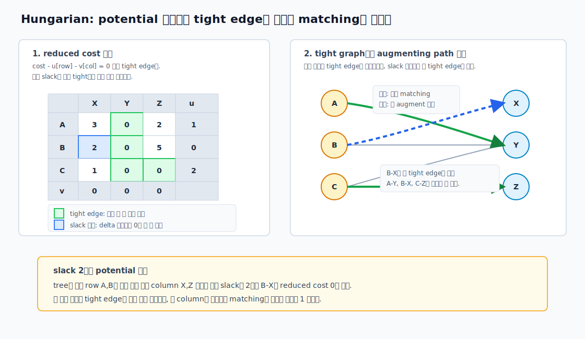
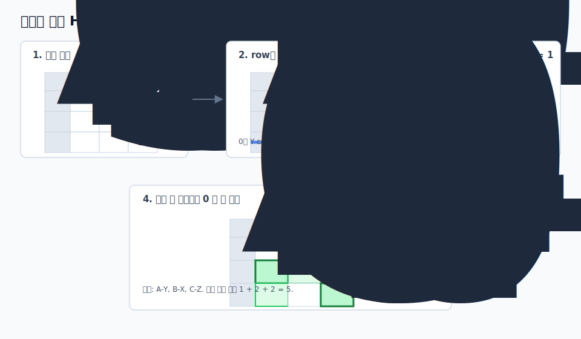

# Hungarian Algorithm

Hungarian Algorithm은 이분 assignment 문제를 `O(N^3)`에 푸는 표준 알고리즘입니다. `N`명의 worker와 `N`개의 job이 있고, 각 worker를 정확히 하나의 job에 배정하면서 각 job도 정확히 한 번만 쓰는 최소 비용을 찾습니다.

이 문제는 "가장 싼 간선을 하나씩 고르면 되지 않을까?"처럼 보이지만, 한 번 고른 job이 다른 worker의 유일한 좋은 선택지를 막을 수 있습니다. Hungarian은 간선을 바로 확정하지 않고, 현재 dual potential 기준으로 비용이 0인 `tight edge`를 만들고 그 위에서 augmenting path를 찾아 matching을 키웁니다.

## 0. 선수 지식과 이어지는 레슨

- 선수 지식: Matching과 Cover Duality, Weighted Matching
- 함께 보면 좋은 레슨: Min-Cost Flow, Max Flow와 Bipartite Matching
- 다음에 볼 레슨: Min-Cost Flow 변형 모델링, Matroid Algorithms

## 1. 언제 필요한가

| 문제 신호 | Hungarian이 맞는 이유 |
| --- | --- |
| 왼쪽 집합과 오른쪽 집합을 1:1로 모두 매칭 | assignment problem |
| 비용이 `cost[i][j]` 행렬로 주어진다 | dense bipartite graph |
| 한쪽 크기가 수백에서 수천 정도 | `O(N^3)` 구현이 실용적 |
| 제약이 "한 row당 하나, 한 column당 하나"뿐이다 | Min-Cost Flow보다 짧고 빠름 |
| 실제 선택 목록도 필요하다 | `assignment[row] = column`으로 복원 가능 |

직사각형 행렬도 처리할 수 있습니다. 아래 구현은 `n <= m`일 때 `n`개의 row를 서로 다른 column에 배정합니다. 정사각형 assignment는 그대로 넣으면 되고, `n > m`이면 행과 열을 바꾸거나 dummy column을 추가합니다.

## 2. 쓰지 말아야 할 경우

| 상황 | 더 먼저 볼 선택지 |
| --- | --- |
| forbidden edge가 많고 그래프가 sparse | Min-Cost Flow 또는 이분 matching 변형 |
| capacity, lower bound, 여러 개 배정 같은 제약이 있다 | Min-Cost Flow |
| 모든 worker를 배정하지 않아도 된다 | dummy job, penalty, 또는 Min-Cost Flow |
| 한쪽 크기가 20 이하로 매우 작다 | bitmask DP |
| 일반 그래프 matching이다 | Weighted Blossom 또는 small-N DP |

Hungarian은 "완전한 이분 1:1 배정"에 가장 깔끔합니다. 제약이 조금만 복잡해져도 flow로 모델링하는 편이 실수를 줄입니다.

## 3. 왜 그리디가 깨지는가

아래 비용 행렬에서 각 row가 남은 column 중 가장 싼 곳을 고르는 그리디를 생각해 봅니다.

|  | X | Y | Z |
| --- | ---: | ---: | ---: |
| A | 1 | 2 | 100 |
| B | 1 | 100 | 2 |
| C | 100 | 2 | 1 |

row 순서대로 가장 싼 column을 고르면 `A-X`, `B-Z`, `C-Y`가 되어 총 비용은 `1 + 2 + 2 = 5`입니다. 하지만 최적해는 `A-Y`, `B-X`, `C-Z`이고 총 비용은 `2 + 1 + 1 = 4`입니다.

문제는 지금 싼 선택이 나중의 선택지를 막는다는 점입니다. Hungarian은 현재 싸 보이는 간선 하나를 고정하지 않고, 여러 row와 column을 번갈아 따라가며 matching을 뒤집을 수 있는 경로를 찾습니다.

## 4. 핵심 아이디어: potential과 tight edge

최소 비용 문제에서 row potential `u[i]`, column potential `v[j]`를 둡니다.

```text
reducedCost(i, j) = cost[i][j] - u[i] - v[j]
```

`reducedCost(i, j) == 0`인 간선을 `tight edge`라고 부릅니다. Hungarian은 matching을 tight edge 위에서만 유지합니다.

1. 현재 tight edge만으로 augmenting path를 찾는다.
2. augmenting path가 없으면, 아직 닿지 않은 column으로 가는 최소 slack만큼 potential을 조정한다.
3. 그러면 새로운 tight edge가 생긴다.
4. 새 tight edge를 포함해 다시 augmenting path를 찾고 matching을 하나 키운다.



이 관점은 Min-Cost Flow의 shortest augmenting path와도 이어집니다. 다만 Hungarian은 assignment 구조를 이용해 potential과 slack을 훨씬 짧게 관리합니다.

## 5. 손으로 푸는 방식

손으로 작은 행렬을 풀 때는 "potential"이라는 단어보다 0을 만드는 표 조작으로 보는 편이 쉽습니다. 하지만 손계산도 결국 같은 알고리즘입니다. 핵심은 다음 두 가지입니다.

1. 0인 칸만 간선으로 보는 이분 그래프에서, 서로 row와 column이 겹치지 않는 0들을 최대한 많이 고른다.
2. 아직 `N`개를 못 고르면, 현재 0 그래프의 alternating 구조로 0을 덮는 최소 선을 찾고, 덮이지 않은 칸의 최솟값만큼 행렬을 조정해 새 0을 만든다.

아래 두 표현은 같은 dual 조정을 다른 언어로 말하는 것입니다.

| 손계산 표현 | 구현 표현 |
| --- | --- |
| 각 row에서 최솟값을 뺀다 | row potential을 올린다 |
| 각 column에서 최솟값을 뺀다 | column potential을 조정한다 |
| 0인 칸만 보고 독립적인 0을 고른다 | tight edge 위에서 matching을 찾는다 |
| 모든 0을 덮는 선 수가 부족하면 uncovered 최솟값을 조정한다 | 최소 slack `delta`로 새 tight edge를 만든다 |

다음 최소 비용 assignment를 손으로 따라가 보겠습니다. 목표는 각 row에서 정확히 하나, 각 column에서 정확히 하나를 골라 총 비용을 최소화하는 것입니다.

|  | X | Y | Z |
| --- | ---: | ---: | ---: |
| A | 4 | 1 | 3 |
| B | 2 | 0 | 5 |
| C | 3 | 2 | 2 |

먼저 각 row의 최솟값을 뺍니다. `A`에서는 1, `B`에서는 0, `C`에서는 2를 뺍니다. 이렇게 해도 어떤 assignment가 다른 assignment보다 얼마나 더 싼지는 바뀌지 않습니다. 모든 row에서 정확히 하나씩 고르므로, 모든 후보 해의 비용이 같은 값 `1 + 0 + 2`만큼 줄어들기 때문입니다.

|  | X | Y | Z |
| --- | ---: | ---: | ---: |
| A | 3 | 0 | 2 |
| B | 2 | 0 | 5 |
| C | 1 | 0 | 0 |

그다음 각 column의 최솟값을 뺍니다. `X` column의 최솟값은 1이고, `Y`, `Z`는 이미 0입니다. column도 정확히 하나씩 쓰는 정사각형 assignment에서는 같은 이유로 최적해가 보존됩니다.

|  | X | Y | Z |
| --- | ---: | ---: | ---: |
| A | 2 | 0 | 2 |
| B | 1 | 0 | 5 |
| C | 0 | 0 | 0 |

이제 0인 칸만 봅니다.

```text
A: Y
B: Y
C: X, Y, Z
```

서로 row와 column이 겹치지 않게 0을 고르면, 예를 들어 `A-Y`, `C-Z`까지는 고를 수 있지만 `B`가 남습니다. 최대 0 matching 크기가 2라서 아직 완전 assignment가 아닙니다.

여기서 "모든 0을 덮는 최소 선"은 다음 절차로 찾습니다. 손으로 선을 감으로 긋는 대신, 이 절차를 따르면 코드의 alternating tree와 같은 구조가 됩니다.

1. 현재 고른 0 matching을 하나 잡습니다. 예: `A-Y`, `C-Z`.
2. matching되지 않은 row를 표시합니다. 여기서는 `B`를 표시합니다.
3. 표시된 row에서 0이 있는 column을 모두 표시합니다. `B`의 0은 `Y`에 있으므로 `Y`를 표시합니다.
4. 표시된 column에 matching된 row가 있으면 그 row를 표시합니다. `Y`에는 `A-Y`가 matching되어 있으므로 `A`를 표시합니다.
5. 새로 표시된 row에서 다시 0 column을 표시합니다. `A`의 0은 이미 표시된 `Y`뿐이므로 멈춥니다.
6. 표시되지 않은 row와 표시된 column에 선을 긋습니다.

따라서 선은 `C` row와 `Y` column, 총 2개입니다. 실제로 모든 0인 칸 `A-Y`, `B-Y`, `C-X`, `C-Y`, `C-Z`가 이 두 선 중 하나에 덮입니다. 선 수가 3보다 작다는 것은 아직 서로 독립적인 0 세 개를 만들 수 없다는 뜻입니다.

이제 덮이지 않은 칸을 봅니다. 표시된 row `A`, `B`와 표시되지 않은 column `X`, `Z`가 만나는 칸입니다.

```text
A-X = 2, A-Z = 2, B-X = 1, B-Z = 5
```

그 최솟값 `delta = 1`을 사용합니다.

1. 선에 덮이지 않은 칸에서 `delta`를 뺍니다.
2. 두 선이 교차하는 칸에는 `delta`를 더합니다.
3. 선 하나에만 덮인 칸은 그대로 둡니다.

이 조정은 모든 row와 column에서 고르는 assignment 비용의 상대 순서를 보존하면서, 적어도 하나의 새 0을 만듭니다. 여기서는 `B-X`가 새 0이 됩니다.

|  | X | Y | Z |
| --- | ---: | ---: | ---: |
| A | 1 | 0 | 1 |
| B | 0 | 0 | 4 |
| C | 0 | 1 | 0 |

이제 `A-Y`, `B-X`, `C-Z`를 서로 겹치지 않게 고를 수 있습니다. 원래 비용으로 돌아가면 총 비용은 `1 + 2 + 2 = 5`입니다.



손계산에서는 "0을 만들고, 독립적인 0을 고른다"가 중심입니다. 코드에서는 이 0인 칸을 `tight edge`, 새 0을 만들기 위해 빼는 값을 `delta` 또는 최소 slack이라고 부릅니다. 표시된 row와 column을 따라가는 절차가 곧 augmenting path 탐색이고, `delta` 조정은 아직 tree에 들어오지 않은 column까지의 최소 slack을 0으로 만드는 작업입니다.

## 6. 구현 변수 읽는 법

아래 구현은 대회에서 자주 쓰는 shortest augmenting path 형태입니다. 보조 배열은 1-indexed이고, 입력 비용 행렬만 0-indexed입니다.

| 변수 | 의미 |
| --- | --- |
| `u[i]` | row potential |
| `v[j]` | column potential |
| `p[j]` | column `j`에 현재 매칭된 row |
| `p[0]` | 이번에 새로 매칭하려는 dummy column의 row |
| `way[j]` | augmenting path 복원용 이전 column |
| `minv[j]` | 현재 alternating tree에서 column `j`로 가는 최소 slack |
| `used[j]` | 이번 augmenting 탐색에서 tree에 들어온 column |

핵심은 `minv[j]`입니다. tree에 들어온 row들에서 아직 쓰지 않은 column `j`로 넘어가는 최소 reduced cost를 저장합니다. `delta = min(minv[j])`를 고르면 그만큼 potential을 움직였을 때 최소 하나의 새 tight edge가 생깁니다.

한 row를 추가하는 내부 루프는 다음 순서로 읽으면 됩니다.

1. 새 row `i`를 dummy column `0`에 매달아 시작합니다. `p[0] = i`, `j0 = 0`입니다.
2. `used[j0] = 1`로 현재 column을 alternating tree에 넣습니다.
3. `i0 = p[j0]`는 현재 column을 통해 도달한 row입니다. dummy column에서는 방금 추가하려는 row가 됩니다.
4. 아직 tree에 없는 모든 column `j`에 대해 `cur = cost[i0 - 1][j - 1] - u[i0] - v[j]`를 계산합니다. 이것이 현재 row `i0`에서 column `j`로 가는 slack입니다.
5. `cur`가 기존 `minv[j]`보다 작으면 `minv[j] = cur`, `way[j] = j0`로 갱신합니다. `way[j]`는 나중에 path를 뒤집을 때 "이 column에 어디서 왔는가"를 복원합니다.
6. 모든 미사용 column 중 `minv[j]`가 가장 작은 column을 `j1`로 고르고, 그 값을 `delta`로 둡니다.
7. tree 안의 column `j`에 대해서는 `u[p[j]] += delta`, `v[j] -= delta`를 적용합니다. tree 밖 column은 `minv[j] -= delta`만 해 둡니다.
8. `j0 = j1`로 이동합니다. `p[j0] == 0`이면 빈 column에 도달했으므로 augmenting path를 찾은 것입니다. 아니면 그 column에 이미 매칭된 row `p[j0]`로 이어서 tree를 확장합니다.
9. 빈 column에 도달하면 `way`를 따라 뒤로 가며 `p[j0] = p[j1]`을 반복합니다. 이것이 matching edge를 뒤집는 단계입니다.

손계산의 "표시된 row/column"은 코드에서 `used` column들과 그 column에 매달린 `p[j]` row들입니다. 손계산의 "덮이지 않은 칸 최솟값"은 코드에서 `delta = min(minv[j])`입니다. 손계산에서 새 0이 생기듯이, 코드에서도 `minv[j]`가 0이 된 column이 새 tight edge 후보가 됩니다.

## 7. 순수 C 배열 구현

아래 코드는 `vector`, `pair`, 동적 할당 없이 고정 최대 크기 배열만 사용합니다. `HUNGARIAN_MAX_N`, `HUNGARIAN_MAX_M`은 문제 제한에 맞게 조정합니다. `n <= m`이어야 하고, 반환되는 `assignment[i]`는 row `i`가 배정된 0-indexed column입니다.

```cpp compile-check
#define HUNGARIAN_MAX_N 1000
#define HUNGARIAN_MAX_M 1000
#define HUNGARIAN_INF 4000000000000000000LL

static long long h_u[HUNGARIAN_MAX_N + 1];
static long long h_v[HUNGARIAN_MAX_M + 1];
static long long h_minv[HUNGARIAN_MAX_M + 1];
static int h_p[HUNGARIAN_MAX_M + 1];
static int h_way[HUNGARIAN_MAX_M + 1];
static int h_used[HUNGARIAN_MAX_M + 1];

long long hungarian_min_cost(
    int n,
    int m,
    const long long cost[][HUNGARIAN_MAX_M],
    int assignment[]
) {
    int i, j;

    if (n < 0 || m < 0 || n > HUNGARIAN_MAX_N || m > HUNGARIAN_MAX_M || n > m) {
        return HUNGARIAN_INF;
    }

    for (i = 0; i <= n; i++) {
        h_u[i] = 0;
    }
    for (j = 0; j <= m; j++) {
        h_v[j] = 0;
        h_p[j] = 0;
        h_way[j] = 0;
    }
    for (i = 0; i < n; i++) {
        assignment[i] = -1;
    }

    for (i = 1; i <= n; i++) {
        int j0 = 0;
        h_p[0] = i;

        for (j = 0; j <= m; j++) {
            h_minv[j] = HUNGARIAN_INF;
            h_used[j] = 0;
            h_way[j] = 0;
        }

        do {
            int i0;
            int j1 = 0;
            long long delta = HUNGARIAN_INF;

            h_used[j0] = 1;
            i0 = h_p[j0];

            for (j = 1; j <= m; j++) {
                if (!h_used[j]) {
                    long long cur = cost[i0 - 1][j - 1] - h_u[i0] - h_v[j];
                    if (cur < h_minv[j]) {
                        h_minv[j] = cur;
                        h_way[j] = j0;
                    }
                    if (h_minv[j] < delta) {
                        delta = h_minv[j];
                        j1 = j;
                    }
                }
            }

            if (delta >= HUNGARIAN_INF / 2) {
                for (j = 0; j < n; j++) {
                    assignment[j] = -1;
                }
                return HUNGARIAN_INF;
            }

            for (j = 0; j <= m; j++) {
                if (h_used[j]) {
                    h_u[h_p[j]] += delta;
                    h_v[j] -= delta;
                } else {
                    h_minv[j] -= delta;
                }
            }

            j0 = j1;
        } while (h_p[j0] != 0);

        do {
            int j1 = h_way[j0];
            h_p[j0] = h_p[j1];
            j0 = j1;
        } while (j0 != 0);
    }

    for (j = 1; j <= m; j++) {
        if (h_p[j] != 0) {
            assignment[h_p[j] - 1] = j - 1;
        }
    }

    return -h_v[0];
}
```

이 구현은 C 문법에 가깝게 작성했지만, validator에서는 C++17 문법 검사로 확인합니다. `cost`의 두 번째 차원은 컴파일 타임 상수여야 하므로, 호출 쪽도 아래처럼 같은 최대 폭을 사용합니다.

```cpp
static long long cost[HUNGARIAN_MAX_N][HUNGARIAN_MAX_M];
static int assignment[HUNGARIAN_MAX_N];
```

## 8. 구현 팁

1. 비용 합의 최댓값을 먼저 계산합니다. `HUNGARIAN_INF`는 가능한 정답보다 충분히 커야 하고, `cost - u - v`에서 overflow가 나면 안 됩니다.
2. forbidden edge가 많으면 `INF`를 잔뜩 넣기보다 Min-Cost Flow가 더 자연스러운지 먼저 봅니다.
3. 최대 이익 문제는 `cost = -profit` 또는 `cost = maxProfit - profit`으로 바꿉니다. 후자는 음수 비용을 피하고 싶을 때 편합니다.
4. `n > m`이면 이 함수는 실패합니다. 모든 row를 배정해야 한다면 dummy column을 추가하거나 행과 열을 바꿉니다.
5. `assignment` 방향은 row에서 column입니다. column에서 row가 필요하면 결과를 한 번 뒤집어 만듭니다.
6. static 배열 구현은 재진입성이 없습니다. 여러 번 동시에 호출하는 구조라면 작업 배열을 함수 밖 context로 분리합니다.
7. 같은 비용이 많으면 답이 여러 개일 수 있습니다. 채점이 특정 배정을 요구하지 않는다면 총 비용만 맞으면 됩니다.

## 9. 시간 복잡도

| 항목 | 복잡도 |
| --- | ---: |
| 한 row를 추가하는 augmenting 과정 | `O(M^2)` |
| 전체 `N`개 row 처리 | `O(NM^2)` |
| 정사각형 `N x N` | `O(N^3)` |
| 작업 배열 메모리 | `O(N + M)` |
| 입력 비용 행렬 | `O(NM)` |

dense assignment에서는 Min-Cost Flow보다 상수가 작고 코드도 짧습니다. 반대로 sparse graph, capacity, lower bound, 여러 번 선택 가능한 job이 섞이면 flow가 더 안전합니다.

## 10. COUPANG2에서 어떻게 쓸 수 있는가

[물류 상품 배송 2](/practice/COUPANG2)는 Hungarian을 꽤 직접적으로 쓸 수 있는 문제입니다. 고객은 정확히 하나의 상품을 주문하고, 같은 productID의 상품 copy들은 어느 고객에게 가도 검증상 차이가 없습니다. 따라서 먼저 **상품 종류별로** 문제를 쪼갭니다.

1. `getOrderInfo()`로 고객 `c`가 주문한 `productID`를 모읍니다.
2. `getProductList(center)`로 각 물류센터가 가진 상품 copy를 셉니다.
3. 상품 `p`마다 `p`를 주문한 고객들을 row로 둡니다.
4. 상품 `p`의 실제 재고 copy들을 column으로 둡니다. 같은 센터에 `p`가 여러 개 있으면 같은 좌표를 가진 column이 여러 개 생깁니다.
5. 비용은 보통 `dist(center_of_copy, customer)` 같은 맨해튼 거리로 둡니다.
6. 상품 `p`별 Hungarian으로 어떤 센터의 `p` copy가 어떤 고객에게 갈지 정합니다.

겉으로는 고객 10000명과 상품 copy 10000개를 맞추는 큰 assignment처럼 보이지만, 상품 종류가 다르면 매칭할 수 없으므로 행렬은 productID별 block으로 완전히 분해됩니다. 상품 종류가 1000개이고 고객이 10000명이면 한 상품당 평균 고객 수는 약 10명입니다. 그래서 `10000 x 10000` Hungarian이 아니라 작은 Hungarian 1000개를 푸는 모양이 됩니다.

작은 예를 보겠습니다. 상품 `P7`을 주문한 고객 `A`, `B`가 있고, `P7` copy가 센터 10000에 하나, 센터 10004에 하나 있습니다. 상품 `P12`는 고객 `C`와 센터 10003 copy 하나가 있습니다. 상품별로 보면 아래처럼 독립적인 작은 행렬입니다.

| 고객 | 주문 상품 | copy 0: 센터 10000의 P7 | copy 1: 센터 10004의 P7 | copy 2: 센터 10003의 P12 |
| --- | --- | ---: | ---: | ---: |
| A | P7 | 42 | 30 | INF |
| B | P7 | 35 | 70 | INF |
| C | P12 | INF | INF | 28 |

실제로는 `P7` block에서 `A`, `B`와 두 `P7` copy만 Hungarian으로 맞추고, `P12` block은 크기 1이라 바로 결정됩니다. row greedy는 `A-copy0`, `B-copy1`, `C-copy2`를 고르기 쉬워 총 140입니다. Hungarian은 `A-copy1`, `B-copy0`, `C-copy2`를 골라 총 93을 만듭니다.

이 매칭은 "어느 센터의 어떤 상품 copy를 어느 고객에게 보내야 하는가"를 정합니다. 그다음에는 센터별로 담당 고객 목록이 생기므로, 실제 `move/load/unload` 순서는 트럭 용량 100과 상품 무게를 보며 여러 trip으로 나눕니다. 같은 productID copy는 서로 구분되지 않기 때문에, 센터에서 해당 상품을 필요한 개수만큼 싣고 매칭된 고객에게 내려놓으면 됩니다. `unload()`는 마지막 적재 상품을 내리는 LIFO API라서 여러 상품을 섞어 싣는 trip에서는 내릴 순서의 역순으로 load하거나, 한 trip을 같은 상품/가까운 고객 묶음 위주로 구성하면 구현이 단순해집니다.

즉 COUPANG2에서 Hungarian의 역할은 작은 batch 보조 최적화가 아니라, 먼저 전역 배송 계획의 뼈대를 만드는 **상품별 재고 copy와 고객 수요의 최적 매칭**입니다. 이후 route heuristic은 이 매칭 결과를 실제 운행 순서로 바꾸는 두 번째 단계입니다.

## 11. 문제를 볼 때 체크할 조건

- 왼쪽과 오른쪽이 분명한 이분 구조인가?
- 모든 왼쪽 정점을 반드시 배정해야 하는가?
- 오른쪽 정점은 최대 한 번만 쓰이는가, 정확히 한 번 쓰이는가?
- 비용 행렬이 dense인가, forbidden edge가 많은 sparse graph인가?
- 목적이 최소 비용인가, 최대 이익인가?
- capacity, lower bound, penalty 같은 추가 제약이 있는가?
- 전체 문제를 한 번에 풀 것인가, COUPANG2처럼 상품별 독립 block으로 분해할 수 있는가?

추가 제약이 하나라도 강하게 보이면 Hungarian보다 Min-Cost Flow가 자연스러울 수 있습니다.

## 12. 구현 전 체크리스트

1. `n <= m` 조건을 만족시켰는가?
2. 비용 타입을 `long long`으로 두고 최댓값을 계산했는가?
3. forbidden edge를 쓸 때 최종 matching에 forbidden이 포함됐는지 검사하는가?
4. 최대화 문제를 최소화 문제로 변환했는가?
5. 작은 `N <= 8` 랜덤 테스트에서 brute force 순열 답과 비교했는가?
6. 반환된 `assignment[i]`가 모두 서로 다른 column인지 확인했는가?

## 13. 틀렸을 때 보는 체크리스트

1. `p`, `way`, `minv`, `used`는 1-indexed column 배열인데 input은 0-indexed입니다.
2. `h_p[0] = i`를 row마다 다시 넣지 않으면 augmenting 시작점이 깨집니다.
3. `delta` 조정 때 `used[j]`인 column과 아닌 column의 처리가 반대면 tight edge 조건이 깨집니다.
4. `assignment[h_p[j] - 1] = j - 1`에서 row와 column을 바꾸면 결과 방향이 뒤집힙니다.
5. `INF`가 너무 작으면 forbidden edge가 실제 선택되고, 너무 크면 overflow가 납니다.
6. COUPANG2에서 상품별 matching 결과와 실제 배송 순서를 같은 것으로 착각하면 LIFO unload와 트럭 용량 처리에서 구현이 꼬일 수 있습니다.

## 14. 연습 문제

| 단계 | 문제 | 목표 | 힌트 키워드 |
| --- | --- | --- | --- |
| 입문 | TODO: 작은 assignment problem `/practice/...` 문제 필요 | row greedy가 깨지는 반례 직접 계산 | counterexample |
| 표준 | [상품 재고 매칭](/practice/STOCKMAT) | 배열 기반 `hungarian_min_cost`로 최적 비용 0점과 배정 복원 | potential, tight edge |
| 응용 | [물류 상품 배송 2](/practice/COUPANG2) | 상품별로 센터 재고 copy와 고객 수요를 Hungarian으로 맞춘 뒤 route heuristic에 넘기기 | product block, stock copy, Manhattan distance |
| 함정 | TODO: forbidden edge가 있는 sparse assignment `/practice/...` 문제 필요 | Hungarian과 Min-Cost Flow 선택 비교 | dummy, INF, sparse graph |
