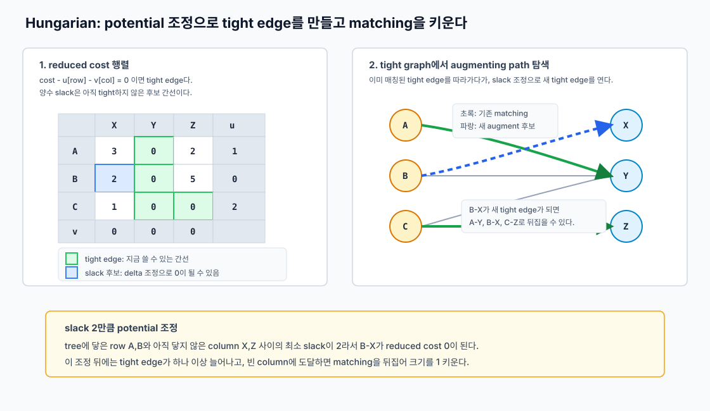
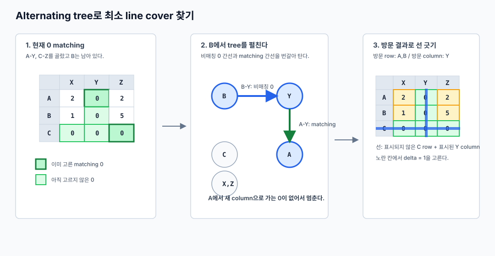

# Hungarian Algorithm

Hungarian Algorithm은 이분 assignment 문제를 `O(N^3)`에 푸는 표준 알고리즘입니다. `N`명의 worker와 `N`개의 job이 있고, 각 worker를 정확히 하나의 job에 배정하면서 각 job도 정확히 한 번만 쓰는 최소 비용을 찾습니다.

이 문제는 "가장 싼 간선을 하나씩 고르면 되지 않을까?"처럼 보이지만, 한 번 고른 job이 다른 worker의 유일한 좋은 선택지를 막을 수 있습니다. Hungarian은 간선을 바로 확정하지 않고, 현재 dual potential 기준으로 비용이 0인 `tight edge`를 만들고 그 위에서 augmenting path를 찾아 matching을 키웁니다.

## 언제 필요한가

| 문제 신호 | Hungarian이 맞는 이유 |
| --- | --- |
| 왼쪽 집합과 오른쪽 집합을 1:1로 모두 매칭 | assignment problem |
| 비용이 `cost[i][j]` 행렬로 주어진다 | dense bipartite graph |
| 한쪽 크기가 수백에서 수천 정도 | `O(N^3)` 구현이 실용적 |
| 제약이 "한 row당 하나, 한 column당 하나"뿐이다 | Min-Cost Flow보다 짧고 빠름 |
| 실제 선택 목록도 필요하다 | `assignment[row] = column`으로 복원 가능 |

최대 이익 문제는 `cost = -profit`으로 바꿉니다.

직사각형 행렬도 처리할 수 있습니다. 아래 구현은 `n <= m`일 때 `n`개의 row를 서로 다른 column에 배정합니다. 정사각형 assignment는 그대로 넣으면 되고, `n > m`이면 모든 row를 서로 다른 실제 column에 배정할 수 없습니다. 일부 row를 남겨도 되는 목적이라면 전치해 배정 방향을 복원하고, 미배정 비용을 모델링하려면 그 비용의 dummy column을 추가합니다.

## 쓰지 말아야 할 경우

| 상황 | 더 먼저 볼 선택지 |
| --- | --- |
| forbidden edge가 많고 그래프가 sparse | Min-Cost Flow 또는 이분 matching 변형 |
| capacity, lower bound, 여러 개 배정 같은 제약이 있다 | Min-Cost Flow |
| 모든 worker를 배정하지 않아도 된다 | dummy job, penalty, 또는 Min-Cost Flow |
| 한쪽 크기가 20 이하로 매우 작다 | bitmask DP |
| 일반 그래프 matching이다 | Weighted Blossom 또는 small-N DP |

## 왜 그리디가 깨지는가

아래 비용 행렬에서 각 row가 남은 column 중 가장 싼 곳을 고르는 그리디를 생각해 봅니다.

|  | X | Y | Z |
| --- | ---: | ---: | ---: |
| A | 1 | 2 | 100 |
| B | 1 | 100 | 2 |
| C | 100 | 2 | 1 |

row 순서대로 가장 싼 column을 고르면 `A-X`, `B-Z`, `C-Y`가 되어 총 비용은 `1 + 2 + 2 = 5`입니다. 하지만 최적해는 `A-Y`, `B-X`, `C-Z`이고 총 비용은 `2 + 1 + 1 = 4`입니다.

문제는 지금 싼 선택이 나중의 선택지를 막는다는 점입니다. Hungarian은 현재 싸 보이는 간선 하나를 고정하지 않고, 여러 row와 column을 번갈아 따라가며 matching을 뒤집을 수 있는 경로를 찾습니다.

## 핵심 아이디어: potential과 tight edge

최소 비용 문제에서 row potential `u[i]`, column potential `v[j]`를 둡니다.

```text
reducedCost(i, j) = cost[i][j] - u[i] - v[j]
```

`reducedCost(i, j) == 0`인 간선을 `tight edge`라고 부릅니다. Hungarian은 matching을 tight edge 위에서만 유지합니다.

1. 현재 tight edge만으로 augmenting path를 찾는다.
2. augmenting path가 없으면, 아직 닿지 않은 column으로 가는 최소 slack만큼 potential을 조정한다.
3. 그러면 새로운 tight edge가 생긴다.
4. 새 tight edge를 포함해 다시 augmenting path를 찾고 matching을 하나 키운다.



이 관점은 Min-Cost Flow의 shortest augmenting path와도 이어집니다. 다만 Hungarian은 assignment 구조를 이용해 potential과 slack을 훨씬 짧게 관리합니다.

## 손으로 푸는 방식

다음 최소 비용 assignment를 손으로 따라가 보겠습니다. 목표는 각 row에서 정확히 하나, 각 column에서 정확히 하나를 골라 총 비용을 최소화하는 것입니다.

|  | X | Y | Z |
| --- | ---: | ---: | ---: |
| A | 4 | 1 | 3 |
| B | 2 | 0 | 5 |
| C | 3 | 2 | 2 |

먼저 각 row의 최솟값을 뺍니다. `A`에서는 1, `B`에서는 0, `C`에서는 2를 뺍니다. 이렇게 해도 어떤 assignment가 다른 assignment보다 얼마나 더 싼지는 바뀌지 않습니다. 모든 row에서 정확히 하나씩 고르므로, 모든 후보 해의 비용이 같은 값 `1 + 0 + 2`만큼 줄어들기 때문입니다.

|  | X | Y | Z |
| --- | ---: | ---: | ---: |
| A | 3 | 0 | 2 |
| B | 2 | 0 | 5 |
| C | 1 | 0 | 0 |

그다음 각 column의 최솟값을 뺍니다. `X` column의 최솟값은 1이고, `Y`, `Z`는 이미 0입니다. column도 정확히 하나씩 쓰는 정사각형 assignment에서는 같은 이유로 최적해가 보존됩니다.

|  | X | Y | Z |
| --- | ---: | ---: | ---: |
| A | 2 | 0 | 2 |
| B | 1 | 0 | 5 |
| C | 0 | 0 | 0 |

이제 0인 칸만 봅니다.

```text
A: Y
B: Y
C: X, Y, Z
```

서로 row와 column이 겹치지 않게 0을 고르면, 예를 들어 `A-Y`, `C-Z`까지는 고를 수 있지만 `B`가 남습니다. 최대 0 matching 크기가 2라서 아직 완전 assignment가 아닙니다.

여기서 "모든 0을 덮는 최소 선"은 다음 절차로 찾습니다. 손으로 선을 감으로 긋는 대신, 이 절차를 따르면 코드의 alternating tree와 같은 구조가 됩니다.

배정되지 않은 B에서 시작해 아직 쓰지 않은 column으로 가는 경로를 찾습니다.

alternating path는 이름 그대로 두 종류의 간선을 번갈아 탑니다.

1. row에서 column으로 갈 때는 아직 matching에 들어 있지 않은 0 간선을 탑니다.
2. column에서 row로 돌아올 때는 그 column에 현재 matching된 0 간선을 거꾸로 탑니다.

미배정 column에 도착하면 경로의 간선을 뒤집어 matching을 하나 늘릴 수 있습니다. 지금은 `B → Y → A`까지만 도달합니다. A의 다른 0이 없어 더 나아갈 수 없습니다.



표시된 row는 `B`, `A`이고, 표시된 column은 `Y`입니다. 표시되지 않은 row는 `C`, 표시되지 않은 column은 `X`, `Z`입니다.

최소 선을 만들 때는 **표시되지 않은 row**와 **표시된 column**에 선을 긋습니다. 그래서 선은 `C` row와 `Y` column, 총 2개입니다.

더 일반적으로도 이유는 같습니다. 표시된 row에서 표시되지 않은 column으로 가는 0이 있었다면, alternating 탐색에서 그 column도 표시됐어야 합니다. 따라서 그런 0은 존재하지 않습니다. 남은 0은 표시되지 않은 row에 있거나 표시된 column에 있으므로, `표시되지 않은 row + 표시된 column` 선으로 전부 덮입니다.

선 수가 현재 matching 크기와 같다는 점도 중요합니다. 여기서는 matching 크기가 2이고 선도 2개입니다. 0만으로 크기 3 matching을 만들 수 있었다면 모든 0을 덮는 데 최소 3개의 선이 필요해야 합니다. 그런데 2개의 선으로 모든 0을 덮었으므로, 지금 0 구조로는 아직 완전 assignment가 불가능합니다.

이제 덮이지 않은 칸을 봅니다. 표시된 row `A`, `B`와 표시되지 않은 column `X`, `Z`가 만나는 칸입니다.

```text
A-X = 2, A-Z = 2, B-X = 1, B-Z = 5
```

그 최솟값 `delta = 1`을 사용합니다.

1. 선에 덮이지 않은 칸에서 `delta`를 뺍니다.
2. 두 선이 교차하는 칸에는 `delta`를 더합니다.
3. 선 하나에만 덮인 칸은 그대로 둡니다.

이 조정은 모든 row와 column에서 고르는 assignment 비용의 상대 순서를 보존하면서, 적어도 하나의 새 0을 만듭니다. 여기서는 `B-X`가 새 0이 됩니다.

|  | X | Y | Z |
| --- | ---: | ---: | ---: |
| A | 1 | 0 | 1 |
| B | 0 | 0 | 4 |
| C | 0 | 1 | 0 |

이제 alternating tree를 다시 보면 `B`에서 새 0 `B-X`로 갈 수 있습니다. `X`는 현재 matching `A-Y`, `C-Z`에 쓰이지 않은 column입니다. 따라서 `B -> X`가 바로 augmenting path가 되고, matching 크기를 2에서 3으로 키울 수 있습니다.

결과적으로 `A-Y`, `B-X`, `C-Z`를 서로 겹치지 않게 고를 수 있습니다. 원래 비용으로 돌아가면 총 비용은 `1 + 2 + 2 = 5`입니다.

## 구현 변수 읽는 법

아래 구현은 대회에서 자주 쓰는 shortest augmenting path 형태입니다. 보조 배열은 1-indexed이고, 입력 비용 행렬만 0-indexed입니다.

| 변수 | 의미 |
| --- | --- |
| `u[i]` | row potential |
| `v[j]` | column potential |
| `p[j]` | column `j`에 현재 매칭된 row |
| `p[0]` | 이번에 새로 매칭하려는 dummy column의 row |
| `way[j]` | augmenting path 복원용 이전 column |
| `minv[j]` | 현재 alternating tree에서 column `j`로 가는 최소 slack |
| `used[j]` | 이번 augmenting 탐색에서 tree에 들어온 column |

핵심은 `minv[j]`입니다. tree에 들어온 row들에서 아직 쓰지 않은 column `j`로 넘어가는 최소 reduced cost를 저장합니다. `delta = min(minv[j])`를 고르면 그만큼 potential을 움직였을 때 최소 하나의 새 tight edge가 생깁니다.

새 row를 `p[0]`에 연결하고 `j0 = 0`에서 시작합니다. 현재 row에서 미방문 column으로 가는 slack을 `minv`에 모아 가장 작은 `delta`만큼 potential을 조정합니다. 선택한 column이 이미 배정되어 있으면 그 row로 탐색을 이어가고, 비어 있으면 `way`를 거슬러 매칭을 뒤집습니다.

## 순수 C 배열 구현

아래 코드는 `vector`, `pair`, 동적 할당 없이 고정 최대 크기 배열만 사용합니다. `HUNGARIAN_MAX_N`, `HUNGARIAN_MAX_M`은 문제 제한에 맞게 조정합니다. `n <= m`이어야 하고, 반환되는 `assignment[i]`는 row `i`가 배정된 0-indexed column입니다.

```cpp compile-check
#define HUNGARIAN_MAX_N 1000
#define HUNGARIAN_MAX_M 1000
#define HUNGARIAN_INF 4000000000000000000LL

static long long h_u[HUNGARIAN_MAX_N + 1];
static long long h_v[HUNGARIAN_MAX_M + 1];
static long long h_minv[HUNGARIAN_MAX_M + 1];
static int h_p[HUNGARIAN_MAX_M + 1];
static int h_way[HUNGARIAN_MAX_M + 1];
static int h_used[HUNGARIAN_MAX_M + 1];

long long hungarian_min_cost(
    int n,
    int m,
    const long long cost[][HUNGARIAN_MAX_M],
    int assignment[]
) {
    int i, j;

    if (n < 0 || m < 0 || n > HUNGARIAN_MAX_N || m > HUNGARIAN_MAX_M || n > m) {
        return HUNGARIAN_INF;
    }

    for (i = 0; i <= n; i++) {
        h_u[i] = 0;
    }
    for (j = 0; j <= m; j++) {
        h_v[j] = 0;
        h_p[j] = 0;
        h_way[j] = 0;
    }
    for (i = 0; i < n; i++) {
        assignment[i] = -1;
    }

    for (i = 1; i <= n; i++) {
        int j0 = 0;
        h_p[0] = i;

        for (j = 0; j <= m; j++) {
            h_minv[j] = HUNGARIAN_INF;
            h_used[j] = 0;
            h_way[j] = 0;
        }

        do {
            int i0;
            int j1 = 0;
            long long delta = HUNGARIAN_INF;

            h_used[j0] = 1;
            i0 = h_p[j0];

            for (j = 1; j <= m; j++) {
                if (!h_used[j]) {
                    long long cur = cost[i0 - 1][j - 1] - h_u[i0] - h_v[j];
                    if (cur < h_minv[j]) {
                        h_minv[j] = cur;
                        h_way[j] = j0;
                    }
                    if (h_minv[j] < delta) {
                        delta = h_minv[j];
                        j1 = j;
                    }
                }
            }

            if (delta >= HUNGARIAN_INF / 2) {
                for (j = 0; j < n; j++) {
                    assignment[j] = -1;
                }
                return HUNGARIAN_INF;
            }

            for (j = 0; j <= m; j++) {
                if (h_used[j]) {
                    h_u[h_p[j]] += delta;
                    h_v[j] -= delta;
                } else {
                    h_minv[j] -= delta;
                }
            }

            j0 = j1;
        } while (h_p[j0] != 0);

        do {
            int j1 = h_way[j0];
            h_p[j0] = h_p[j1];
            j0 = j1;
        } while (j0 != 0);
    }

    for (j = 1; j <= m; j++) {
        if (h_p[j] != 0) {
            assignment[h_p[j] - 1] = j - 1;
        }
    }

    return -h_v[0];
}
```

예제는 유한 비용의 절댓값이 `10^12` 이하인 입력을 전제로 합니다. `N,M <= 1000`에서 potential과 slack 계산에 충분한 여유를 둡니다. `HUNGARIAN_INF`는 가능한 비용 합보다 커야 하며, `cost - u - v`도 `long long` 범위 안에 있어야 합니다. 금지된 배정을 큰 비용으로 표시했다면 반환된 `assignment`에 그 배정이 포함됐는지 별도로 검사합니다.

작은 `N <= 8`에서는 모든 순열의 비용과 비교할 수 있습니다. 최적 배정이 여러 개일 수 있으므로 배열 자체 대신 총 비용과 column 중복 여부를 비교합니다. 이 구현의 작업 배열은 static이어서 동시에 호출할 수 없습니다.

## 시간 복잡도

| 항목 | 복잡도 |
| --- | ---: |
| 한 row를 추가하는 augmenting 과정 | `O(NM)` |
| 전체 `N`개 row 처리 | `O(N²M)` |
| 정사각형 `N x N` | `O(N^3)` |
| 작업 배열 메모리 | `O(N + M)` |
| 입력 비용 행렬 | `O(NM)` |

직사각형 시간 분석과 구현 원리는 [cp-algorithms Hungarian 문서](https://cp-algorithms.com/graph/hungarian-algorithm.html)를 참고합니다.

## COUPANG2에서 어떻게 쓸 수 있는가

[물류 상품 배송 2](/practice/COUPANG2)는 Hungarian을 꽤 직접적으로 쓸 수 있는 문제입니다. 고객은 정확히 하나의 상품을 주문하고, 같은 productID의 상품 copy들은 어느 고객에게 가도 검증상 차이가 없습니다. 따라서 먼저 **상품 종류별로** 문제를 쪼갭니다.

1. `getOrderInfo()`로 고객 `c`가 주문한 `productID`를 모읍니다.
2. `getProductList(center)`로 각 물류센터가 가진 상품 copy를 셉니다.
3. 상품 `p`마다 `p`를 주문한 고객들을 row로 둡니다.
4. 상품 `p`의 실제 재고 copy들을 column으로 둡니다. 같은 센터에 `p`가 여러 개 있으면 같은 좌표를 가진 column이 여러 개 생깁니다.
5. 비용은 보통 `dist(center_of_copy, customer)` 같은 맨해튼 거리로 둡니다.
6. 상품 `p`별 Hungarian으로 어떤 센터의 `p` copy가 어떤 고객에게 갈지 정합니다.

겉으로는 고객 10000명과 상품 copy 10000개를 맞추는 큰 assignment처럼 보이지만, 상품 종류가 다르면 매칭할 수 없으므로 행렬은 productID별 block으로 완전히 분해됩니다. 상품 종류가 1000개이고 고객이 10000명이면 한 상품당 평균 고객 수는 약 10명입니다. 그래서 `10000 x 10000` Hungarian이 아니라 작은 Hungarian 1000개를 푸는 모양이 됩니다.

작은 예를 보겠습니다. 상품 `P7`을 주문한 고객 `A`, `B`가 있고, `P7` copy가 센터 10000에 하나, 센터 10004에 하나 있습니다. 상품 `P12`는 고객 `C`와 센터 10003 copy 하나가 있습니다. 상품별로 보면 아래처럼 독립적인 작은 행렬입니다.

| 고객 | 주문 상품 | copy 0: 센터 10000의 P7 | copy 1: 센터 10004의 P7 | copy 2: 센터 10003의 P12 |
| --- | --- | ---: | ---: | ---: |
| A | P7 | 42 | 30 | INF |
| B | P7 | 35 | 70 | INF |
| C | P12 | INF | INF | 28 |

실제로는 `P7` block에서 `A`, `B`와 두 `P7` copy만 Hungarian으로 맞추고, `P12` block은 크기 1이라 바로 결정됩니다. copy 번호대로 `A-copy0`, `B-copy1`, `C-copy2`를 배정하면 총 비용은 140입니다. Hungarian은 `A-copy1`, `B-copy0`, `C-copy2`를 골라 총 93을 만듭니다.

이 매칭은 "어느 센터의 어떤 상품 copy를 어느 고객에게 보내야 하는가"를 정합니다. 그다음에는 센터별로 담당 고객 목록이 생기므로, 실제 `move/load/unload` 순서는 트럭 용량 100과 상품 무게를 보며 여러 trip으로 나눕니다. 같은 productID copy는 서로 구분되지 않기 때문에, 센터에서 해당 상품을 필요한 개수만큼 싣고 매칭된 고객에게 내려놓으면 됩니다. `unload()`는 마지막 적재 상품을 내리는 LIFO API라서 여러 상품을 섞어 싣는 trip에서는 내릴 순서의 역순으로 load하거나, 한 trip을 같은 상품/가까운 고객 묶음 위주로 구성하면 구현이 단순해집니다.

이 배정이 최소화하는 값은 비용 행렬에 넣은 센터–고객 거리의 합입니다. 여러 고객을 묶어 도는 실제 운행 비용까지 최소라는 보장은 없으므로, 배정 결과를 경로 탐색의 초기해로 사용합니다.

## 배정 실습

[상품 재고 매칭](/practice/STOCKMATCH)에서 `hungarian_min_cost`의 배정을 복원해 제출합니다. 같은 최소 비용을 만드는 배정이 여럿일 수 있으므로, 비용과 재고 사용 조건을 확인합니다.
