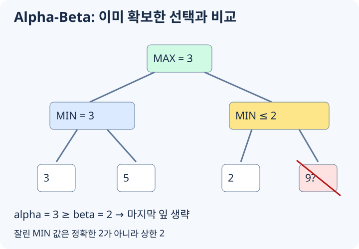

# Minimax와 Alpha-Beta Pruning

두 사람이 번갈아 수를 두고, 한쪽의 이득이 다른 쪽의 손해인 게임을 생각합니다. 점수는 항상 첫 번째 플레이어 관점으로 표시합니다. 그 플레이어의 차례에는 자식 값의 최댓값을, 상대 차례에는 최솟값을 고릅니다.

## 상대의 선택까지 계산하기

아래 트리에서 위쪽 플레이어는 점수를 최대화하고, 다음 수를 두는 상대는 최소화합니다.

```text
                  MAX
                /     \
              MIN     MIN
             /   \   /   \
            3     5 2     9
```

왼쪽으로 가면 상대는 3을, 오른쪽으로 가면 2를 고릅니다. 따라서 루트에서는 왼쪽을 골라 3을 얻습니다. 잎의 최대 점수 9만 보고 오른쪽을 고르면 상대가 그 수를 골라 주리라고 가정한 셈입니다.

## 마지막 9를 읽지 않아도 되는 이유



[그림 크게 보기](https://blog.readiz.com/h-contest-lesson/lessons/minimax-alpha-beta/lesson-assets/concept-trace.svg)

왼쪽 가지를 먼저 계산하면 MAX는 이미 3을 확보할 수 있습니다. 이 하한이 `alpha = 3`입니다.

오른쪽 MIN에서 첫 잎 2를 읽는 순간 그 가지의 값은 **최대 2**라는 것을 압니다. 남은 잎이 9든 100이든 MIN은 2를 고를 수 있고, 더 작으면 그 값을 고릅니다. 루트의 MAX가 이 가지로 바꿀 이유가 없으므로 나머지 잎은 보지 않아도 됩니다.

`beta`는 MIN이 확보한 상한입니다. 탐색 중 `alpha >= beta`가 되면 이와 같은 이유로 남은 자식을 생략합니다. 오른쪽 가지를 먼저 보면 아직 확보한 3이 없어 마지막 잎까지 읽어야 합니다. 그래서 이전 탐색에서 좋았던 수를 먼저 보는 순서가 탐색량에 영향을 줍니다.

가지치기는 같은 깊이의 Minimax 결과를 유지합니다. 분기 수 `b`, 깊이 `d`에서 최악의 탐색량은 여전히 `O(b^d)`입니다.

## 게임을 끝까지 볼 수 없을 때

깊이 제한에 도달한 미종료 상태는 평가 함수로 점수를 추정합니다. 종료 상태라면 추정값 대신 실제 승패나 점수를 반환합니다. 턴이 바뀌어도 점수의 관점은 바꾸지 않습니다.

이때 탐색 결과는 제한 깊이와 평가 함수에 대한 결과입니다. Alpha-Beta가 정확하게 계산해도 평가 함수의 오차까지 없애 주지는 않습니다. 상태를 직접 바꾸어 자식을 탐색했다면 다음 형제로 넘어가기 전에 수를 되돌려야 합니다.

## 잘린 가지를 캐시에 넣을 때

위 오른쪽 가지를 2에서 잘랐다면 정확한 값은 아직 모릅니다. 나머지 잎이 1일 수도 있으므로 저장할 정보는 “값이 2 이하”라는 **상한**입니다. 이를 정확한 점수 2로 재사용하면 다른 탐색 구간에서 잘못된 선택을 할 수 있습니다.

같은 상태를 재사용하는 transposition table에는 상태와 남은 깊이뿐 아니라 값이 정확한 결과인지, 하한인지, 상한인지도 저장합니다.

## 로컬 연습: 작은 게임 트리의 값과 가지치기

깊이 D의 완전 이진 게임 트리에서 root는 MAX, 다음 층은 MIN으로 번갈아 선택합니다. 왼쪽 자식을 먼저 방문하며 root 값을 구하세요.

**입력:** D 뒤 왼쪽부터 나열한 2^D개 leaf 점수. 0 <= D <= 16, |점수| <= 10^9입니다.

**출력:** root의 minimax 값을 출력합니다.

### 예시

```text exercise=minimax-alpha-beta role=input
2
3 5 2 9
```

```text exercise=minimax-alpha-beta role=output
3
```

**확인 방법:** 전체 minimax는 max(min(3,5),min(2,9))=3입니다. Alpha-Beta는 왼쪽 결과 3을 얻은 뒤 오른쪽의 첫 leaf 2에서 나머지 9를 생략할 수 있습니다. 모든 leaf를 보는 기준 풀이와 값을 비교하고, 방문 leaf 수는 이 예시에서 4와 3인지 확인합니다. D=0과 모든 점수가 음수인 경우도 검사합니다.
