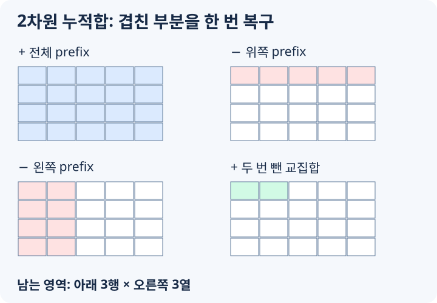

# 누적합과 차분 배열

누적합은 배열의 앞에서부터 합을 미리 저장해 두고, 구간 합을 빠르게 꺼내는 기법입니다. 차분 배열은 반대로 여러 구간에 값을 더하는 작업을 표시만 해 두었다가 마지막에 한 번에 실제 값을 복원하는 기법입니다.

두 기법은 모두 "구간을 매번 직접 훑지 않는다"는 생각에서 출발합니다.

```text
구간 합을 많이 물어본다 -> 누적합
구간 업데이트를 많이 한 뒤 최종 배열만 필요하다 -> 차분 배열
격자 직사각형 합을 많이 물어본다 -> 2차원 누적합
격자 직사각형 업데이트를 많이 모은다 -> 2차원 차분 배열
```

Fenwick Tree나 Segment Tree보다 단순하지만, 업데이트와 질의가 섞이지 않는 문제에서는 더 빠르고 구현도 짧습니다.

## 1차원 누적합

배열 `a`가 있을 때 `prefix[i]`를 `a[0]`부터 `a[i - 1]`까지의 합으로 정의합니다. 즉 `prefix[0] = 0`이고, `prefix`의 길이는 `n + 1`입니다.

```text
a:       3   1   4   1   5
prefix:  0   3   4   8   9   14
index:   0   1   2   3   4    5
```

이렇게 잡으면 0-indexed 구간 `[l, r]`의 합은 아래처럼 구합니다.

```text
sum(l, r) = prefix[r + 1] - prefix[l]
```

예를 들어 `a[1] + a[2] + a[3] = 1 + 4 + 1 = 6`입니다.

```text
prefix[4] - prefix[1] = 9 - 3 = 6
```

## 구현

`prefix[i]`에는 앞의 `i`개 원소 합을 저장합니다. `prefix[0] = 0`을 두면 `l = 0`인 구간도 같은 식으로 계산할 수 있습니다.

```cpp
#include <tuple>
#include <vector>
using namespace std;

vector<long long> buildPrefix(const vector<int>& a) {
    int n = (int)a.size();
    vector<long long> prefix(n + 1, 0);

    for (int i = 0; i < n; ++i) {
        prefix[i + 1] = prefix[i] + a[i];
    }
    return prefix;
}

long long rangeSum(const vector<long long>& prefix, int l, int r) {
    return prefix[r + 1] - prefix[l];
}
```

구간은 0부터 시작하는 양 끝 포함 `[l, r]`입니다. 입력이 1부터 시작하면 두 끝에서 1을 뺍니다. 빈 구간을 허용하는 호출부에서는 `l > r`일 때 0을 반환하도록 처리합니다.

누적합을 한 번 만드는 데 `O(n)`, 이후 구간 하나는 `O(1)`이므로 질의 `q`개의 총비용은 `O(n + q)`입니다.

## 차분 배열

차분 배열은 인접한 값의 차이를 저장합니다.

```text
a:    3   1   4   1   5
diff: 3  -2   3  -3   4
```

`diff[0] = a[0]`이고, `diff[i] = a[i] - a[i - 1]`입니다. 이 차분 배열의 누적합을 다시 구하면 원래 배열이 복원됩니다.

```text
3
3 + (-2) = 1
1 + 3 = 4
4 + (-3) = 1
1 + 4 = 5
```

차분 배열의 장점은 구간에 값을 더할 때 나타납니다.

```text
a[l]부터 a[r]까지 x를 더하고 싶다.
```

이 작업은 차분 배열에서 두 곳만 바꾸면 됩니다.

```text
diff[l] += x
diff[r + 1] -= x
```

`l`부터 값이 x만큼 올라가고, `r + 1`부터 다시 x만큼 내려가도록 표시하는 것입니다.

## 구간 업데이트를 모아서 적용하기

`diff`에 업데이트만 모은 뒤 누적해서 원래 배열에 더합니다. 처음부터 0인 배열도 같은 코드에 넣을 수 있습니다.

```cpp
vector<long long> addRangesToArray(
    const vector<long long>& a,
    const vector<tuple<int, int, long long>>& queries
) {
    int n = (int)a.size();
    vector<long long> diff(n + 1, 0);

    for (auto [l, r, value] : queries) {
        diff[l] += value;
        diff[r + 1] -= value;
    }

    vector<long long> result(n);
    long long extra = 0;
    for (int i = 0; i < n; ++i) {
        extra += diff[i];
        result[i] = a[i] + extra;
    }
    return result;
}
```

업데이트 `q`개를 기록하고 최종 배열을 복원하는 데 `O(q + n)`이 듭니다. 중간 상태의 구간 합을 묻는 질의가 섞이면 이 방식만으로는 처리할 수 없습니다.

시간 구간을 `[start, end)`로 표현한다면 종료 표시는 `end + 1`이 아니라 `end`에 둡니다. 모든 업데이트가 끝난 뒤 합 질의만 남는다면 복원한 배열의 누적합을 만들면 됩니다.

## 2차원 누적합

격자에서 직사각형 합을 많이 물어보면 2차원 누적합을 씁니다.

`prefix[y][x]`를 왼쪽 위부터 `(y - 1, x - 1)`까지의 직사각형 합으로 정의합니다. 모든 행의 길이가 같은 직사각형 격자를 받으며, 배열 크기는 `(h + 1) x (w + 1)`로 둡니다.

```cpp
vector<vector<long long>> buildPrefix2D(const vector<vector<int>>& grid) {
    int h = (int)grid.size();
    int w = h == 0 ? 0 : (int)grid[0].size();
    vector<vector<long long>> prefix(h + 1, vector<long long>(w + 1, 0));

    for (int y = 0; y < h; ++y) {
        for (int x = 0; x < w; ++x) {
            prefix[y + 1][x + 1] =
                prefix[y][x + 1]
                + prefix[y + 1][x]
                - prefix[y][x]
                + grid[y][x];
        }
    }
    return prefix;
}
```

`prefix[y][x]`가 두 번 더해지는 영역을 한 번 빼는 것이 핵심입니다.

## 2차원 직사각형 합



[그림 크게 보기](lesson-assets/concept-trace.svg)

위쪽 행 `y1`, 아래쪽 행 `y2`, 왼쪽 열 `x1`, 오른쪽 열 `x2`가 모두 0-indexed이고 양 끝 포함이라고 하겠습니다.

```cpp
long long rectSum(
    const vector<vector<long long>>& prefix,
    int y1,
    int x1,
    int y2,
    int x2
) {
    return prefix[y2 + 1][x2 + 1]
        - prefix[y1][x2 + 1]
        - prefix[y2 + 1][x1]
        + prefix[y1][x1];
}
```

그림으로 생각하면 큰 직사각형에서 위쪽과 왼쪽을 빼고, 두 번 빠진 왼쪽 위를 다시 더합니다.

```text
answer = 전체 - 위쪽 - 왼쪽 + 왼쪽 위 중복 영역
```

2차원 누적합도 질의는 `O(1)`입니다. 전처리는 `O(hw)`입니다.

## 2차원 차분 배열

여러 직사각형에 값을 더한 뒤 최종 격자만 필요할 때 씁니다. `(y1, x1)`에서 증가를 시작하고, 아래쪽과 오른쪽 경계 다음 칸에서 각각 취소합니다. 두 번 취소된 오른쪽 아래 영역은 한 번 더해 복구합니다.

```cpp
#include <tuple>
#include <vector>
using namespace std;

vector<vector<long long>> applyRectAdds(
    int h,
    int w,
    const vector<tuple<int, int, int, int, long long>>& queries
) {
    vector<vector<long long>> diff(h + 1, vector<long long>(w + 1, 0));

    for (auto [y1, x1, y2, x2, value] : queries) {
        diff[y1][x1] += value;
        diff[y2 + 1][x1] -= value;
        diff[y1][x2 + 1] -= value;
        diff[y2 + 1][x2 + 1] += value;
    }

    vector<vector<long long>> result(h, vector<long long>(w, 0));
    for (int y = 0; y < h; ++y) {
        for (int x = 0; x < w; ++x) {
            long long value = diff[y][x];
            if (y > 0) value += result[y - 1][x];
            if (x > 0) value += result[y][x - 1];
            if (y > 0 && x > 0) value -= result[y - 1][x - 1];
            result[y][x] = value;
        }
    }
    return result;
}
```

`diff`를 `(h + 1) × (w + 1)`로 만들면 `y2 + 1 == h`나 `x2 + 1 == w`인 표시도 안전합니다. 최종 결과는 `h × w`만 사용합니다.
