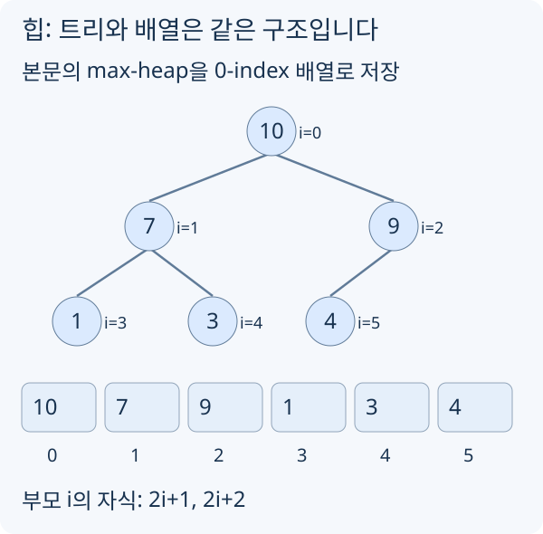

# 우선순위 큐와 힙

우선순위 큐는 "지금 가장 우선순위가 높은 원소"를 빠르게 꺼내는 자료구조입니다. 일반 큐는 먼저 들어온 원소가 먼저 나오지만, 우선순위 큐는 값이나 조건에 따라 먼저 나올 원소가 정해집니다.

```text
가장 작은 비용의 작업을 먼저 처리한다.
마감이 급한 일을 먼저 꺼낸다.
현재까지 본 값 중 가장 큰 K개만 유지한다.
Dijkstra에서 가장 짧은 후보 정점을 먼저 확정한다.
```

이 레슨은 배열로 구현한 공통 최소 힙을 사용합니다. 최대 힙과 최소 힙은 부모·자식 사이에서 어떤 값이 먼저 나와야 하는지만 다릅니다.

## 후보가 계속 들어올 때

모든 후보가 처음부터 주어지고 순서대로 꺼내기만 한다면 한 번 정렬하면 됩니다. 후보가 계속 추가되면서 매번 최솟값이나 최댓값을 꺼내야 할 때 힙을 씁니다.

## 힙의 핵심 아이디어



[그림 크게 보기](https://blog.readiz.com/h-contest-lesson/lessons/priority-queue-heap/lesson-assets/structure-trace.svg)

배열은 정렬된 순서가 아니라 트리를 위에서 아래로, 같은 층에서는 왼쪽부터 읽은 순서입니다. 부모와 자식 사이의 우선순위만 보장합니다.

우선순위 큐는 보통 binary heap으로 구현합니다. 힙은 완전 이진 트리 모양을 배열에 담고, 부모가 자식보다 우선순위가 높다는 조건을 유지합니다.

max-heap에서는 부모가 자식보다 크거나 같습니다.

```text
        10
      /    \
     7      9
    / \    /
   1   3  4
```

루트에는 항상 최댓값이 있습니다. 그래서 최댓값 조회는 `O(1)`입니다. 삽입과 삭제는 트리 높이만큼 위아래로 이동하므로 `O(log n)`입니다.

배열로 저장할 때 0-indexed 기준으로 관계는 아래와 같습니다.

```text
parent(i) = (i - 1) / 2
left(i) = 2 * i + 1
right(i) = 2 * i + 2
```

배열로 작성한 전체 구현은 [공통 라이브러리의 최소 힙](https://h.readiz.com/learn/cpp-common-library)에 있습니다. 이 구현은 위 그림과 달리 1-index 배열을 써서 부모가 `i / 2`, 자식이 `2 * i`, `2 * i + 1`입니다. 삽입은 부모와 비교하며 올리고, 루트 삭제는 마지막 원소를 루트에 옮긴 뒤 두 자식 중 더 작은 쪽과 비교하며 내립니다. 같은 key는 ID 오름차순으로 처리합니다.

## 상위 K개 유지

`0 <= K <= 원소 수`에서 가장 큰 K개만 유지하려면 min-heap을 씁니다. heap 안에는 현재 선택된 K개가 들어 있고, 그중 가장 작은 값이 top입니다.

공통 `min-heap` 블록을 붙인 뒤 아래 함수를 사용합니다. `values`와 `result`는 각각 `n`칸 이상이며 `0 <= n <= 200000`, `0 <= k <= n`, `|values[i]| <= 10^9`입니다. `result[i]`에 도착한 값 `i+1`개 중 상위 `min(k, i+1)`개 합을 기록합니다. 빈 입력이면 기록하지 않습니다.

> **코드 환경: STL 없는 C++17 예제.** [공통 라이브러리](https://h.readiz.com/learn/cpp-common-library)의 필요한 블록을 앞에 붙입니다. 표준 헤더·STL·동적 할당을 사용하지 않으며, 실제 제출에서는 문제의 공개 API와 배열 상한을 맞춥니다.

```cpp
const int MAX_TOP_K = 200000;
hc::MinHeap<MAX_TOP_K> topKHeap;

bool topKSums(const int values[], int n, int k, long long result[]) {
    if (n < 0 || n > MAX_TOP_K || k < 0 || k > n) return false;
    topKHeap.clear();
    long long sum = 0;

    for (int i = 0; i < n; ++i) {
        if (!topKHeap.push(values[i], i)) return false;
        sum += values[i];
        if (topKHeap.size > k) {
            hc::HeapItem removed;
            topKHeap.pop(removed);
            sum -= removed.key;
        }
        result[i] = sum;
    }
    return true;
}
```

새 값이 들어올 때마다 일단 넣고, K개를 넘으면 가장 작은 값을 버립니다. 그러면 남은 값들은 가장 큰 K개입니다.

한 번 넣은 직후에는 최대 `min(k + 1, n)`개가 있으므로 힙 용량을 `MAX_TOP_K`로 잡았습니다. `k = 0`이면 매번 넣은 값을 바로 버려 모든 합이 0입니다. 입력 계약 안에서는 true를 반환하며, 호출할 때마다 힙과 합을 초기화합니다.

반대로 가장 작은 K개만 유지하려면 max-heap을 쓰고, K개를 넘으면 가장 큰 값을 버립니다.

## 이미 낡은 후보를 꺼냈을 때

배열의 거리나 우선순위를 바꾸어도 힙 안에 복사해 둔 값은 자동으로 바뀌지 않습니다. 수정할 원소를 찾아 지우는 대신 새 후보를 넣고, 옛 후보는 꺼냈을 때 걸러 낼 수 있습니다.

[Dijkstra](https://h.readiz.com/learn/dijkstra)에서 정점 5까지의 거리 후보 20을 넣은 뒤 더 짧은 거리 12를 찾았다고 합시다. 힙에는 `(12, 5)`와 `(20, 5)`가 모두 있지만, `dist[5]`는 12입니다. 나중에 20을 꺼냈을 때 저장된 최단거리와 다르므로 버립니다.

같은 우선순위의 서로 다른 항목을 구분해야 하면 id를, 같은 항목의 여러 갱신을 구분해야 하면 버전을 함께 저장합니다. 무효 후보를 제거한 뒤 힙이 비었을 수도 있으므로 다시 확인합니다.

## 시간 복잡도

| 작업 | 시간 |
| --- | --- |
| 최댓값/최솟값 조회 | `O(1)` |
| 삽입 | `O(log n)` |
| top 제거 | `O(log n)` |
| 전체 n개 heapify | `O(n)` |
| n개를 모두 push 후 pop | `O(n log n)` |

이 표의 heapify는 힙 전체를 한 번에 만드는 일반 알고리즘의 비용입니다. 공통 최소 힙은 `clear`, `top`, `push`, `pop`을 제공하며, n개를 push해서 만드는 데는 `O(n log n)`이 듭니다. 임의 원소 검색·중간 삭제가 핵심이면 인덱스를 따로 관리하는 힙이나 [Treap](https://h.readiz.com/learn/treap) 같은 탐색 트리를 검토합니다.

## 로컬 연습: 스트림에서 가장 큰 K개 합

정수가 하나씩 들어올 때 지금까지 들어온 값 중 가장 큰 min(K,현재 개수)개의 합을 출력하세요. 같은 값도 서로 다른 원소이며 음수라고 임의로 버리지 않습니다.

**입력:** N K와 도착 순서의 N개 값. 1 <= N <= 200000, 0 <= K <= N, |값| <= 10^9입니다.

**출력:** 매 도착 직후의 합을 N줄 출력합니다.

### 예시

```text exercise=priority-queue-heap role=input
6 3
5 1 9 2 9 -3
```

```text exercise=priority-queue-heap role=output
5
6
15
16
23
23
```

**확인 방법:** K개를 유지하는 최소 힙에서 가장 작은 값을 교체합니다. 작은 입력은 매 prefix를 정렬한 합과 비교합니다. K=0, K=N, 음수만 있는 입력과 중복 최댓값을 검사합니다.
