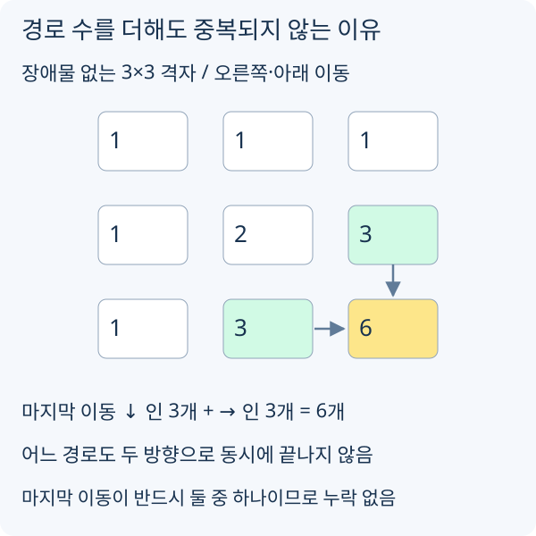

# Proof와 Invariant

이분 탐색에서 절반을 버리거나 그리디에서 선택을 확정하려면, 그 과정에서 답을 잃지 않는 이유가 필요합니다. 테스트는 틀린 입력을 찾고, 증명은 아직 돌려 보지 않은 입력에도 같은 선택이 성립하는지 설명합니다.

## 후보를 버려도 답이 남는가

[최소 처리 시간 이분 탐색](https://h.readiz.com/learn/binary-search)에서 `canMake(t)`는 시간 `t` 동안 목표 수량을 만들 수 있는지 판정합니다. 시간이 늘면 각 기계가 생산하는 수량은 줄지 않으므로 결과는 불가능에서 가능으로 한 번만 바뀝니다.

반복 중 지킬 조건은 “최소 가능한 시간이 `[left, right]` 안에 있다”입니다. 가능한 `right`로 시작한 뒤 다음 두 경우를 봅니다.

- `mid`가 가능하면 더 작은 답이 있을 수 있지만 `mid`보다 큰 값은 최소 답일 필요가 없습니다. `right = mid`로 줄입니다.
- `mid`가 불가능하면 단조성에 의해 그 이하도 불가능합니다. `left = mid + 1`로 줄입니다.

두 갱신 모두 답을 남기면서 구간 길이를 줄입니다. 끝에 `left == right`이면 남은 한 값이 답입니다. 단조성만 말하고 초기 범위가 답을 포함하는지 설명하지 않으면 증명이 완성되지 않습니다.

## 선택을 바꿔도 최적해가 남는가

[회의실 배정](https://h.readiz.com/learn/greedy)에서 종료가 가장 빠른 회의를 `g`, 어떤 최적해의 첫 회의를 `o`라고 합시다. `g`는 `o`보다 늦게 끝나지 않으므로 `o`를 `g`로 바꿔도 뒤 회의와 겹치지 않고 선택 개수도 같습니다.

따라서 `g`로 시작하는 최적해가 하나는 있습니다. 남은 회의에도 같은 논리를 반복할 수 있습니다. 단, 보상 합을 최대화하는 문제라면 개수가 같다는 사실만으로 점수 보존을 보일 수 없습니다. 목표 함수가 바뀌면 이 교환 논리도 다시 확인해야 합니다.

## DP의 덧셈이 같은 경로를 두 번 세는가

[격자 경로 DP](https://h.readiz.com/learn/dynamic-programming)는 위에서 내려오는 경로 수와 왼쪽에서 들어오는 경로 수를 더합니다. 모든 경로는 두 방향 중 하나로 마지막 이동을 하므로 빠진 경로가 없습니다. 마지막 이동 방향이 달라 두 집합은 겹치지 않으므로 중복도 없습니다.

출발점의 1과 장애물의 0이 올바르고, 위·왼쪽 칸이 먼저 계산되면 이 전이를 칸마다 적용할 수 있습니다. 경우의 수 DP에서 “이전 답을 더한다”는 설명만으로 부족한 이유가 이 중복 여부에 있습니다.

[그림 크게 보기](https://blog.readiz.com/h-contest-lesson/lessons/proof-and-invariants/lesson-assets/disjoint-paths.svg)

각 칸의 숫자는 좌상단에서 그 칸까지의 경로 수입니다. 도착 직전 칸으로 집합을 나누면 서로 겹치지 않는다는 점이 보입니다. 반대로 단지 “특정 칸을 지나는가”로 둘을 골라 더하면 한 경로가 두 칸을 모두 지나 중복될 수 있습니다.
