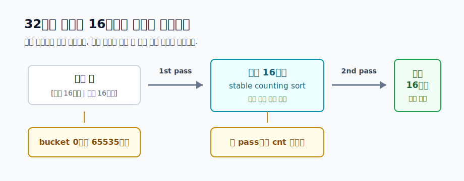

# 정렬 알고리즘

정렬은 원소를 어떤 기준에 맞게 줄 세우는 알고리즘입니다. 하지만 문제 풀이에서 정렬의 역할은 단순히 보기 좋게 나열하는 데서 끝나지 않습니다. 정렬은 흩어진 정보를 **한 번 훑을 수 있는 순서**로 바꾸는 전처리입니다.

예를 들어 마감이 빠른 요청부터 보고 싶다면 마감 시간으로 정렬합니다. 같은 값을 한곳에 모으고 싶다면 값으로 정렬합니다. 구간 문제에서 끝나는 시간이 빠른 순서로 보려면 종료 시각으로 정렬합니다. 정렬을 잘 쓰면 복잡한 선택 문제가 단순한 순회 문제로 바뀝니다.

이 자료는 정렬 기준을 세우는 법에서 시작해, 안정 정렬과 정수 전용 정렬까지 이어집니다. 마지막에는 `SORTTEST` 문제 해설과 연결되는 16비트 radix sort를 봅니다.

## 1. 정렬 기준부터 정한다

정렬을 쓴다는 말은 "어떤 값을 먼저 볼 것인가"를 정한다는 뜻입니다. 그래서 코드를 쓰기 전에 기준을 문장으로 먼저 말할 수 있어야 합니다.

```text
값이 작은 순서
끝나는 시간이 빠른 순서
마감 시간이 빠른 순서, 같으면 시작 시간이 빠른 순서
팀 크기가 큰 순서, 같으면 대표 번호가 작은 순서
```

기준이 하나만 있으면 단순합니다. 하지만 실전 문제에서는 동률 처리까지 같이 정해야 하는 경우가 많습니다.

```cpp
struct Meeting {
    int start;
    int end;
};

bool cmp(Meeting a, Meeting b) {
    if (a.end != b.end) return a.end < b.end;
    return a.start < b.start;
}
```

비교 함수에서는 `<=`를 쓰면 안 됩니다. `a`와 `b`가 같을 때 `cmp(a, b)`와 `cmp(b, a)`가 둘 다 참이 되면 정렬 기준이 깨집니다. 보통 "앞에 와야 하면 true, 아니면 false"라고 생각하면 됩니다.

## 2. 정렬 후 한 번 훑기

정렬의 가장 흔한 사용법은 정렬한 뒤 왼쪽부터 오른쪽까지 한 번 훑는 것입니다.

```cpp
sort(a, a + n);

for (int i = 0; i < n; ++i) {
    // 지금까지 본 원소와 a[i]의 관계만 관리한다.
}
```

이 패턴이 강한 이유는 정렬 이후에는 "앞쪽은 이미 처리했다"는 사실을 믿을 수 있기 때문입니다.

예를 들어 배열에서 같은 값의 묶음을 세려면 값 기준으로 정렬합니다. 그러면 같은 값이 모두 연속해서 나오므로, 이전 값과 달라지는 지점만 보면 됩니다.

```cpp
sort(a, a + n);

int groupCount = 0;
for (int i = 0; i < n; ) {
    int j = i + 1;
    while (j < n && a[j] == a[i]) j++;
    groupCount++;
    i = j;
}
```

정렬 전에는 같은 값이 배열 곳곳에 흩어져 있을 수 있습니다. 정렬은 이 흩어진 관계를 연속 구간으로 바꾸어 줍니다.

## 3. 시간 복잡도 감각

정렬 알고리즘을 고를 때 가장 먼저 보는 것은 입력 크기입니다.

| 방식 | 대표 예시 | 시간 복잡도 | 쓰기 좋은 상황 |
| --- | --- | ---: | --- |
| 단순 비교 정렬 | 선택 정렬, 삽입 정렬 | `O(n^2)` | 입력이 작거나 구현 원리를 확인할 때 |
| 빠른 비교 정렬 | merge sort, heap sort, quick sort, `std::sort` | `O(n log n)` | 일반적인 정렬 문제 대부분 |
| 값 범위 활용 | counting sort | `O(n + K)` | 값의 범위 `K`가 작을 때 |
| 자릿수 활용 | radix sort | `O(pass * (n + K))` | 정수나 문자열처럼 자릿수로 나눌 수 있을 때 |

`O(n^2)` 정렬은 구현이 쉽지만 `n`이 커지면 급격히 느려집니다. 예를 들어 `n = 100000`이면 비교 횟수가 대략 100억 번까지 커질 수 있습니다. 작은 테스트에서는 맞아 보여도 큰 테스트에서 바로 막힙니다.

반대로 `O(n log n)` 정렬은 대부분의 일반 문제에서 충분히 빠릅니다. 하지만 `SORTTEST`처럼 `n`이 수백만이고 시간 제한이 강하면, 비교 기반 정렬보다 입력 값의 특성을 직접 쓰는 정렬이 필요할 수 있습니다.

## 4. 안정 정렬

안정 정렬은 정렬 기준이 같은 원소들의 상대 순서를 유지하는 정렬입니다.

```text
정렬 전: (2, A), (1, B), (2, C)
첫 값 기준 안정 정렬: (1, B), (2, A), (2, C)
```

첫 값이 같은 `(2, A)`와 `(2, C)`의 순서가 유지됩니다. 이 성질은 여러 기준을 차례대로 적용할 때 중요합니다.

예를 들어 두 기준 `(major, minor)`로 정렬하고 싶다고 합시다. 먼저 `minor`로 안정 정렬하고, 그다음 `major`로 안정 정렬하면 됩니다.

```text
1단계: minor 기준 안정 정렬
2단계: major 기준 안정 정렬
결과: major가 우선이고, major가 같으면 minor 순서
```

두 번째 정렬이 안정 정렬이기 때문에 같은 `major` 안에서 첫 번째 정렬이 만들어 둔 `minor` 순서가 보존됩니다.

## 5. Counting Sort

값의 범위가 작다면 비교를 하지 않고도 정렬할 수 있습니다. 값이 `0`부터 `K - 1`까지라면 각 값이 몇 번 나왔는지 세면 됩니다.

```cpp
int cnt[1000];

for (int i = 0; i < K; ++i) cnt[i] = 0;
for (int i = 0; i < n; ++i) cnt[a[i]]++;

int idx = 0;
for (int value = 0; value < K; ++value) {
    while (cnt[value] > 0) {
        a[idx++] = value;
        cnt[value]--;
    }
}
```

이 코드는 값 자체만 정렬할 때는 충분합니다. 하지만 원소에 다른 정보가 붙어 있고 안정성이 필요하다면 누적합을 써서 각 값이 들어갈 위치를 계산해야 합니다.

```cpp
for (int i = 1; i < K; ++i) {
    cnt[i] += cnt[i - 1];
}

for (int i = n - 1; i >= 0; --i) {
    int key = a[i];
    tmp[--cnt[key]] = a[i];
}
```

뒤에서 앞으로 배치하면 같은 key를 가진 원소의 원래 순서가 유지됩니다. 이 안정성이 radix sort의 핵심 재료가 됩니다.

## 6. Radix Sort

Radix sort는 값을 여러 조각으로 나누어 낮은 자리부터 안정 정렬하는 방식입니다.

10진수 세 자리 숫자를 생각해 봅시다. 먼저 1의 자리로 안정 정렬하고, 그다음 10의 자리로 안정 정렬하고, 마지막으로 100의 자리로 안정 정렬하면 전체 숫자가 정렬됩니다. 뒤의 pass가 안정 정렬이므로, 높은 자리가 같은 원소들 안에서는 낮은 자리 순서가 유지됩니다.

`SORTTEST` 문제의 값은 `unsigned int` 범위입니다. 32비트 정수이므로 16비트씩 둘로 나눌 수 있습니다.

```text
상위 16비트 | 하위 16비트
```

정렬 순서는 아래와 같습니다.

```text
1. 하위 16비트로 안정 counting sort
2. 상위 16비트로 안정 counting sort
```

bucket 개수는 `2^16 = 65536`개입니다. pass는 2번으로 고정되어 있으므로 전체 시간은 배열을 몇 번 훑는 정도입니다.

```cpp
const int B = 1 << 16;
unsigned int tmp[4000000];
int cnt[B];

void radix_sort_u32(int n, unsigned int values[]) {
    unsigned int* src = values;
    unsigned int* dst = tmp;

    for (int pass = 0; pass < 2; ++pass) {
        for (int i = 0; i < B; ++i) cnt[i] = 0;

        int shift = pass * 16;
        for (int i = 0; i < n; ++i) {
            int bucket = (int)((src[i] >> shift) & 0xffffU);
            cnt[bucket]++;
        }

        int pos = 0;
        for (int i = 0; i < B; ++i) {
            int next = pos + cnt[i];
            cnt[i] = pos;
            pos = next;
        }

        for (int i = 0; i < n; ++i) {
            int bucket = (int)((src[i] >> shift) & 0xffffU);
            dst[cnt[bucket]++] = src[i];
        }

        unsigned int* swapTmp = src;
        src = dst;
        dst = swapTmp;
    }
}
```

`SORTTEST` 해설의 핵심도 여기에 있습니다. 하위 16비트로 먼저 안정 정렬하고, 그 결과를 상위 16비트로 다시 안정 정렬합니다. 두 번째 pass에서 상위 16비트가 같은 값들은 이미 하위 16비트 순서로 정리되어 있으므로 전체 32비트 값이 오름차순이 됩니다.



## 7. 자주 하는 실수

정렬 문제에서 많이 나오는 실수는 아래와 같습니다.

- 비교 함수에서 `<=`를 써서 같은 원소 사이의 기준을 깨뜨린다.
- 동률 기준을 빠뜨려 결과 순서가 애매해진다.
- `O(n^2)` 정렬로 큰 입력을 처리하려고 한다.
- radix sort에서 안정 정렬이 아닌 pass를 사용한다.
- radix sort pass 순서를 높은 자리부터 시작한다.
- `cnt` 배열을 pass마다 초기화하지 않는다.
- `unsigned int` 값을 다루면서 부호 있는 정수처럼 비교하거나 shift한다.

특히 radix sort는 "bucket별로 모으기"만 맞으면 되는 것처럼 보이지만, 낮은 자리 정보를 보존하려면 각 pass가 안정적이어야 합니다.

## 8. 문제로 연결하기

정렬을 공부한 뒤에는 아래 흐름으로 문제를 보는 것이 좋습니다.

1. 무엇을 기준으로 먼저 볼지 정한다.
2. 같은 기준 안의 동률 처리를 정한다.
3. 정렬 후 한 번 훑으면 충분한지 확인한다.
4. 입력 크기를 보고 `O(n^2)`, `O(n log n)`, 값 범위 활용 중 무엇이 맞는지 고른다.
5. 여러 기준을 단계적으로 적용한다면 안정성이 필요한지 확인한다.

`SORTTEST`는 네 번째와 다섯 번째 질문을 강하게 묻는 문제입니다. 작은 입력은 단순 정렬로도 처리할 수 있지만, 큰 입력에서 만점을 받으려면 32비트 정수라는 조건을 이용해야 합니다. 값의 조각을 기준으로 안정 정렬을 반복하는 radix sort가 그 조건을 직접 활용하는 풀이입니다.
