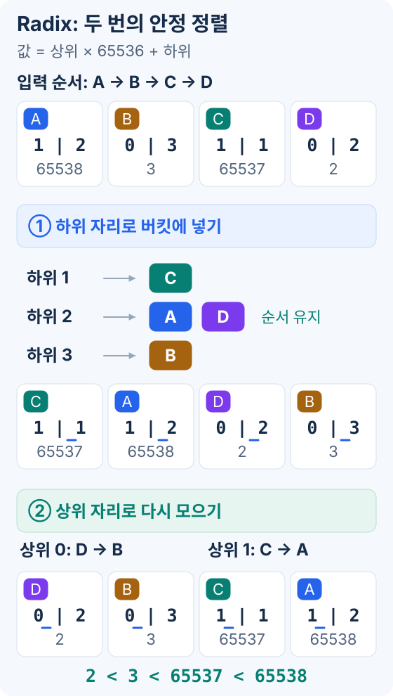

# 정렬 알고리즘

정렬은 원소를 어떤 기준에 맞게 줄 세우는 알고리즘입니다. 하지만 문제 풀이에서 정렬의 역할은 단순히 보기 좋게 나열하는 데서 끝나지 않습니다. 정렬은 흩어진 정보를 **한 번 훑을 수 있는 순서**로 바꾸는 전처리입니다.

예를 들어 마감이 빠른 요청부터 보고 싶다면 마감 시간으로 정렬합니다. 같은 값을 한곳에 모으고 싶다면 값으로 정렬합니다. 구간 문제에서 끝나는 시간이 빠른 순서로 보려면 종료 시각으로 정렬합니다. 정렬을 잘 쓰면 복잡한 선택 문제가 단순한 순회 문제로 바뀝니다.

## 정렬 기준부터 정한다

정렬을 쓴다는 말은 "어떤 값을 먼저 볼 것인가"를 정한다는 뜻입니다. 그래서 코드를 쓰기 전에 기준을 문장으로 먼저 말할 수 있어야 합니다.

```text
값이 작은 순서
끝나는 시간이 빠른 순서
마감 시간이 빠른 순서, 같으면 시작 시간이 빠른 순서
팀 크기가 큰 순서, 같으면 대표 번호가 작은 순서
```

기준이 하나만 있으면 단순합니다. 하지만 실전 문제에서는 동률 처리까지 같이 정해야 하는 경우가 많습니다.

비교 기준은 이 레슨에서 정하고, 정렬의 공통 구현은 별도 라이브러리의 `sort` 블록을 사용합니다. 아래 `a`와 `temp`는 서로 겹치지 않는 길이 `n` 이상의 배열이며 `0 <= n <= 1,000,000`입니다. 큰 배열은 전역으로 준비합니다.

> **코드 환경: STL 없는 C++17 예제.** [공통 라이브러리](https://h.readiz.com/learn/cpp-common-library)의 필요한 블록을 앞에 붙입니다. 표준 헤더·STL·동적 할당을 사용하지 않으며, 실제 제출에서는 문제의 공개 API와 배열 상한을 맞춥니다.

```cpp
struct Meeting {
    int start;
    int end;
};

bool meetingBefore(const Meeting& a, const Meeting& b) {
    if (a.end != b.end) return a.end < b.end;
    return a.start < b.start;
}

void sortMeetings(Meeting a[], Meeting temp[], int n) {
    hc::stableSort(a, temp, n, meetingBefore);
}
```

비교 함수에서는 `<=`를 쓰면 안 됩니다. `a`와 `b`가 같을 때 `meetingBefore(a, b)`와 `meetingBefore(b, a)`가 둘 다 참이 되면 정렬 기준이 깨집니다. 보통 "앞에 와야 하면 true, 아니면 false"라고 생각하면 됩니다.

`const Meeting&`로 받으면 비교할 때마다 구조체를 복사하지 않고, 함수 안에서 원소를 수정할 수도 없습니다.

## 정렬 후 한 번 훑기

예를 들어 배열에서 같은 값의 묶음을 세려면 값 기준으로 정렬합니다. 그러면 같은 값이 모두 연속해서 나오므로, 이전 값과 달라지는 지점만 보면 됩니다.

```cpp
bool intBefore(int a, int b) { return a < b; }

int countGroups(int a[], int temp[], int n) {
    hc::stableSort(a, temp, n, intBefore);
    int groupCount = 0;
    for (int i = 0; i < n; ) {
        int j = i + 1;
        while (j < n && a[j] == a[i]) ++j;
        ++groupCount;
        i = j;
    }
    return groupCount;
}
```

정렬 전에는 같은 값이 배열 곳곳에 흩어져 있을 수 있습니다. 정렬은 이 흩어진 관계를 연속 구간으로 바꾸어 줍니다.

정렬은 다른 기법의 전처리로도 자주 이어집니다. 값의 순서만 필요하면 좌표 압축으로 큰 값을 작은 인덱스로 바꾸고, 구간의 시작/끝 이벤트를 정렬하면 스위프 라인으로 한 번 훑을 수 있습니다.

## 시간 복잡도 감각

정렬 알고리즘을 고를 때 가장 먼저 보는 것은 입력 크기입니다.

| 방식 | 대표 예시 | 시간 복잡도 | 쓰기 좋은 상황 |
| --- | --- | ---: | --- |
| 단순 비교 정렬 | 선택 정렬, 삽입 정렬 | `O(n^2)` | 입력이 작거나 구현 원리를 확인할 때 |
| 빠른 비교 정렬 | merge sort, heap sort | `O(n log n)` | 일반적인 정렬 문제 대부분 |
| 값 범위 활용 | counting sort | `O(n + K)` | 값의 범위 `K`가 작을 때 |
| 자릿수 활용 | radix sort | `O(pass * (n + K))` | 정수나 문자열처럼 자릿수로 나눌 수 있을 때 |

일반적인 quick sort는 평균 `O(n log n)`이지만 최악에는 `O(n²)`입니다.

`O(n^2)` 정렬은 구현이 쉽지만 `n`이 커지면 급격히 느려집니다. 예를 들어 `n = 100000`이면 비교 횟수가 대략 100억 번까지 커질 수 있습니다. 작은 테스트에서는 맞아 보여도 큰 테스트에서 바로 막힙니다.

반대로 `O(n log n)` 정렬은 대부분의 일반 문제에서 충분히 빠릅니다. 하지만 `SORTTEST`처럼 `n`이 수백만이고 시간 제한이 강하면, 비교 기반 정렬보다 입력 값의 특성을 직접 쓰는 정렬이 필요할 수 있습니다.

## 안정 정렬

안정 정렬은 정렬 기준이 같은 원소들의 상대 순서를 유지하는 정렬입니다.

```text
정렬 전: (2, A), (1, B), (2, C)
첫 값 기준 안정 정렬: (1, B), (2, A), (2, C)
```

첫 값이 같은 `(2, A)`와 `(2, C)`의 순서가 유지됩니다. 이 성질은 여러 기준을 차례대로 적용할 때 중요합니다.

예를 들어 두 기준 `(major, minor)`로 정렬하고 싶다고 합시다. 먼저 `minor`로 안정 정렬하고, 그다음 `major`로 안정 정렬하면 됩니다.

```text
1단계: minor 기준 안정 정렬
2단계: major 기준 안정 정렬
결과: major가 우선이고, major가 같으면 minor 순서
```

두 번째 정렬이 안정 정렬이기 때문에 같은 `major` 안에서 첫 번째 정렬이 만들어 둔 `minor` 순서가 보존됩니다.

공통 `stableSort`는 이 동률 순서를 보존합니다. 반면 `sortIds`는 키가 같을 때 ID 오름차순을 추가 기준으로 사용합니다. 여러 기준을 차례로 정렬하는 예제에는 `stableSort`와 해당 기준만 비교하는 함수를 사용합니다.

## Counting Sort

값의 범위가 작다면 비교를 하지 않고도 정렬할 수 있습니다. 값이 `0`부터 `K - 1`까지라면 각 값이 몇 번 나왔는지 세면 됩니다.

아래 두 구현은 `0 <= n <= 1,000,000`, `1 <= k <= 1000`, 모든 키가 `0..k-1`인 조건을 사용합니다. 입력 배열은 `n`칸 이상이어야 합니다.

```cpp
void countingSort(int a[], int n, int k) {
    int count[1000];
    for (int i = 0; i < k; ++i) count[i] = 0;
    for (int i = 0; i < n; ++i) ++count[a[i]];
    int pos = 0;
    for (int value = 0; value < k; ++value) {
        while (count[value] > 0) {
            a[pos++] = value;
            --count[value];
        }
    }
}
```

이 코드는 값 자체만 정렬할 때는 충분합니다. 하지만 원소에 다른 정보가 붙어 있고 안정성이 필요하다면 누적합을 써서 각 값이 들어갈 위치를 계산해야 합니다.

값 대신 원래 ID를 옮기면 같은 키 안에서 순서가 보존되는지 확인할 수 있습니다. 다음 함수의 `id`는 `0..n-1`의 순열이고, `key`는 원본 키 배열입니다. `temp`는 길이 `n` 이상의 별도 배열로 `key`, `id`와 겹치지 않습니다. 각 함수는 빈도 배열을 직접 초기화합니다.

```cpp
void countingSortIds(const int key[], int id[], int temp[], int n, int k) {
    int count[1000];
    for (int i = 0; i < k; ++i) count[i] = 0;
    for (int i = 0; i < n; ++i) ++count[key[id[i]]];
    for (int i = 1; i < k; ++i) count[i] += count[i - 1];
    for (int i = n - 1; i >= 0; --i) {
        int value = key[id[i]];
        temp[--count[value]] = id[i];
    }
    for (int i = 0; i < n; ++i) id[i] = temp[i];
}
```

뒤에서 앞으로 배치하면 같은 key를 가진 원소의 현재 ID 순서가 유지됩니다. `key = [2, 1, 2]`, `id = [2, 0, 1]`이면 결과는 `[1, 2, 0]`입니다. ID 오름차순으로 바꾸지 않는다는 점을 확인하세요. 이 안정성이 radix sort의 핵심 재료가 됩니다.

## Radix Sort

Radix sort는 값을 여러 조각으로 나누어 낮은 자리부터 안정 정렬하는 방식입니다.

10진수 세 자리 숫자를 생각해 봅시다. 먼저 1의 자리로 안정 정렬하고, 그다음 10의 자리로 안정 정렬하고, 마지막으로 100의 자리로 안정 정렬하면 전체 숫자가 정렬됩니다. 뒤의 pass가 안정 정렬이므로, 높은 자리가 같은 원소들 안에서는 낮은 자리 순서가 유지됩니다.

[정수 정렬 함수](/practice/SORTTEST)의 값은 `unsigned int` 범위입니다. 32비트 정수이므로 16비트씩 둘로 나눌 수 있습니다.

```text
상위 16비트 | 하위 16비트
```

정렬 순서는 아래와 같습니다.

```text
1. 하위 16비트로 안정 counting sort
2. 상위 16비트로 안정 counting sort
```

bucket 개수는 `2^16 = 65536`개입니다. pass는 2번으로 고정되어 있으므로 전체 시간은 배열을 몇 번 훑는 정도입니다.

```cpp
const int B = 1 << 16;
unsigned int tmp[4000000];
int cnt[B];

void radix_sort_u32(int n, unsigned int values[]) {
    unsigned int* src = values;
    unsigned int* dst = tmp;

    for (int pass = 0; pass < 2; ++pass) {
        for (int i = 0; i < B; ++i) cnt[i] = 0;

        int shift = pass * 16;
        for (int i = 0; i < n; ++i) {
            int bucket = (int)((src[i] >> shift) & 0xffffU);
            cnt[bucket]++;
        }

        int pos = 0;
        for (int i = 0; i < B; ++i) {
            int next = pos + cnt[i];
            cnt[i] = pos;
            pos = next;
        }

        for (int i = 0; i < n; ++i) {
            int bucket = (int)((src[i] >> shift) & 0xffffU);
            dst[cnt[bucket]++] = src[i];
        }

        unsigned int* swapTmp = src;
        src = dst;
        dst = swapTmp;
    }
}
```



그림의 각 카드는 `상위 16비트 | 하위 16비트`와 원래 정수를 함께 표시합니다. 첫 pass의 하위 자리 2 버킷은 A 다음 D라는 입력 순서를 보존합니다. 두 번째 pass에서는 상위 자리가 같은 D·B, C·A의 순서가 유지되어, 앞서 만든 하위 자리 순서까지 정렬 결과에 남습니다.

입력은 `0 <= n <= 4,000,000`이며 `values`와 전역 버퍼 `tmp`는 겹치지 않아야 합니다. 두 pass가 끝나면 결과는 원래 `values`에 있습니다. 각 pass 전에 `cnt`를 0으로 초기화합니다. 이 구현은 `unsigned int`의 32비트 패턴을 다루므로, 중간에 부호 있는 타입으로 바꾸면 shift와 정렬 순서가 달라질 수 있습니다.
