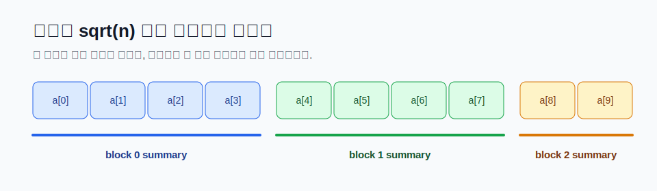
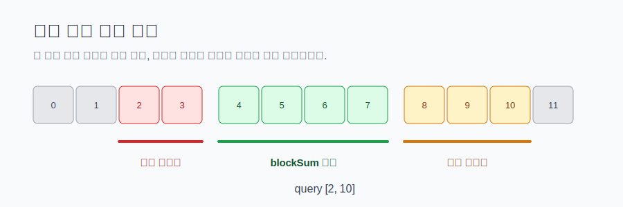

# Sqrt Decomposition

Sqrt Decomposition은 긴 배열을 길이 약 `sqrt(n)`인 블록들로 나누고, 각 블록에 미리 계산한 값을 저장해 질의를 빠르게 처리하는 방법입니다. 한국어로는 보통 **제곱근 분할**이라고 부릅니다.

이 기법이 다루는 대표 질문은 다음과 같습니다.

```text
배열 값이 바뀔 수 있다.
중간중간 구간 [l, r]의 합, 최솟값, 등장 횟수 같은 정보를 빠르게 물어본다.
```

배열을 매번 전부 훑으면 질의 하나가 `O(n)`입니다. Segment Tree를 쓰면 `O(log n)`까지 줄일 수 있지만, 구현이 부담스럽거나 블록 단위로 쉽게 정리되는 문제가 있습니다. 이때 Sqrt Decomposition은 구현 난이도와 속도 사이에서 좋은 선택지가 됩니다.



## 1. 핵심 아이디어

배열 길이가 `n`일 때 블록 크기를 `B`라고 합시다. 보통 `B = sqrt(n)` 근처로 잡습니다. 배열의 각 위치 `i`는 `i / B`번째 블록에 들어갑니다.

```text
index: 0 1 2 3 | 4 5 6 7 | 8 9 10 11 | 12 13
block: 0 0 0 0 | 1 1 1 1 | 2 2  2  2 | 3  3
```

구간 질의 `[l, r]`을 처리할 때는 구간 안에 완전히 들어오는 블록은 미리 저장한 블록 값을 한 번에 사용합니다. 양 끝에서 블록이 잘리는 부분만 원소를 직접 훑습니다.

이렇게 하면 한 질의에서 직접 보는 원소 수는 양 끝 블록의 최대 `2B`개 정도이고, 가운데에서 사용하는 전체 블록 수는 대략 `n / B`개입니다.

```text
한 질의 비용 = O(B + n / B)
```

`B`가 너무 작으면 블록 개수가 많아지고, 너무 크면 양 끝에서 직접 훑는 원소가 많아집니다. 둘을 비슷하게 맞추면 `B = sqrt(n)` 근처가 됩니다.

## 2. 구간 합 예시

가장 기본적인 예시는 구간 합입니다. 원본 배열 `a`와 블록별 합 `blockSum`을 같이 저장합니다.

```text
a        = [5, 2, 7, 1, 4, 6, 3, 8, 9, 2]
B        = 4
blockSum = [15, 21, 11]
```

첫 번째 블록의 합은 `5 + 2 + 7 + 1 = 15`입니다. 두 번째 블록의 합은 `4 + 6 + 3 + 8 = 21`입니다.

## 3. 전처리

전처리는 모든 원소를 한 번 보면서 해당 블록 합에 더하면 됩니다.

```cpp
int n = a.size();
int B = (int)sqrt(n) + 1;
int blockCount = (n + B - 1) / B;
vector<long long> blockSum(blockCount, 0);

for (int i = 0; i < n; ++i) {
    blockSum[i / B] += a[i];
}
```

`sqrt(n)`이 정수가 아닐 수 있으므로 `+ 1`을 붙이면 마지막 블록 처리까지 단순해집니다. 블록 개수는 올림 나눗셈으로 구합니다.

```cpp
int blockCount = (n + B - 1) / B;
```

## 4. 구간 합 질의

구간 `[l, r]`의 합을 구해 봅시다. 두 끝이 같은 블록에 있으면 그냥 직접 더합니다.

```cpp
long long rangeSum(int l, int r) {
    long long result = 0;
    while (l <= r && l % B != 0) {
        result += a[l];
        l++;
    }
    while (l + B - 1 <= r) {
        result += blockSum[l / B];
        l += B;
    }
    while (l <= r) {
        result += a[l];
        l++;
    }
    return result;
}
```

이 구현은 세 단계로 움직입니다.

1. `l`을 다음 블록 시작 위치까지 옮기며 원소를 직접 더합니다.
2. 통째로 들어오는 블록은 `blockSum`을 더하고 `B`칸씩 건너뜁니다.
3. 끝에 남은 원소를 직접 더합니다.



예를 들어 `B = 4`이고 `[2, 10]`을 물으면 `2, 3`은 직접 보고, `[4, 7]` 블록은 `blockSum[1]`로 한 번에 처리하고, `8, 9, 10`은 직접 봅니다.

## 5. 점 업데이트

한 위치 `idx`의 값을 `newValue`로 바꿀 때는 원본 배열과 블록 합을 같이 고칩니다.

```cpp
void update(int idx, long long newValue) {
    int block = idx / B;
    blockSum[block] += newValue - a[idx];
    a[idx] = newValue;
}
```

업데이트는 한 블록의 저장 값만 바꾸면 되므로 `O(1)`입니다. 구간 합 Sqrt Decomposition이 특히 단순한 이유입니다.

## 6. 전체 구현

아래 구현은 0-indexed 배열에서 점 업데이트와 구간 합 질의를 처리합니다.

```cpp
#include <cmath>
#include <vector>
using namespace std;

struct SqrtSum {
    int n;
    int B;
    vector<long long> a;
    vector<long long> blockSum;

    SqrtSum(const vector<long long>& values) {
        a = values;
        n = (int)a.size();
        B = (int)sqrt(n) + 1;
        int blockCount = (n + B - 1) / B;
        blockSum.assign(blockCount, 0);

        for (int i = 0; i < n; ++i) {
            blockSum[i / B] += a[i];
        }
    }

    void update(int idx, long long newValue) {
        int block = idx / B;
        blockSum[block] += newValue - a[idx];
        a[idx] = newValue;
    }

    long long query(int l, int r) {
        long long result = 0;

        while (l <= r && l % B != 0) {
            result += a[l];
            l++;
        }
        while (l + B - 1 <= r) {
            result += blockSum[l / B];
            l += B;
        }
        while (l <= r) {
            result += a[l];
            l++;
        }

        return result;
    }
};
```

사용할 때는 입력 구간이 1-indexed라면 `l--`, `r--`로 변환한 뒤 호출합니다.

## 7. 시간 복잡도

구간 합 버전의 복잡도는 다음과 같습니다.

| 작업 | 시간 |
| --- | --- |
| 전처리 | `O(n)` |
| 점 업데이트 | `O(1)` |
| 구간 합 질의 | `O(sqrt(n))` |
| 메모리 | `O(n)` |

정확히는 질의가 `O(B + n / B)`이고, `B`를 `sqrt(n)` 근처로 잡았을 때 `O(sqrt(n))`입니다.

`n = 100000`이면 `sqrt(n)`은 약 316입니다. 한 질의에서 원소 수십만 개를 전부 훑는 대신 몇백 단위 작업으로 줄어듭니다.

## 8. 블록 크기 선택

대부분은 `B = sqrt(n) + 1`로 충분합니다. 다만 실제 시간은 상수에도 영향을 받습니다.

| 상황 | 블록 크기 힌트 |
| --- | --- |
| 질의가 많고 업데이트가 적다 | 조금 작은 블록이 유리할 수 있다 |
| 업데이트 후 블록을 다시 정렬해야 한다 | 너무 큰 블록은 재정렬 비용이 커진다 |
| 구현을 단순하게 유지하고 싶다 | `sqrt(n) + 1`부터 시작한다 |

블록 크기를 문제마다 미세하게 튜닝해야 하는 경우도 있지만, 처음에는 이론에 맞게 잡고 시간 초과가 나면 병목을 확인하는 편이 좋습니다.

## 9. 최솟값 질의는 왜 조금 다를까

구간 최솟값도 비슷하게 블록별 최솟값 `blockMin`을 저장하면 됩니다. 질의는 구간 합과 같은 방식으로 처리할 수 있습니다.

하지만 점 업데이트가 달라집니다. 합은 `newValue - oldValue`만큼 더하면 되지만, 최솟값은 한 원소가 바뀌었을 때 블록 최솟값이 어떻게 변하는지 바로 알기 어렵습니다.

그래서 업데이트가 일어나면 해당 블록을 다시 훑어 `blockMin`을 계산합니다.

```cpp
void update(int idx, int newValue) {
    a[idx] = newValue;

    int block = idx / B;
    int start = block * B;
    int end = min(n, start + B);

    blockMin[block] = INF;
    for (int i = start; i < end; ++i) {
        blockMin[block] = min(blockMin[block], a[i]);
    }
}
```

이 경우 업데이트는 `O(B)`, 질의는 `O(sqrt(n))`입니다. 저장하는 블록 정보가 무엇이냐에 따라 업데이트 비용이 달라진다는 점을 기억해야 합니다.

## 10. Lazy 블록 갱신

Sqrt Decomposition은 블록 전체에 같은 변경을 적용하는 문제에도 자주 쓰입니다. 예를 들어 구간 `[l, r]`에 `x`를 더하고, 한 위치의 값을 묻는 문제를 생각해 봅시다.

블록 전체가 구간 안에 들어오면 모든 원소를 직접 바꾸지 않고 `lazy[block] += x`만 기록합니다. 양 끝의 잘린 부분만 원소를 직접 바꿉니다.

```cpp
void rangeAdd(int l, int r, long long x) {
    while (l <= r && l % B != 0) {
        a[l] += x;
        l++;
    }
    while (l + B - 1 <= r) {
        lazy[l / B] += x;
        l += B;
    }
    while (l <= r) {
        a[l] += x;
        l++;
    }
}

long long get(int idx) {
    return a[idx] + lazy[idx / B];
}
```

여기서 `a[i]`는 개별로 직접 바꾼 값이고, `lazy[block]`은 블록 전체에 밀려 있는 증가량입니다. 실제 값은 둘을 더해야 합니다.

## 11. Segment Tree와 비교

Segment Tree는 많은 구간 문제에서 더 빠른 `O(log n)`을 제공합니다. 그래도 Sqrt Decomposition이 유용한 경우가 있습니다.

| 관점 | Sqrt Decomposition | Segment Tree |
| --- | --- | --- |
| 구현 난이도 | 낮은 편 | 중간 이상 |
| 대표 질의 시간 | `O(sqrt(n))` | `O(log n)` |
| 블록 정렬/버킷 관리 | 자연스럽다 | 문제에 따라 복잡하다 |
| lazy range update | 단순한 형태는 쉽다 | 범용적이지만 구현량이 늘어난다 |

단순한 구간 합만 보면 Segment Tree가 더 빠릅니다. 하지만 "블록마다 정렬된 배열을 유지한다", "각 블록에 빈도표를 둔다", "큰 범위는 통째로 처리하고 작은 범위만 직접 본다" 같은 형태는 Sqrt Decomposition이 오히려 생각하기 쉬울 때가 있습니다.

## 12. 자주 나오는 변형

### 구간에서 k보다 작은 원소 개수

각 블록 안의 값을 정렬된 배열로 따로 저장합니다. 구간 질의에서 통째로 들어오는 블록은 `lower_bound`로 개수를 세고, 양 끝은 직접 봅니다.

점 업데이트가 있으면 해당 블록의 정렬 배열에서 기존 값을 지우고 새 값을 넣거나, 블록을 다시 정렬합니다. 구현 편의를 위해 한 블록을 다시 만드는 방식도 `O(B log B)` 정도라 충분할 때가 많습니다.

### 구간 덧셈 + 구간 최댓값

각 블록에 lazy 증가량과 블록 최댓값을 같이 둡니다. 블록 전체에 더할 때는 `lazy`와 `blockMax`만 바꿉니다. 일부 원소만 바뀌는 경우에는 먼저 lazy를 원소에 내려 보낸 뒤 블록 정보를 다시 계산합니다.

### Mo's Algorithm

Mo's Algorithm도 제곱근 분할 계열로 볼 수 있습니다. 배열을 직접 블록으로 저장한다기보다, 질의의 왼쪽 끝을 블록 기준으로 정렬해 현재 구간을 조금씩 움직입니다. 오프라인 질의가 많고 업데이트가 없을 때 등장 횟수, 서로 다른 값 개수 같은 문제에 자주 씁니다.

## 13. 실전 체크리스트

Sqrt Decomposition으로 풀 수 있을 것 같다면 아래를 먼저 정리해 보세요.

1. 원본 원소를 직접 바꾸는 작업이 있는가?
2. 블록 하나를 통째로 처리할 때 저장해 둘 값이 명확한가?
3. 일부 원소만 바뀌었을 때 블록 정보를 다시 계산할 수 있는가?
4. 구간 양 끝의 잘린 부분을 직접 훑어도 충분히 빠른가?
5. `O((n + q) sqrt(n))` 또는 비슷한 비용이 제한 시간 안에 들어오는가?

Sqrt Decomposition의 장점은 "큰 부분은 요약해서 처리하고, 애매한 부분은 직접 본다"는 단순함입니다. 블록 정보만 정확히 유지하면 코드가 직관적이고 디버깅하기도 쉽습니다.

반대로 블록마다 저장해야 할 상태가 너무 복잡하거나, 업데이트가 한 원소 변경만으로 여러 블록에 영향을 주면 다른 자료구조가 더 나을 수 있습니다. 이 기법은 모든 구간 문제의 정답이라기보다, 문제 구조가 블록 단위로 잘 끊길 때 강한 도구입니다.

## 14. 연습 문제

| 단계 | 문제 | 목표 | 힌트 키워드 |
| --- | --- | --- | --- |
| 입문 | TODO: 정적 구간 합 질의 문제 추가 | 블록 합과 양 끝 직접 순회 구현 | block sum |
| 표준 | [창고 구역 장부](/practice/SHELFLOG) | 구간 덧셈과 구간 합 질의를 블록 단위로 처리 | lazy block, range sum |
| 응용 | TODO: 구간에서 k보다 작은 원소 개수 문제 추가 | 블록별 정렬 배열과 `lower_bound` 결합 | sorted block |
| 함정 | TODO: Mo's Algorithm 문제 추가 | 오프라인 질의 순서로 현재 구간 이동 비용 줄이기 | offline query, Mo |
