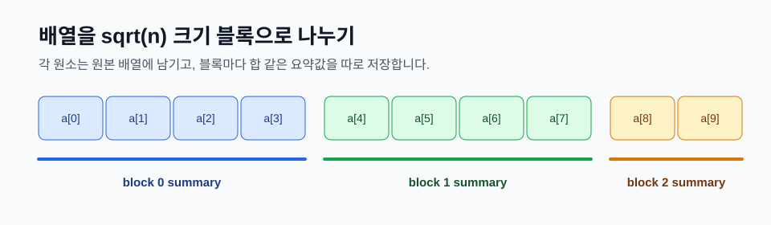
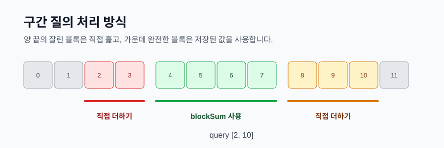

# Sqrt Decomposition

Sqrt Decomposition은 긴 배열을 길이 약 `sqrt(n)`인 블록들로 나누고, 각 블록에 미리 계산한 값을 저장해 질의를 빠르게 처리하는 방법입니다. 한국어로는 보통 **제곱근 분할**이라고 부릅니다.

이 기법이 다루는 대표 질문은 다음과 같습니다.

```text
배열 값이 바뀔 수 있다.
중간중간 구간 [l, r]의 합, 최솟값, 등장 횟수 같은 정보를 빠르게 물어본다.
```

배열을 매번 전부 훑으면 질의 하나가 `O(n)`입니다. Segment Tree를 쓰면 `O(log n)`까지 줄일 수 있지만, 구현이 부담스럽거나 블록 단위로 쉽게 정리되는 문제가 있습니다. 이때 Sqrt Decomposition은 구현 난이도와 속도 사이에서 좋은 선택지가 됩니다.



## 핵심 아이디어

배열 길이가 `n`일 때 블록 크기를 `B`라고 합시다. 보통 `B = sqrt(n)` 근처로 잡습니다. 배열의 각 위치 `i`는 `i / B`번째 블록에 들어갑니다.

```text
index: 0 1 2 3 | 4 5 6 7 | 8 9 10 11 | 12 13
block: 0 0 0 0 | 1 1 1 1 | 2 2  2  2 | 3  3
```

구간 질의 `[l, r]`을 처리할 때는 구간 안에 완전히 들어오는 블록은 미리 저장한 블록 값을 한 번에 사용합니다. 양 끝에서 블록이 잘리는 부분만 원소를 직접 훑습니다.

이렇게 하면 한 질의에서 직접 보는 원소 수는 양 끝 블록의 최대 `2B`개 정도이고, 가운데에서 사용하는 전체 블록 수는 대략 `n / B`개입니다.

```text
한 질의 비용 = O(B + n / B)
```

`B`가 너무 작으면 블록 개수가 많아지고, 너무 크면 양 끝에서 직접 훑는 원소가 많아집니다. 둘을 비슷하게 맞추면 `B = sqrt(n)` 근처가 됩니다.

## 구간 합 예시

가장 기본적인 예시는 구간 합입니다. 원본 배열 `a`와 블록별 합 `blockSum`을 같이 저장합니다.

```text
a        = [5, 2, 7, 1, 4, 6, 3, 8, 9, 2]
B        = 4
blockSum = [15, 21, 11]
```

첫 번째 블록의 합은 `5 + 2 + 7 + 1 = 15`입니다. 두 번째 블록의 합은 `4 + 6 + 3 + 8 = 21`입니다.

## 양 끝만 직접 읽기

`B = 4`이고 `[2, 10]`을 물으면 `2, 3`은 직접 보고, `[4, 7]` 블록은 저장된 합으로 한 번에 처리하고, `8, 9, 10`은 직접 봅니다.



아래 `query`의 세 반복문이 이 세 부분을 처리합니다. 점 하나를 바꾸는 `update`는 해당 블록의 합에 `새 값 - 옛 값`만 더하므로 `O(1)`입니다.

## 전체 구현

아래 구현은 0-indexed 배열에서 점 업데이트와 구간 합 질의를 처리합니다.

```cpp
#include <cmath>
#include <vector>
using namespace std;

struct SqrtSum {
    int n;
    int B;
    vector<long long> a;
    vector<long long> blockSum;

    SqrtSum(const vector<long long>& values) {
        a = values;
        n = (int)a.size();
        B = (int)sqrt(n) + 1;
        int blockCount = (n + B - 1) / B;
        blockSum.assign(blockCount, 0);

        for (int i = 0; i < n; ++i) {
            blockSum[i / B] += a[i];
        }
    }

    void update(int idx, long long newValue) {
        int block = idx / B;
        blockSum[block] += newValue - a[idx];
        a[idx] = newValue;
    }

    long long query(int l, int r) {
        long long result = 0;

        while (l <= r && l % B != 0) {
            result += a[l];
            l++;
        }
        while (l + B - 1 <= r) {
            result += blockSum[l / B];
            l += B;
        }
        while (l <= r) {
            result += a[l];
            l++;
        }

        return result;
    }
};
```

사용할 때는 입력 구간이 1-indexed라면 `l--`, `r--`로 변환한 뒤 호출합니다.

## 시간 복잡도

구간 합 버전의 복잡도는 다음과 같습니다.

| 작업 | 시간 |
| --- | --- |
| 전처리 | `O(n)` |
| 점 업데이트 | `O(1)` |
| 구간 합 질의 | `O(sqrt(n))` |
| 메모리 | `O(n)` |

정확히는 질의가 `O(B + n / B)`이고, `B`를 `sqrt(n)` 근처로 잡았을 때 `O(sqrt(n))`입니다.

`n = 100000`이면 `sqrt(n)`은 약 316입니다. 한 질의에서 원소 수십만 개를 전부 훑는 대신 몇백 단위 작업으로 줄어듭니다.

## 최솟값 질의는 왜 조금 다를까

구간 최솟값도 비슷하게 블록별 최솟값 `blockMin`을 저장하면 됩니다. 질의는 구간 합과 같은 방식으로 처리할 수 있습니다.

하지만 점 업데이트가 달라집니다. 합은 `newValue - oldValue`만큼 더하면 되지만, 최솟값은 한 원소가 바뀌었을 때 블록 최솟값이 어떻게 변하는지 바로 알기 어렵습니다.

그래서 업데이트가 일어나면 해당 블록을 다시 훑어 `blockMin`을 계산합니다.

이 경우 업데이트는 `O(B)`, 질의는 `O(sqrt(n))`입니다.

## Lazy 블록 갱신

Sqrt Decomposition은 블록 전체에 같은 변경을 적용하는 문제에도 자주 쓰입니다. 예를 들어 구간 `[l, r]`에 `x`를 더하고, 한 위치의 값을 묻는 문제를 생각해 봅시다.

블록 전체가 구간 안에 들어오면 모든 원소를 직접 바꾸지 않고 `lazy[block] += x`만 기록합니다. 양 끝의 잘린 부분만 원소를 직접 바꿉니다. 다음 코드는 앞의 구간 합 자료구조와 별개의 변형으로, `a`에 원래 값을 넣고 블록별 `lazy`는 0으로 초기화합니다. `B`와 인덱스 범위는 앞과 같습니다.

```cpp
void rangeAdd(int l, int r, long long x) {
    while (l <= r && l % B != 0) {
        a[l] += x;
        l++;
    }
    while (l + B - 1 <= r) {
        lazy[l / B] += x;
        l += B;
    }
    while (l <= r) {
        a[l] += x;
        l++;
    }
}

long long get(int idx) {
    return a[idx] + lazy[idx / B];
}
```

여기서 `a[i]`는 개별로 직접 바꾼 값이고, `lazy[block]`은 블록 전체에 밀려 있는 증가량입니다. 실제 값은 둘을 더해야 합니다.

## 구간 갱신 실습

[창고 구역 장부](/practice/SHELFLOG)에서 구간 덧셈과 구간 합을 구현해 봅니다. 블록 전체를 갱신할 때는 합에 `증가량 × 블록 길이`를 반영하고, 양 끝의 일부 구간은 직접 처리합니다.
