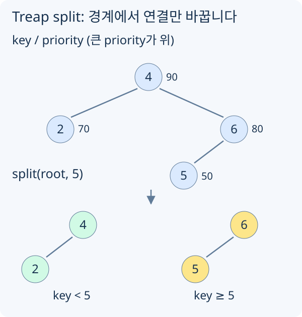

# Treap과 BST 기본

Treap은 직접 구현하기 쉬운 randomized balanced BST입니다. `key`로 탐색 순서를, 무작위 `priority`로 트리의 모양을 정합니다.

BST는 Binary Search Tree, 즉 이진 탐색 트리입니다. 각 노드는 왼쪽 subtree에 더 작은 key를, 오른쪽 subtree에 더 큰 key를 둡니다.

```text
left subtree의 모든 key < root key < right subtree의 모든 key
```

이 조건 덕분에 탐색, 삽입, 삭제를 트리 높이에 비례해서 처리할 수 있습니다. 문제는 트리 높이입니다. 균형이 잘 잡히면 `O(log n)`이지만, 한쪽으로 기울면 `O(n)`이 됩니다.

```text
균형 잡힌 BST:       기울어진 BST:

      4                 1
    /   \                \
   2     6                2
  / \   / \                \
 1   3 5   7                3
                              \
                               4
```

균형 BST는 이 문제를 해결하려는 자료구조입니다. Treap은 각 노드에 무작위 `priority`를 붙여 트리 모양을 입력 순서에 덜 민감하게 만들고, 기대 `O(log n)`에 삽입, 삭제, 탐색, 순위 질의를 처리합니다.

BST를 왼쪽 자식, 현재 노드, 오른쪽 자식 순으로 방문하면 key가 오름차순으로 나옵니다. Treap은 이 순서를 유지한 채 priority로 부모를 정합니다.


## Treap 노드와 size

순위 질의와 k번째 원소를 처리하려면 각 subtree 크기를 저장합니다.

```cpp
struct Node {
    int key;
    unsigned priority;
    int size;
    Node* left;
    Node* right;

    Node(int key, unsigned priority)
        : key(key), priority(priority), size(1), left(nullptr), right(nullptr) {}
};

int getSize(Node* node) {
    return node ? node->size : 0;
}

void pull(Node* node) {
    if (!node) return;
    node->size = 1 + getSize(node->left) + getSize(node->right);
}
```

자식을 바꾼 뒤에는 항상 `pull(node)`로 `size`를 다시 계산합니다.

## Treap merge

`merge(a, b)`는 두 Treap을 하나로 합칩니다. 단, `a`의 모든 key가 `b`의 모든 key보다 작아야 합니다.

```cpp
Node* merge(Node* a, Node* b) {
    if (!a) return b;
    if (!b) return a;

    if (a->priority > b->priority) {
        a->right = merge(a->right, b);
        pull(a);
        return a;
    } else {
        b->left = merge(a, b->left);
        pull(b);
        return b;
    }
}
```

BST 조건은 `a < b` 전제 때문에 유지됩니다. Heap 조건은 priority가 높은 쪽을 root로 고르기 때문에 유지됩니다.

## Treap split



[그림 크게 보기](https://blog.readiz.com/h-contest-lesson/lessons/treap/lesson-assets/structure-trace.svg)

4는 왼쪽 결과에 남기고 오른쪽 자식 6을 재귀로 나눕니다. 6의 왼쪽 5도 오른쪽 결과이므로, 4의 오른쪽 연결만 비게 됩니다. 다시 merge하면 priority에 따라 원래 구조가 복원됩니다.

`split(root, key, a, b)`는 하나의 Treap을 두 개로 나눕니다.

```text
a: key보다 작은 원소들
b: key 이상인 원소들
```

```cpp
void split(Node* root, int key, Node*& a, Node*& b) {
    if (!root) {
        a = nullptr;
        b = nullptr;
        return;
    }

    if (root->key < key) {
        split(root->right, key, root->right, b);
        a = root;
        pull(a);
    } else {
        split(root->left, key, a, root->left);
        b = root;
        pull(b);
    }
}
```

`root->key < key`이면 root와 왼쪽 subtree는 전부 `a` 쪽에 남을 수 있습니다. 오른쪽 subtree에는 작은 값과 큰 값이 섞여 있을 수 있으므로 오른쪽만 다시 나눕니다.

## Treap 삽입과 삭제

삽입은 split 후 가운데에 새 노드를 끼우고 다시 merge합니다. `node`는 `new Node(key, priority)`로 만든 독립 노드이며, 삭제가 `delete`를 사용하므로 배열 pool의 주소를 넘기지 않습니다. TC가 끝나면 남은 노드도 해제합니다.

```cpp
Node* insert(Node* root, Node* node) {
    Node* left = nullptr;
    Node* right = nullptr;
    split(root, node->key, left, right);
    return merge(merge(left, node), right);
}
```

이 삽입 함수는 같은 key가 아직 없다는 전제로 호출합니다. 중복이 가능한 입력이면 key를 비교하며 트리를 탐색해 존재 여부를 먼저 확인하거나 `(value, id)`처럼 유일한 키를 사용합니다. `priority`는 입력 key와 독립적으로 뽑습니다. 난수 생성기는 [공통 코드](https://h.readiz.com/learn/cpp-contest-basics/arrays-and-random)를 사용할 수 있습니다.

삭제는 찾은 노드를 제거하고, 그 노드의 왼쪽 subtree와 오른쪽 subtree를 merge합니다.

```cpp
Node* erase(Node* root, int key) {
    if (!root) return nullptr;

    if (root->key == key) {
        Node* next = merge(root->left, root->right);
        delete root;
        return next;
    }

    if (key < root->key) {
        root->left = erase(root->left, key);
    } else {
        root->right = erase(root->right, key);
    }

    pull(root);
    return root;
}
```

왼쪽 subtree의 모든 key는 삭제된 key보다 작고, 오른쪽 subtree의 모든 key는 더 큽니다. 그래서 `merge(left, right)`의 전제가 맞습니다.

## 순위와 k번째 원소

`orderOfKey(x)`는 `x`보다 작은 원소 개수를 반환합니다.

```cpp
int orderOfKey(Node* root, int key) {
    if (!root) return 0;

    if (key <= root->key) {
        return orderOfKey(root->left, key);
    }
    return getSize(root->left) + 1 + orderOfKey(root->right, key);
}
```

`kth(root, k)`는 0-indexed로 k번째 작은 원소를 반환합니다. 호출부에서 `0 <= k < getSize(root)`인지 확인해야 합니다.

```cpp
int kth(Node* root, int k) {
    int leftSize = getSize(root->left);

    if (k < leftSize) {
        return kth(root->left, k);
    }
    if (k == leftSize) {
        return root->key;
    }
    return kth(root->right, k - leftSize - 1);
}
```

둘 다 subtree 크기만 보고 한쪽으로 내려가므로 기대 `O(log n)`입니다.
