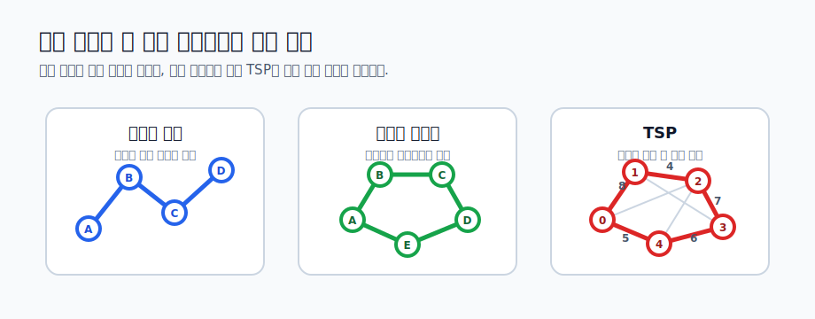
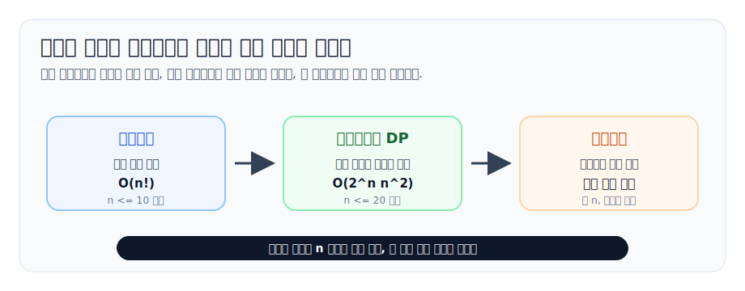
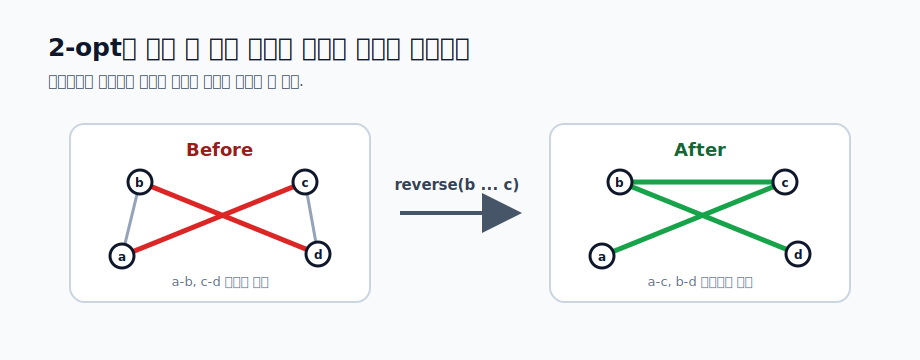

# TSP와 해밀턴 경로

해밀턴 경로와 TSP(Traveling Salesman Problem, 외판원 문제)는 모두 **모든 정점을 정확히 한 번씩 방문한다**는 조건에서 출발합니다. 차이는 무엇을 묻는지에 있습니다.

- **해밀턴 경로**: 모든 정점을 한 번씩 방문하는 경로가 존재하는가?
- **해밀턴 사이클**: 모든 정점을 한 번씩 방문하고 시작점으로 돌아오는 사이클이 존재하는가?
- **TSP**: 모든 정점을 한 번씩 방문하고 시작점으로 돌아올 때 비용 합을 최소화하면 얼마인가?

즉, 해밀턴 경로/사이클은 존재 여부를 묻는 경우가 많고, TSP는 비용 최적화를 묻는 경우가 많습니다. 하지만 구현 관점에서는 둘 다 "방문한 정점 집합"과 "마지막 정점"을 상태로 잡는 연습으로 이어집니다.



이 문제군은 입력 크기에 따라 접근이 크게 갈립니다.

| 입력 크기 감각 | 접근 |
| --- | --- |
| `n <= 10` 안팎 | 순열 완전탐색 |
| `n <= 20` 안팎 | 비트마스크 DP |
| `n`이 수십 이상 | 그리디 초기해, 지역 탐색, 휴리스틱 |

정확한 최적해를 보장하는 알고리즘은 보통 지수 시간입니다. 그래서 이 레슨은 완전탐색에서 시작해 DP로 중복을 줄이고, 더 큰 입력에서는 휴리스틱으로 좋은 답을 만드는 흐름으로 봅니다.



## 1. 그래프 표현부터 정한다

해밀턴 경로는 보통 간선이 있는지 없는지만 중요합니다.

```cpp
vector<vector<int>> graph(n);
vector<vector<bool>> connected(n, vector<bool>(n, false));
```

TSP는 정점 사이 이동 비용이 필요합니다. 완전 그래프가 아니라면 갈 수 없는 간선을 `INF`로 두고 처리할 수 있습니다.

```cpp
const long long INF = 4e18;
vector<vector<long long>> cost(n, vector<long long>(n, INF));

for (int i = 0; i < n; ++i) {
    cost[i][i] = 0;
}
```

문제에서 "어느 도시에서든 어느 도시로든 이동할 수 있다"고 하면 완전 그래프입니다. 그렇지 않다면 마지막에 시작점으로 돌아오는 간선이 있는지도 반드시 확인해야 합니다.

## 2. 완전탐색: 모든 방문 순서 시험

가장 직접적인 TSP 풀이는 시작점을 하나 고정하고, 나머지 정점의 방문 순서를 모두 시험하는 것입니다.

```cpp
const long long INF = 4e18;
vector<int> order;

for (int v = 1; v < n; ++v) {
    order.push_back(v);
}

long long answer = INF;

do {
    long long total = 0;
    int current = 0;
    bool ok = true;

    for (int next : order) {
        if (cost[current][next] == INF) {
            ok = false;
            break;
        }
        total += cost[current][next];
        current = next;
    }

    if (ok && cost[current][0] != INF) {
        answer = min(answer, total + cost[current][0]);
    }
} while (next_permutation(order.begin(), order.end()));
```

시작점을 `0`으로 고정해도 되는 이유는 순회 사이클에서는 어디서 출발해도 같은 원형 순서를 표현하기 때문입니다. 그래도 경우의 수는 `(n - 1)!`이므로 금방 커집니다.

해밀턴 경로 존재 여부도 순열로 확인할 수 있습니다.

```cpp
vector<int> order(n);
iota(order.begin(), order.end(), 0);

bool exists = false;

do {
    bool ok = true;
    for (int i = 0; i + 1 < n; ++i) {
        if (!connected[order[i]][order[i + 1]]) {
            ok = false;
            break;
        }
    }
    if (ok) {
        exists = true;
        break;
    }
} while (next_permutation(order.begin(), order.end()));
```

이 방식은 구현이 단순하고 디버깅하기 좋습니다. DP 풀이를 작성하기 전에 작은 입력 검증용 brute force로 남겨 두면 도움이 됩니다.

## 3. 중복을 보는 관점

완전탐색은 같은 부분 문제를 여러 번 풉니다.

```text
0 -> 1 -> 2 까지 방문하고 2에 있음
0 -> 3 -> 2 까지 방문하고 2에 있음
```

두 상태는 방문한 집합이 다르므로 미래 선택지가 다릅니다. 반대로 아래 두 경로는 미래 입장에서 같은 상태입니다.

```text
0 -> 1 -> 3 -> 2
0 -> 3 -> 1 -> 2
```

둘 다 `{0, 1, 2, 3}`을 방문했고 마지막 정점이 `2`라면, 앞으로 갈 수 있는 정점 집합은 같습니다. TSP에서는 그 상태에 도달하는 최소 비용만 남기면 됩니다.

그래서 비트마스크 DP의 핵심 상태는 다음입니다.

```text
mask = 지금까지 방문한 정점 집합
last = 현재 마지막 정점
```

## 4. 해밀턴 경로 존재 여부 DP

먼저 비용이 없는 존재 여부 문제부터 봅시다.

```text
dp[mask][last] = mask에 들어 있는 정점들을 모두 한 번씩 방문했고,
                 마지막 정점이 last인 경로가 존재하는가?
```

시작점을 고정하지 않는 해밀턴 경로라면 모든 단일 정점에서 시작할 수 있습니다.

```cpp
int full = 1 << n;
vector<vector<char>> dp(full, vector<char>(n, false));

for (int start = 0; start < n; ++start) {
    dp[1 << start][start] = true;
}

for (int mask = 0; mask < full; ++mask) {
    for (int last = 0; last < n; ++last) {
        if (!dp[mask][last]) continue;

        for (int next = 0; next < n; ++next) {
            if (mask & (1 << next)) continue;
            if (!connected[last][next]) continue;

            dp[mask | (1 << next)][next] = true;
        }
    }
}

bool hasHamiltonianPath = false;
for (int last = 0; last < n; ++last) {
    hasHamiltonianPath = hasHamiltonianPath || dp[full - 1][last];
}
```

해밀턴 사이클은 마지막 정점에서 시작점으로 돌아오는 간선을 추가로 확인해야 합니다. 시작점을 `0`으로 고정하면 상태 수가 줄고, 사이클 확인도 명확해집니다.

```cpp
vector<vector<char>> dp(full, vector<char>(n, false));
dp[1][0] = true;

for (int mask = 0; mask < full; ++mask) {
    for (int last = 0; last < n; ++last) {
        if (!dp[mask][last]) continue;

        for (int next = 0; next < n; ++next) {
            if (mask & (1 << next)) continue;
            if (!connected[last][next]) continue;
            dp[mask | (1 << next)][next] = true;
        }
    }
}

bool hasHamiltonianCycle = false;
for (int last = 1; last < n; ++last) {
    if (dp[full - 1][last] && connected[last][0]) {
        hasHamiltonianCycle = true;
    }
}
```

시간 복잡도는 `O(2^n * n^2)`, 메모리는 `O(2^n * n)`입니다.

## 5. TSP DP: Held-Karp 알고리즘

TSP에서는 `true/false` 대신 최소 비용을 저장합니다.

```text
dp[mask][last] = 0번에서 시작해 mask의 정점들을 방문했고,
                 last에서 끝나는 최소 비용
```

```cpp
const long long INF = 4e18;
int full = 1 << n;
vector<vector<long long>> dp(full, vector<long long>(n, INF));

dp[1][0] = 0;

for (int mask = 0; mask < full; ++mask) {
    for (int last = 0; last < n; ++last) {
        if (dp[mask][last] == INF) continue;

        for (int next = 0; next < n; ++next) {
            if (mask & (1 << next)) continue;
            if (cost[last][next] == INF) continue;

            int nextMask = mask | (1 << next);
            dp[nextMask][next] = min(
                dp[nextMask][next],
                dp[mask][last] + cost[last][next]
            );
        }
    }
}

long long answer = INF;
for (int last = 1; last < n; ++last) {
    if (cost[last][0] == INF) continue;
    answer = min(answer, dp[full - 1][last] + cost[last][0]);
}
```

이 알고리즘을 Held-Karp DP라고 부릅니다. 완전탐색의 `(n - 1)!`보다 훨씬 낫지만, 여전히 지수 시간입니다. `n = 20`이면 상태가 약 `2^20 * 20`, 즉 2천만 개 수준입니다. `long long` 테이블이면 메모리도 커지므로 제한을 먼저 계산해야 합니다.

## 6. 경로 문제와 사이클 문제의 차이

문제에서 "다시 시작점으로 돌아오라"고 하지 않는다면 마지막 간선을 더하면 안 됩니다.

```cpp
long long bestPath = INF;

for (int last = 0; last < n; ++last) {
    bestPath = min(bestPath, dp[full - 1][last]);
}
```

반대로 사이클이라면 마지막 정점에서 시작점으로 돌아오는 비용을 반드시 더합니다.

```cpp
long long bestCycle = INF;

for (int last = 1; last < n; ++last) {
    if (cost[last][0] != INF) {
        bestCycle = min(bestCycle, dp[full - 1][last] + cost[last][0]);
    }
}
```

이 차이는 자주 틀리는 지점입니다. "모든 정점을 방문한다"와 "순회한다"는 같은 말이 아닙니다.

## 7. 경로 복원

최소 비용뿐 아니라 실제 방문 순서가 필요하면 부모 상태를 저장합니다.

```cpp
vector<vector<int>> parent(full, vector<int>(n, -1));

for (int mask = 0; mask < full; ++mask) {
    for (int last = 0; last < n; ++last) {
        if (dp[mask][last] == INF) continue;

        for (int next = 0; next < n; ++next) {
            if (mask & (1 << next)) continue;
            if (cost[last][next] == INF) continue;

            int nextMask = mask | (1 << next);
            long long candidate = dp[mask][last] + cost[last][next];
            if (candidate < dp[nextMask][next]) {
                dp[nextMask][next] = candidate;
                parent[nextMask][next] = last;
            }
        }
    }
}
```

마지막 정점을 찾은 뒤 거꾸로 따라갑니다.

```cpp
int mask = full - 1;
int last = bestLast;
vector<int> route;

while (last != -1) {
    route.push_back(last);
    int previous = parent[mask][last];
    mask ^= (1 << last);
    last = previous;
}

reverse(route.begin(), route.end());
route.push_back(0); // TSP cycle이면 시작점으로 복귀
```

`mask`에서 현재 `last` 비트를 제거한 뒤 부모로 이동해야 합니다. 순서를 반대로 하면 잘못된 parent를 따라갈 수 있습니다.

## 8. 메모리 줄이기보다 먼저 정확히 만들기

TSP DP는 메모리가 큽니다. 그래도 처음부터 무리하게 최적화하면 실수가 늘어납니다.

먼저 전체 테이블로 맞춘 뒤, 필요하면 아래를 검토합니다.

- 비용 범위가 작으면 `int`를 쓸 수 있는가?
- 존재 여부 DP라면 `char`, `bitset`을 쓸 수 있는가?
- 시작점을 고정해 불필요한 상태를 줄였는가?
- `mask`가 시작점 `0`을 포함하지 않는 상태를 건너뛰는가?

예를 들어 시작점이 고정된 TSP에서는 `0`번을 포함하지 않는 `mask`는 볼 필요가 없습니다.

```cpp
for (int mask = 0; mask < full; ++mask) {
    if ((mask & 1) == 0) continue;
    // ...
}
```

## 9. 더 큰 입력: 정확한 최적해를 포기하는 순간

`n = 30`만 되어도 `2^n` DP는 현실적으로 어렵습니다. 이때 문제의 목표가 "정확한 최적 비용"인지, "제한 시간 안에 좋은 경로"인지 확인해야 합니다.

휴리스틱 TSP 풀이의 기본 구조는 보통 아래와 같습니다.

```text
1. 빠른 초기 경로를 만든다.
2. 경로를 조금 바꿔 더 좋아지는지 본다.
3. 좋아지면 반영한다.
4. 제한 시간까지 반복한다.
```

정확한 알고리즘과 달리, 휴리스틱은 최적해를 보장하지 않습니다. 대신 입력이 커도 실행할 수 있고, 실험으로 품질을 끌어올릴 수 있습니다.

## 10. Nearest Neighbor 초기해

가장 쉬운 초기해는 현재 정점에서 아직 방문하지 않은 정점 중 가장 가까운 곳으로 가는 방식입니다.

```cpp
vector<int> nearestNeighborRoute(int n, const vector<vector<long long>>& cost) {
    vector<int> route;
    vector<char> used(n, false);

    int current = 0;
    route.push_back(current);
    used[current] = true;

    for (int step = 1; step < n; ++step) {
        int best = -1;
        for (int next = 0; next < n; ++next) {
            if (used[next]) continue;
            if (best == -1 || cost[current][next] < cost[current][best]) {
                best = next;
            }
        }

        current = best;
        route.push_back(current);
        used[current] = true;
    }

    route.push_back(0);
    return route;
}
```

이 방법은 빠르고 구현이 쉽지만, 눈앞의 가까운 정점을 고르다가 나중에 비싼 간선을 강제로 탈 수 있습니다. 그래서 초기해로 쓰고, 이후 개선을 붙이는 편이 좋습니다.

## 11. 2-opt 지역 탐색

TSP에서 가장 유명한 개선 연산 중 하나가 2-opt입니다. 경로의 간선 두 개를 끊고, 가운데 구간을 뒤집어 다시 연결합니다.



경로가 `... a - b ... c - d ...` 형태일 때, `a-b`, `c-d`를 끊고 `a-c`, `b-d`로 바꿉니다. 가운데 구간 `b ... c`는 뒤집힙니다.

```cpp
long long delta =
    cost[a][c] + cost[b][d]
    - cost[a][b] - cost[c][d];

if (delta < 0) {
    reverse(route.begin() + i, route.begin() + j + 1);
}
```

완전한 형태는 다음과 같습니다. `route`는 마지막에 시작점 `0`이 한 번 더 들어 있는 사이클 표현이라고 가정합니다.

```cpp
bool improve2Opt(vector<int>& route, const vector<vector<long long>>& cost) {
    int m = (int)route.size();

    for (int i = 1; i + 2 < m; ++i) {
        for (int j = i + 1; j + 1 < m; ++j) {
            int a = route[i - 1];
            int b = route[i];
            int c = route[j];
            int d = route[j + 1];

            long long before = cost[a][b] + cost[c][d];
            long long after = cost[a][c] + cost[b][d];

            if (after < before) {
                reverse(route.begin() + i, route.begin() + j + 1);
                return true;
            }
        }
    }

    return false;
}

while (improve2Opt(route, cost)) {
    // 더 이상 좋아지는 2-opt 이동이 없을 때까지 반복
}
```

이 구현은 첫 번째 개선을 바로 반영하는 방식입니다. 모든 후보를 훑어 가장 큰 개선을 고르는 방식도 가능합니다. 전자는 빠르게 움직이고, 후자는 한 번의 반복 품질이 좋을 수 있습니다.

## 12. 지역 최적을 벗어나기

2-opt만 반복하면 더 이상 좋아지는 2-opt 이동이 없는 상태, 즉 지역 최적에 멈춥니다. 이를 벗어나려면 아래 전략을 섞습니다.

- 시작점을 바꾸거나 random seed를 바꿔 여러 초기해를 만듭니다.
- 가끔은 점수가 나빠지는 이동도 받아들입니다.
- 2-opt뿐 아니라 swap, insert, 3-opt 같은 다른 이동을 섞습니다.
- 큰 구간을 무작위로 흔든 뒤 다시 2-opt로 정리합니다.

담금질 기법을 쓰면 나쁜 이동을 확률적으로 받아들일 수 있습니다.

```cpp
double progress = elapsedTime() / timeLimit;
double temperature = startTemp * pow(endTemp / startTemp, progress);

long long diff = nextScore - currentScore; // 비용 최소화라면 작을수록 좋다
bool accept = false;

if (diff <= 0) {
    accept = true;
} else {
    double probability = exp(-(double)diff / temperature);
    accept = random01() < probability;
}
```

최대화 문제에서는 부호가 반대로 바뀝니다. TSP는 보통 비용 최소화이므로 `diff <= 0`이면 좋은 이동입니다.

## 13. Metric TSP와 보장 있는 근사

모든 간선 비용이 삼각 부등식 `dist[a][c] <= dist[a][b] + dist[b][c]`를 만족하면 Metric TSP라고 부릅니다. 좌표 평면의 유클리드 거리 TSP가 대표적입니다.

이 조건이 있으면 MST를 두 번 따라가는 방식으로 최적해의 2배 이하 경로를 만들 수 있습니다.

```text
1. 모든 정점의 MST를 만든다.
2. MST 간선을 두 번씩 지나 Euler tour를 만든다.
3. 이미 방문한 정점을 건너뛰며 TSP tour로 줄인다.
```

이것은 단순 휴리스틱보다 강한 "근사 보장"이 있는 접근입니다. 다만 삼각 부등식이 없으면 건너뛰기가 비용을 줄인다는 보장이 깨집니다. 문제에서 비용 구조가 무엇인지 먼저 확인해야 합니다.

## 14. 자주 나오는 실수

| 실수 | 결과 | 확인 방법 |
| --- | --- | --- |
| 경로와 사이클을 혼동함 | 마지막 복귀 비용을 빼거나 더함 | 문제 문장에 "돌아온다", "순회"가 있는지 확인 |
| 시작점을 여러 번 세거나 빠뜨림 | 순열/DP 초기값 오류 | TSP cycle은 보통 `0`을 고정 |
| 없는 간선을 0으로 둠 | 불가능한 경로가 최적해가 됨 | 없는 간선은 `INF` |
| `1 << n` overflow | `n >= 31`에서 잘못된 mask | `1LL << n` 또는 제한 확인 |
| `INF + cost` overflow | 음수처럼 wrap됨 | `dp == INF` 상태는 전이하지 않음 |
| parent 복원 순서 오류 | 경로가 뒤섞임 | 현재 정점 비트를 제거한 뒤 parent로 이동 |
| 휴리스틱을 정답 보장처럼 믿음 | 숨은 케이스에서 큰 오차 | brute force/DP 가능한 작은 입력으로 품질 비교 |

## 15. 문제를 볼 때의 선택 순서

TSP나 해밀턴 경로처럼 보이는 문제를 만나면 아래 순서로 판단합니다.

1. 모든 정점을 한 번씩 방문해야 하는가?
2. 존재 여부인가, 최소/최대 비용인가?
3. 다시 시작점으로 돌아와야 하는가?
4. `n`이 완전탐색, 비트마스크 DP, 휴리스틱 중 어디에 맞는가?
5. 간선이 없는 경우가 있는가, 비용이 대칭인가, 삼각 부등식이 있는가?
6. 실제 경로 출력이 필요한가, 비용만 필요한가?

정리하면, 해밀턴 경로와 TSP는 "방문 집합 + 마지막 정점"이라는 상태를 배우기에 좋은 문제입니다. 작은 입력에서는 완전탐색으로 정답을 만들고, 중간 크기에서는 비트마스크 DP로 중복을 줄이고, 큰 입력에서는 좋은 초기해와 지역 탐색으로 제한 시간 안의 답을 개선합니다.
