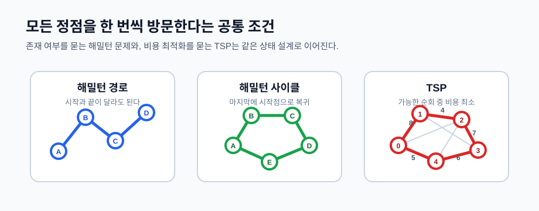
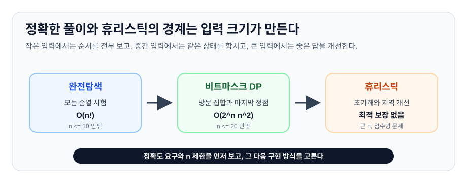

# TSP와 해밀턴 경로

해밀턴 경로와 TSP(Traveling Salesman Problem, 외판원 문제)는 모두 **모든 정점을 정확히 한 번씩 방문한다**는 조건에서 출발합니다. 차이는 무엇을 묻는지에 있습니다.

- **해밀턴 경로**: 모든 정점을 한 번씩 방문하는 경로가 존재하는가?
- **해밀턴 사이클**: 모든 정점을 한 번씩 방문하고 시작점으로 돌아오는 사이클이 존재하는가?
- **TSP**: 모든 정점을 한 번씩 방문하고 시작점으로 돌아올 때 비용 합을 최소화하면 얼마인가?

두 문제 모두 방문한 정점 집합과 마지막 정점을 상태로 사용합니다.



이 문제군은 입력 크기에 따라 접근이 크게 갈립니다.

| 입력 크기 감각 | 접근 |
| --- | --- |
| `n <= 10` 안팎 | 순열 완전탐색 |
| `n <= 20` 안팎 | 비트마스크 DP |
| `n`이 수십 이상 | 그리디 초기해, 지역 탐색, 휴리스틱 |

정확한 최적해를 보장하는 알고리즘은 보통 지수 시간입니다. 그래서 이 레슨은 완전탐색에서 시작해 DP로 중복을 줄이고, 더 큰 입력에서는 휴리스틱으로 좋은 답을 만드는 흐름으로 봅니다.




## 간선과 비용의 의미

해밀턴 경로에서는 `connected[u][v]`로 간선 유무를, TSP에서는 `cost[u][v]`로 이동 비용을 나타냅니다. 아래 코드의 `INF`는 갈 수 없는 간선입니다. `n >= 2`를 가정하며, 비용 합이 `INF`와 정수 범위를 넘지 않아야 합니다.

## 완전탐색: 모든 방문 순서 시험

가장 직접적인 TSP 풀이는 시작점을 하나 고정하고, 나머지 정점의 방문 순서를 모두 시험하는 것입니다.

```cpp
const long long INF = 4e18;
vector<int> order;

for (int v = 1; v < n; ++v) {
    order.push_back(v);
}

long long answer = INF;

do {
    long long total = 0;
    int current = 0;
    bool ok = true;

    for (int next : order) {
        if (cost[current][next] == INF) {
            ok = false;
            break;
        }
        total += cost[current][next];
        current = next;
    }

    if (ok && cost[current][0] != INF) {
        answer = min(answer, total + cost[current][0]);
    }
} while (next_permutation(order.begin(), order.end()));
```

시작점을 `0`으로 고정해도 되는 이유는 순회 사이클에서는 어디서 출발해도 같은 원형 순서를 표현하기 때문입니다. 그래도 경우의 수는 `(n - 1)!`이므로 금방 커집니다.

작은 입력에서는 이 결과를 DP의 기준 답으로 사용할 수 있습니다.

## 중복을 보는 관점

완전탐색은 같은 부분 문제를 여러 번 풉니다.

```text
0 -> 1 -> 2 까지 방문하고 2에 있음
0 -> 3 -> 2 까지 방문하고 2에 있음
```

두 상태는 방문한 집합이 다르므로 미래 선택지가 다릅니다. 반대로 아래 두 경로는 미래 입장에서 같은 상태입니다.

```text
0 -> 1 -> 3 -> 2
0 -> 3 -> 1 -> 2
```

둘 다 `{0, 1, 2, 3}`을 방문했고 마지막 정점이 `2`라면, 앞으로 갈 수 있는 정점 집합은 같습니다. TSP에서는 그 상태에 도달하는 최소 비용만 남기면 됩니다.

그래서 비트마스크 DP의 핵심 상태는 다음입니다.

```text
mask = 지금까지 방문한 정점 집합
last = 현재 마지막 정점
```

## 해밀턴 경로 존재 여부 DP

먼저 비용이 없는 존재 여부 문제부터 봅시다.

```text
dp[mask][last] = mask에 들어 있는 정점들을 모두 한 번씩 방문했고,
                 마지막 정점이 last인 경로가 존재하는가?
```

시작점을 고정하지 않는 해밀턴 경로라면 모든 단일 정점에서 시작할 수 있습니다.

```cpp
int full = 1 << n;
vector<vector<char>> dp(full, vector<char>(n, false));

for (int start = 0; start < n; ++start) {
    dp[1 << start][start] = true;
}

for (int mask = 0; mask < full; ++mask) {
    for (int last = 0; last < n; ++last) {
        if (!dp[mask][last]) continue;

        for (int next = 0; next < n; ++next) {
            if (mask & (1 << next)) continue;
            if (!connected[last][next]) continue;

            dp[mask | (1 << next)][next] = true;
        }
    }
}

bool hasHamiltonianPath = false;
for (int last = 0; last < n; ++last) {
    hasHamiltonianPath = hasHamiltonianPath || dp[full - 1][last];
}
```

해밀턴 사이클은 `dp[1][0]`만 시작 상태로 두고, 마지막 정점에서 0으로 돌아오는 간선까지 확인합니다. 시작점을 고정하지 않는 경로와 초기값을 혼동하면 안 됩니다.

시간은 `O(2^n × n²)`, 메모리는 `O(2^n × n)`입니다.

## TSP DP: Held-Karp 알고리즘

TSP에서는 `true/false` 대신 최소 비용을 저장합니다.

```text
dp[mask][last] = 0번에서 시작해 mask의 정점들을 방문했고,
                 last에서 끝나는 최소 비용
```

```cpp
const long long INF = 4e18;
int full = 1 << n;
vector<vector<long long>> dp(full, vector<long long>(n, INF));

dp[1][0] = 0;

for (int mask = 0; mask < full; ++mask) {
    for (int last = 0; last < n; ++last) {
        if (dp[mask][last] == INF) continue;

        for (int next = 0; next < n; ++next) {
            if (mask & (1 << next)) continue;
            if (cost[last][next] == INF) continue;

            int nextMask = mask | (1 << next);
            dp[nextMask][next] = min(
                dp[nextMask][next],
                dp[mask][last] + cost[last][next]
            );
        }
    }
}

long long answer = INF;
for (int last = 1; last < n; ++last) {
    if (dp[full - 1][last] == INF || cost[last][0] == INF) continue;
    answer = min(answer, dp[full - 1][last] + cost[last][0]);
}
```

이 알고리즘을 Held-Karp DP라고 부릅니다. 완전탐색의 `(n - 1)!`보다 훨씬 낫지만, 여전히 지수 시간입니다. `n = 20`이면 상태가 약 `2^20 * 20`, 즉 2천만 개 수준입니다. `long long` 테이블이면 메모리도 커지므로 제한을 먼저 계산해야 합니다.

시작점으로 돌아오지 않는 경로가 목표라면 마지막 `cost[last][0]`을 더하지 않고 `dp[full - 1][last]`의 최솟값만 고릅니다.

## 경로 복원과 메모리

최종 답이 `INF`이면 경로가 없으므로 복원하지 않습니다. 방문 순서가 필요하면 `parent[mask][last]`를 -1로 초기화합니다. 더 작은 비용으로 `dp[nextMask][next]`를 갱신하는 순간 `parent[nextMask][next] = last`도 기록합니다. 최종 비용을 결정한 정점을 `bestLast`에 저장한 뒤 거꾸로 따라갑니다.

```cpp
int mask = full - 1;
int last = bestLast;
vector<int> route;

while (last != -1) {
    route.push_back(last);
    int previous = parent[mask][last];
    mask ^= (1 << last);
    last = previous;
}

reverse(route.begin(), route.end());
route.push_back(0); // TSP cycle이면 시작점으로 복귀
```

현재 `last`의 부모를 읽고 그 비트를 지운 뒤 부모로 이동합니다. 순서를 바꾸면 다른 상태의 부모를 읽게 됩니다.

`n = 20`에서 `long long dp[1 << n][n]`은 160MiB이고 `int` 부모 테이블은 80MiB를 더 씁니다. 시작점을 포함하지 않는 마스크를 **건너뛰기만 해서는 할당한 메모리가 줄지 않습니다**. 메모리가 부족하다면 시작점 비트를 제외한 별도 인덱스로 테이블을 만들거나, 비용 범위가 허용할 때 자료형을 줄여야 합니다.


## 더 큰 입력: 정확한 최적해를 포기하는 순간

`n = 30`만 되어도 `2^n` DP는 현실적으로 어렵습니다. 이때 문제의 목표가 "정확한 최적 비용"인지, "제한 시간 안에 좋은 경로"인지 확인해야 합니다.

휴리스틱 TSP 풀이의 기본 구조는 보통 아래와 같습니다.

```text
1. 빠른 초기 경로를 만든다.
2. 경로를 조금 바꿔 더 좋아지는지 본다.
3. 좋아지면 반영한다.
4. 제한 시간까지 반복한다.
```

정확한 알고리즘과 달리, 휴리스틱은 최적해를 보장하지 않습니다. 대신 입력이 커도 실행할 수 있고, 실험으로 품질을 끌어올릴 수 있습니다.

## 초기 경로 만들기

아직 방문하지 않은 가장 가까운 정점으로 이동하는 초기해는 [ORDERING 풀이](https://h.readiz.com/learn/heuristic/ordering-route-improvement)에 있습니다. 사이클 문제에서는 마지막 정점에서 출발점으로 돌아오는 간선도 필요합니다. 완전 그래프가 아니라면 그리디가 중간에 막히거나 복귀 간선을 남기지 못할 수 있습니다.

## 2-opt 지역 탐색

TSP에서 가장 유명한 개선 연산 중 하나가 2-opt입니다. 경로의 간선 두 개를 끊고, 가운데 구간을 뒤집어 다시 연결합니다.


경로가 `... a - b ... c - d ...` 형태일 때, `a-b`, `c-d`를 끊고 `a-c`, `b-d`로 바꿉니다. 가운데 구간 `b ... c`는 뒤집힙니다.

아래 구현은 모든 정점 사이에 이동이 가능한 대칭 거리에서 사용합니다. `route`는 마지막에 시작점 `0`이 한 번 더 들어 있는 사이클 표현이라고 가정합니다.

```cpp
bool improve2Opt(vector<int>& route, const vector<vector<long long>>& cost) {
    int m = (int)route.size();

    for (int i = 1; i + 2 < m; ++i) {
        for (int j = i + 1; j + 1 < m; ++j) {
            int a = route[i - 1];
            int b = route[i];
            int c = route[j];
            int d = route[j + 1];

            long long before = cost[a][b] + cost[c][d];
            long long after = cost[a][c] + cost[b][d];

            if (after < before) {
                reverse(route.begin() + i, route.begin() + j + 1);
                return true;
            }
        }
    }

    return false;
}

while (improve2Opt(route, cost)) {
    // 더 이상 좋아지는 2-opt 이동이 없을 때까지 반복
}
```

이 구현은 첫 번째 개선을 바로 반영하는 방식입니다. 모든 후보를 훑어 가장 큰 개선을 고르는 방식도 가능합니다. 전자는 빠르게 움직이고, 후자는 한 번의 반복 품질이 좋을 수 있습니다.

두 경계 간선만 비교하는 위 2-opt 코드는 대칭 거리에서 사용합니다. 비대칭 거리에서는 구간 내부의 간선 방향이 바뀌면서 비용도 달라집니다.

## 2-opt가 멈춘 뒤

개선이 없다는 것은 현재 경로에 유리한 2-opt가 없다는 뜻입니다. 시작 경로를 바꾸거나 삽입 같은 다른 연산을 쓰면 더 짧은 경로를 찾을 수 있습니다. 나쁜 이동을 일시적으로 받아들이는 방법과 온도 설정은 [탐색 전략](https://h.readiz.com/learn/heuristic/search-strategies)에서 다룹니다.

## Metric TSP와 보장 있는 근사

여기서는 완전 무방향 그래프의 비음수 대칭 거리를 다룹니다. 모든 간선 비용이 삼각 부등식 `dist[a][c] <= dist[a][b] + dist[b][c]`를 만족하면 Metric TSP라고 부릅니다. 좌표 평면의 유클리드 거리 TSP가 대표적입니다.

이 조건이 있으면 MST를 두 번 따라가는 방식으로 최적해의 2배 이하 경로를 만들 수 있습니다.

```text
1. 모든 정점의 MST를 만든다.
2. MST 간선을 두 번씩 지나 Euler tour를 만든다.
3. 이미 방문한 정점을 건너뛰며 TSP tour로 줄인다.
```

이것은 단순 휴리스틱보다 강한 "근사 보장"이 있는 접근입니다. 다만 삼각 부등식이 없으면 건너뛰기가 비용을 줄인다는 보장이 깨집니다.

## 연습 문제

- [미니 물품 배송](/practice/ORDERING): 창고 0에서 시작하고 복귀하지 않는 경로입니다. 끝점을 바꾸는 2-opt에서 제거·추가되는 간선을 확인합니다.
- [맨해튼 TSP](/practice/TSPTESTX): 마지막 정점에서 시작점으로 돌아오는 비용까지 포함해 순회를 개선합니다.
