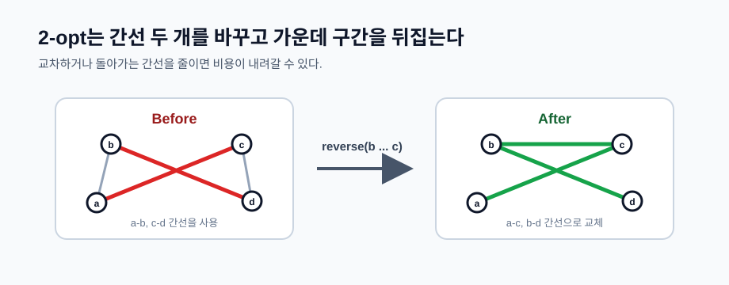

# TSP와 해밀턴 경로: 휴리스틱 개선과 근사

## 더 큰 입력: 정확한 최적해를 포기하는 순간

`n = 30`만 되어도 `2^n` DP는 현실적으로 어렵습니다. 이때 문제의 목표가 "정확한 최적 비용"인지, "제한 시간 안에 좋은 경로"인지 확인해야 합니다.

휴리스틱 TSP 풀이의 기본 구조는 보통 아래와 같습니다.

```text
1. 빠른 초기 경로를 만든다.
2. 경로를 조금 바꿔 더 좋아지는지 본다.
3. 좋아지면 반영한다.
4. 제한 시간까지 반복한다.
```

정확한 알고리즘과 달리, 휴리스틱은 최적해를 보장하지 않습니다. 대신 입력이 커도 실행할 수 있고, 실험으로 품질을 끌어올릴 수 있습니다.

## 초기 경로 만들기

아직 방문하지 않은 가장 가까운 정점으로 이동하는 초기해는 [ORDERING 풀이](https://h.readiz.com/learn/heuristic/ordering-route-improvement)에 있습니다. 사이클 문제에서는 마지막 정점에서 출발점으로 돌아오는 간선도 필요합니다. 완전 그래프가 아니라면 그리디가 중간에 막히거나 복귀 간선을 남기지 못할 수 있습니다.

## 2-opt 지역 탐색

TSP에서 가장 유명한 개선 연산 중 하나가 2-opt입니다. 경로의 간선 두 개를 끊고, 가운데 구간을 뒤집어 다시 연결합니다.



경로가 `... a - b ... c - d ...` 형태일 때, `a-b`, `c-d`를 끊고 `a-c`, `b-d`로 바꿉니다. 가운데 구간 `b ... c`는 뒤집힙니다.

아래 구현은 모든 정점 사이에 이동이 가능한 대칭 거리에서 사용합니다. `route`는 마지막에 시작점 `0`이 한 번 더 들어 있는 사이클 표현이라고 가정합니다.

```cpp
bool improve2Opt(vector<int>& route, const vector<vector<long long>>& cost) {
    int m = (int)route.size();

    for (int i = 1; i + 2 < m; ++i) {
        for (int j = i + 1; j + 1 < m; ++j) {
            int a = route[i - 1];
            int b = route[i];
            int c = route[j];
            int d = route[j + 1];

            long long before = cost[a][b] + cost[c][d];
            long long after = cost[a][c] + cost[b][d];

            if (after < before) {
                reverse(route.begin() + i, route.begin() + j + 1);
                return true;
            }
        }
    }

    return false;
}

while (improve2Opt(route, cost)) {
    // 더 이상 좋아지는 2-opt 이동이 없을 때까지 반복
}
```

이 구현은 첫 번째 개선을 바로 반영하는 방식입니다. 모든 후보를 훑어 가장 큰 개선을 고르는 방식도 가능합니다. 전자는 빠르게 움직이고, 후자는 한 번의 반복 품질이 좋을 수 있습니다.

두 경계 간선만 비교하는 위 2-opt 코드는 대칭 거리에서 사용합니다. 비대칭 거리에서는 구간 내부의 간선 방향이 바뀌면서 비용도 달라집니다.

## 2-opt가 멈춘 뒤

개선이 없다는 것은 현재 경로에 유리한 2-opt가 없다는 뜻입니다. 시작 경로를 바꾸거나 삽입 같은 다른 연산을 쓰면 더 짧은 경로를 찾을 수 있습니다. 나쁜 이동을 일시적으로 받아들이는 방법과 온도 설정은 [탐색 전략](https://h.readiz.com/learn/heuristic/search-strategies)에서 다룹니다.

## Metric TSP와 보장 있는 근사

모든 간선 비용이 삼각 부등식 `dist[a][c] <= dist[a][b] + dist[b][c]`를 만족하면 Metric TSP라고 부릅니다. 좌표 평면의 유클리드 거리 TSP가 대표적입니다.

이 조건이 있으면 MST를 두 번 따라가는 방식으로 최적해의 2배 이하 경로를 만들 수 있습니다.

```text
1. 모든 정점의 MST를 만든다.
2. MST 간선을 두 번씩 지나 Euler tour를 만든다.
3. 이미 방문한 정점을 건너뛰며 TSP tour로 줄인다.
```

이것은 단순 휴리스틱보다 강한 "근사 보장"이 있는 접근입니다. 다만 삼각 부등식이 없으면 건너뛰기가 비용을 줄인다는 보장이 깨집니다.

## 연습 문제

- [미니 물품 배송](/practice/ORDERING): 창고 0에서 시작하고 복귀하지 않는 경로입니다. 끝점을 바꾸는 2-opt에서 제거·추가되는 간선을 확인합니다.
- [맨해튼 TSP](/practice/TSPTESTX): 마지막 정점에서 시작점으로 돌아오는 비용까지 포함해 순회를 개선합니다.
