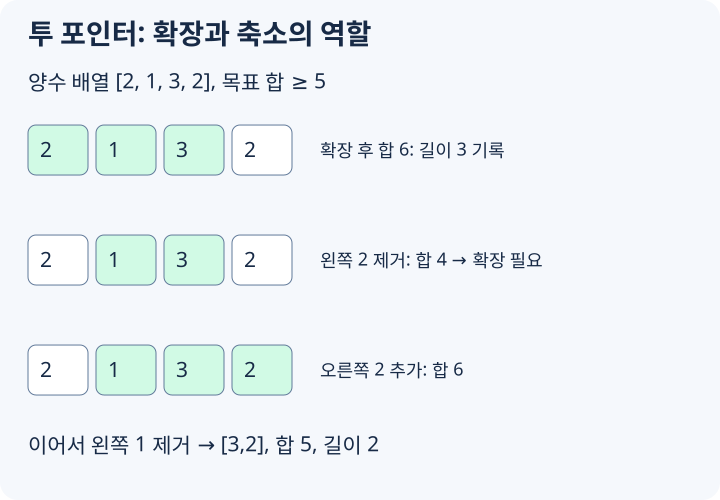

# 투 포인터와 슬라이딩 윈도우

투 포인터는 배열이나 문자열에서 두 위치를 움직이며 필요한 구간이나 쌍을 찾는 방법입니다. 모든 쌍을 `O(n^2)`으로 보지 않고, 포인터가 한 방향으로만 움직이게 만들어 `O(n)` 또는 `O(n log n)`으로 줄이는 것이 핵심입니다.

## 언제 필요한가

아래 신호가 보이면 투 포인터를 먼저 의심합니다.

- 정렬된 배열에서 합이 특정 값이 되는 두 수를 찾는다.
- 연속 구간의 합, 길이, 종류 수를 묻는다.
- 오른쪽 끝을 늘리면 조건이 좋아지거나 나빠지는 방향이 일정하다.
- 같은 원소를 여러 번 세지 않으면서 모든 후보 구간을 훑어야 한다.

핵심은 **한 포인터가 되돌아가지 않아도 되는가**입니다. 왼쪽 포인터와 오른쪽 포인터가 각각 최대 `n`번만 움직이고 이동당 갱신이 `O(1)`이면 전체 시간은 `O(n)`입니다.

## 정렬된 배열에서 양끝 포인터

정렬된 배열에서 두 수의 합을 확인할 때는 왼쪽 끝과 오른쪽 끝에서 시작합니다.

```text
a[l] + a[r] < target 이면 l을 오른쪽으로 이동
a[l] + a[r] > target 이면 r을 왼쪽으로 이동
```

정렬되어 있기 때문에 `l`을 오른쪽으로 옮기면 합은 커지고, `r`을 왼쪽으로 옮기면 합은 작아집니다.

```cpp
bool hasPairWithSum(vector<int> a, int target) {
    sort(a.begin(), a.end());
    int l = 0;
    int r = (int)a.size() - 1;
    while (l < r) {
        long long sum = (long long)a[l] + a[r];
        if (sum == target) return true;
        if (sum < target) l++;
        else r--;
    }
    return false;
}
```

## 조건을 만족하는 가장 짧은 구간



[그림 크게 보기](https://blog.readiz.com/h-contest-lesson/lessons/two-pointers-sliding-window/lesson-assets/concept-trace.svg)

모든 값이 양수라면 오른쪽 끝을 늘릴수록 구간 합은 커지고, 왼쪽 끝을 줄일수록 구간 합은 작아집니다. 이 단조성 덕분에 합이 `target` 이상인 가장 짧은 연속 구간을 `O(n)`에 찾을 수 있습니다.

```cpp
int minLengthAtLeastSum(const vector<int>& a, long long target) {
    int n = (int)a.size();
    int answer = n + 1;
    int left = 0;
    long long sum = 0;

    for (int right = 0; right < n; right++) {
        sum += a[right];
        while (left <= right && sum >= target) {
            answer = min(answer, right - left + 1);
            sum -= a[left];
            left++;
        }
    }

    return answer == n + 1 ? -1 : answer;
}
```

값에 음수가 섞이면 오른쪽을 늘렸을 때 합이 항상 커지지 않습니다. 그때는 누적합 + 자료구조, prefix minimum, deque 같은 다른 도구가 필요할 수 있습니다.

## 조건을 만족하는 가장 긴 구간

구간 안의 서로 다른 값 개수, 최대 빈도, 합의 상한처럼 "오른쪽을 늘리면 조건이 깨질 수 있고, 왼쪽을 줄이면 회복된다"는 형태도 자주 나옵니다.

```cpp
int longestAtMostKDistinct(const vector<int>& a, int k) {
    if (k <= 0) return 0;
    unordered_map<int, int> freq;
    int left = 0;
    int answer = 0;

    for (int right = 0; right < (int)a.size(); right++) {
        freq[a[right]]++;
        while ((int)freq.size() > k) {
            int value = a[left++];
            if (--freq[value] == 0) freq.erase(value);
        }
        answer = max(answer, right - left + 1);
    }

    return answer;
}
```

해시 테이블 연산이 평균 `O(1)`이라는 전제에서 전체 평균 시간은 `O(n)`입니다.

`while` 조건에는 "현재 창이 유효하지 않은 동안"을 넣습니다. 유효해진 뒤에 답을 갱신하면 창이 항상 문제 조건을 만족합니다.
