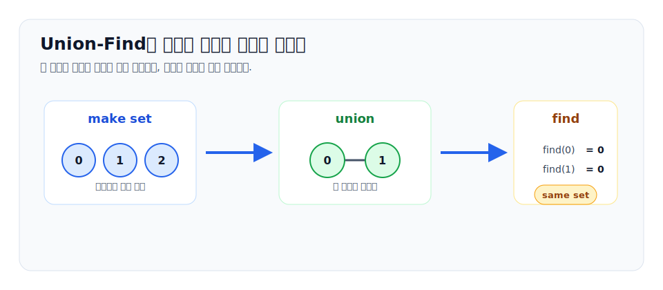
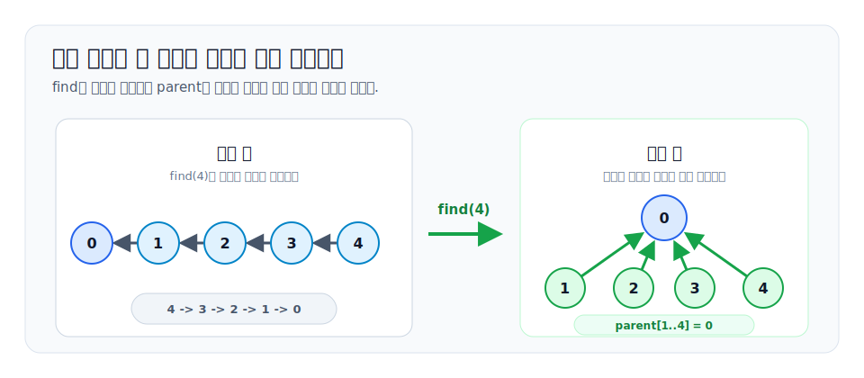
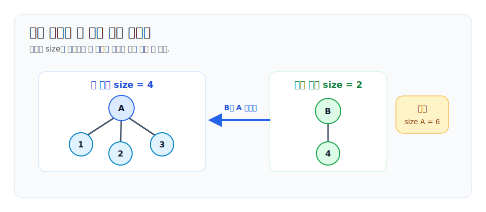

# Union-Find 알고리즘

Union-Find는 여러 원소를 **서로 겹치지 않는 집합들**로 나누어 관리하는 자료구조입니다. Disjoint Set Union, 줄여서 DSU라고도 부릅니다.

이 자료구조가 다루는 핵심 질문은 두 가지입니다.

```text
1. x와 y는 지금 같은 집합에 있는가?
2. x가 속한 집합과 y가 속한 집합을 하나로 합칠 수 있는가?
```

연결 관계가 계속 추가되고, 중간중간 같은 그룹인지 확인해야 하는 문제라면 Union-Find를 먼저 떠올릴 만합니다. 대표적인 예시는 연결 요소 구하기, 사이클 판정, Kruskal 최소 신장 트리, 모임이나 관계 기록으로 그룹 묶기입니다.



## 1. 집합을 숲으로 표현하기

Union-Find는 각 집합을 하나의 트리로 표현합니다. 트리의 루트가 그 집합의 **대표**입니다. 각 원소는 자기 부모를 하나만 기억합니다.

처음에는 모든 원소가 자기 자신만 들어 있는 집합입니다.

```text
parent[0] = 0
parent[1] = 1
parent[2] = 2
parent[3] = 3
```

두 집합을 합칠 때는 한 집합의 대표를 다른 집합의 대표 밑에 붙입니다. 그래서 전체 구조는 여러 트리로 이루어진 숲이 됩니다.

```text
0 <- 1 <- 3
2 <- 4
5
```

이 상태에서 `0, 1, 3`은 같은 집합이고, `2, 4`는 다른 집합입니다. 원소 `5`는 혼자 있는 집합입니다.

## 2. 기본 연산

Union-Find의 기본 연산은 보통 세 개로 나눕니다.

| 연산 | 의미 |
| --- | --- |
| `makeSet(x)` | `x` 하나만 들어 있는 집합을 만든다 |
| `find(x)` | `x`가 속한 집합의 대표를 찾는다 |
| `union(a, b)` | `a`의 집합과 `b`의 집합을 합친다 |

실제 구현에서는 `makeSet`을 모든 원소에 대해 한 번에 초기화합니다.

```cpp
for (int i = 0; i < n; ++i) {
    parent[i] = i;
}
```

`same(a, b)` 같은 함수는 따로 저장하는 정보가 아니라 `find(a) == find(b)`로 판단합니다.

```cpp
bool same(int a, int b) {
    return find(a) == find(b);
}
```

## 3. find: 대표 찾기

가장 단순한 `find`는 부모를 계속 따라 올라가다가, 자기 자신을 부모로 가진 루트를 만나면 그 값을 반환합니다.

```cpp
int find(int x) {
    if (parent[x] == x) return x;
    return find(parent[x]);
}
```

이 방식은 맞지만, 트리가 한 줄로 길게 늘어지면 한 번의 `find`가 `O(n)`까지 느려질 수 있습니다.

```text
0 <- 1 <- 2 <- 3 <- 4 <- 5
```

`find(5)`는 `5, 4, 3, 2, 1, 0`을 모두 지나야 합니다. 이런 모양이 반복되면 Union-Find의 장점이 사라집니다.

## 4. 경로 압축

경로 압축은 `find`를 하면서 지나간 원소들의 부모를 곧바로 대표로 바꾸는 최적화입니다.

```cpp
int find(int x) {
    if (parent[x] == x) return x;
    return parent[x] = find(parent[x]);
}
```

처음 `find(5)`는 여러 노드를 지나갈 수 있습니다. 하지만 그 뒤에는 `5`의 부모가 바로 대표가 되므로 다음 조회가 훨씬 빨라집니다.



경로 압축은 답을 바꾸지 않습니다. 같은 집합 안에서 루트로 가는 길을 짧게 만드는 것뿐입니다.

## 5. union: 대표끼리 합치기

두 원소 `a`, `b`를 합칠 때는 반드시 먼저 대표를 찾아야 합니다.

```cpp
void unite(int a, int b) {
    int rootA = find(a);
    int rootB = find(b);
    if (rootA == rootB) return;
    parent[rootB] = rootA;
}
```

`a`를 `b` 밑에 바로 붙이면 안 됩니다. `a`와 `b`가 집합의 중간 노드일 수도 있기 때문입니다. 항상 대표끼리 연결해야 집합 구조가 깨지지 않습니다.

## 6. 크기 기준 합치기

단순히 한쪽 대표를 다른 쪽 대표 밑에 붙이면 트리가 길어질 수 있습니다. 그래서 각 집합의 크기를 `size[root]`에 저장하고, 작은 집합을 큰 집합 밑에 붙입니다.

```cpp
void unite(int a, int b) {
    int rootA = find(a);
    int rootB = find(b);
    if (rootA == rootB) return;

    if (size[rootA] < size[rootB]) {
        swap(rootA, rootB);
    }
    parent[rootB] = rootA;
    size[rootA] += size[rootB];
}
```

이때 `size` 값은 대표에서만 의미가 있습니다. `rootB`가 `rootA` 밑으로 들어간 뒤에는 `size[rootB]`를 참조하면 안 됩니다.



비슷한 최적화로 rank 기준 합치기도 있습니다. rank는 트리 높이의 대략적인 상한을 저장합니다. 실전에서는 크기 기준 합치기가 이해하기 쉽고, 집합 크기까지 같이 필요한 경우가 많아 자주 쓰입니다.

## 7. 시간 복잡도

경로 압축과 크기 기준 합치기를 함께 쓰면 `find`와 `union`은 매우 빠릅니다. 이론적으로는 한 연산이 `O(alpha(n))`에 가깝다고 설명합니다.

`alpha(n)`은 inverse Ackermann function입니다. 이름은 복잡하지만, 알고리즘 문제에서 등장하는 모든 현실적인 `n`에 대해 거의 5 이하입니다. 그래서 실전에서는 Union-Find 연산을 거의 상수 시간처럼 생각해도 됩니다.

```text
n개 원소 초기화: O(n)
m번 find/union: O(m alpha(n))
```

단, 이 성능은 두 최적화를 같이 쓸 때의 이야기입니다. 경로 압축이나 크기 기준 합치기를 빼면 특정 입력에서 훨씬 느려질 수 있습니다.

## 8. 전체 구현

아래는 0-indexed 원소 `0`부터 `n - 1`까지를 다루는 기본 구현입니다.

```cpp
#include <algorithm>
#include <vector>
using namespace std;

struct DSU {
    vector<int> parent;
    vector<int> size;

    DSU(int n) : parent(n), size(n, 1) {
        for (int i = 0; i < n; ++i) {
            parent[i] = i;
        }
    }

    int find(int x) {
        if (parent[x] == x) return x;
        return parent[x] = find(parent[x]);
    }

    bool same(int a, int b) {
        return find(a) == find(b);
    }

    bool unite(int a, int b) {
        int rootA = find(a);
        int rootB = find(b);
        if (rootA == rootB) return false;

        if (size[rootA] < size[rootB]) {
            swap(rootA, rootB);
        }
        parent[rootB] = rootA;
        size[rootA] += size[rootB];
        return true;
    }

    int componentSize(int x) {
        return size[find(x)];
    }
};
```

`unite`가 `bool`을 반환하게 만들면 실제로 두 집합이 합쳐졌는지 알 수 있습니다. 사이클 판정이나 컴포넌트 개수 관리에서 유용합니다.

## 9. 컴포넌트 개수 관리

처음에는 컴포넌트가 `n`개입니다. 서로 다른 두 집합이 합쳐질 때마다 컴포넌트 개수를 하나 줄이면 됩니다.

```cpp
int components = n;

if (dsu.unite(a, b)) {
    components--;
}
```

이미 같은 집합인 두 원소에 대해 `unite`를 호출하면 컴포넌트 개수는 줄어들면 안 됩니다. 그래서 `unite`의 반환값을 쓰는 습관이 좋습니다.

## 10. 대표별 값 모으기

집합마다 크기, 합, 최솟값 같은 값을 모아야 할 때가 있습니다. 이때는 모든 원소를 훑으며 `find(i)`를 호출해 최신 대표를 확인해야 합니다.

```cpp
vector<int> roots;
vector<char> seen(n, 0);

for (int i = 0; i < n; ++i) {
    int root = dsu.find(i);
    if (seen[root]) continue;
    seen[root] = 1;
    roots.push_back(root);
}
```

경로 압축이 있기 때문에 예전에 부모였던 노드가 지금도 대표라고 가정하면 안 됩니다. 대표 기준 정보를 읽을 때는 항상 `find`를 한 번 거치는 편이 안전합니다.

## 11. 어디에 쓰는가

Union-Find는 연결이 추가되는 문제에 특히 강합니다.

| 상황 | Union-Find로 보는 관점 |
| --- | --- |
| 친구 관계가 추가된다 | 두 사람의 그룹을 합친다 |
| 모임 기록으로 팀을 나눈다 | 같은 모임 참가자들을 같은 집합으로 합친다 |
| 무방향 그래프에서 사이클을 찾는다 | 이미 같은 집합인 두 정점을 잇는 간선이면 사이클이다 |
| Kruskal MST를 구현한다 | 서로 다른 컴포넌트를 잇는 가장 싼 간선만 고른다 |
| 격자 칸이 하나씩 열린다 | 열린 이웃 칸과 컴포넌트를 합친다 |

반대로 간선 삭제가 자주 일어나거나, 최단거리처럼 경로의 길이 자체가 중요한 문제에는 기본 Union-Find가 맞지 않습니다. Union-Find는 "연결되어 있는가"는 잘 다루지만, "어떤 경로가 가장 좋은가"는 직접 답하지 않습니다.

## 12. 실전 연결: 모임으로 나뉜 팀

모임 기록이 여러 개 있고, 같은 모임에 나온 사람들을 한 팀으로 묶어야 한다고 해봅시다. 모임 하나가 `{a, b, c, d}`라면 모든 쌍을 합칠 필요는 없습니다.

```cpp
unite(a, b);
unite(a, c);
unite(a, d);
```

첫 사람을 기준으로 나머지를 합치면 모임 안의 사람들은 모두 같은 집합이 됩니다. 모든 모임을 처리한 뒤에는 대표별 `componentSize`를 한 번씩 모으고, 필요한 순서로 정렬하면 됩니다.

주의할 점은 세 가지입니다.

- 빈 모임이면 기준 원소가 없으므로 아무 것도 하지 않습니다.
- 한 명짜리 모임은 이미 자기 집합에 있으므로 합칠 필요가 없습니다.
- 같은 사람이 모임 안에 여러 번 나와도 `unite(x, x)`는 false를 반환하고 끝나야 합니다.

## 13. 자주 하는 실수

1. `find(a)`와 `find(b)` 없이 `parent[b] = a`로 합친다.
2. 합쳐진 뒤에도 대표가 아닌 노드의 `size`를 읽는다.
3. 이미 같은 집합인 경우에도 컴포넌트 개수를 줄인다.
4. 모든 처리가 끝난 뒤 대표를 셀 때 `find(i)`를 다시 호출하지 않는다.
5. 1-indexed 입력을 0-indexed 배열에 그대로 넣는다.
6. Union-Find로 간선 삭제나 최단거리까지 해결하려고 한다.

## 14. 연습 문제

| 단계 | 문제 | 목표 | 힌트 키워드 |
| --- | --- | --- | --- |
| 입문 | 아래 손 추적 예제 | `find`, `unite`, component 개수 변화를 직접 따라가기 | path compression |
| 표준 | [모임으로 나뉜 팀](/practice/TEAMSIZE) | 모임 기록을 같은 컴포넌트로 합치고 팀 크기 집계 | DSU, component size |
| 응용 | TODO: Kruskal MST 문제 추가 | 비용 순서대로 간선을 보며 사이클 방지 | Kruskal |
| 함정 | TODO: rollback이 필요한 오프라인 연결성 문제 추가 | 일반 Union-Find로 삭제를 처리할 수 없는 조건 확인 | rollback DSU |

아래 연산을 손으로 따라가 보세요.

```text
n = 7
unite(0, 1)
unite(2, 3)
unite(1, 2)
unite(5, 6)
same(0, 3)
same(4, 6)
```

질문:

1. `same(0, 3)`의 결과는 무엇인가?
2. `same(4, 6)`의 결과는 무엇인가?
3. 최종 컴포넌트는 몇 개인가?

정답:

```text
same(0, 3) = true
same(4, 6) = false
components = 3
```
