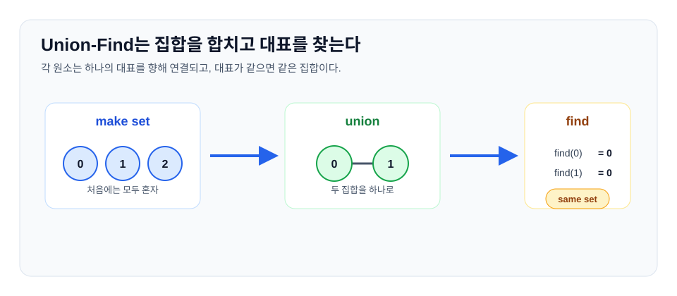
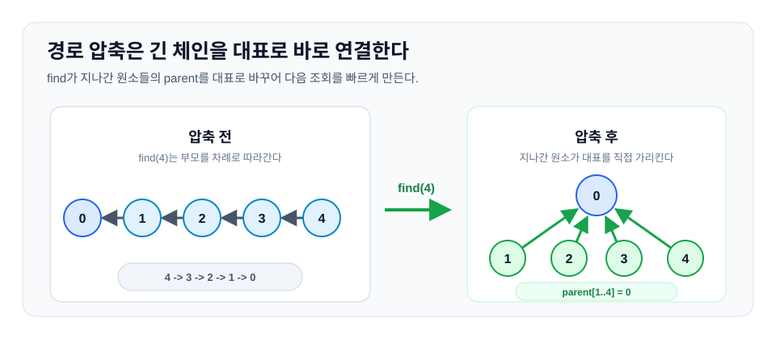
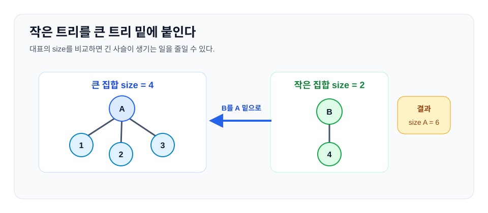

# Union-Find 알고리즘

Union-Find는 여러 원소를 **서로 겹치지 않는 집합들**로 나누어 관리하는 자료구조입니다. Disjoint Set Union, 줄여서 DSU라고도 부릅니다.

이 자료구조가 다루는 핵심 질문은 두 가지입니다.

```text
1. x와 y는 지금 같은 집합에 있는가?
2. x가 속한 집합과 y가 속한 집합을 하나로 합칠 수 있는가?
```

연결 관계가 계속 추가되고, 중간중간 같은 그룹인지 확인해야 하는 문제라면 Union-Find를 먼저 떠올릴 만합니다. 대표적인 예시는 연결 요소 구하기, 사이클 판정, Kruskal 최소 신장 트리, 모임이나 관계 기록으로 그룹 묶기입니다.



## 집합을 숲으로 표현하기

Union-Find는 각 집합을 하나의 트리로 표현합니다. 트리의 루트가 그 집합의 **대표**입니다. 각 원소는 자기 부모를 하나만 기억합니다.

처음에는 모든 원소가 자기 자신만 들어 있는 집합입니다.

```text
parent[0] = 0
parent[1] = 1
parent[2] = 2
parent[3] = 3
```

두 집합을 합칠 때는 한 집합의 대표를 다른 집합의 대표 밑에 붙입니다. 그래서 전체 구조는 여러 트리로 이루어진 숲이 됩니다.

```text
0 <- 1 <- 3
2 <- 4
5
```

이 상태에서 `0, 1, 3`은 같은 집합이고, `2, 4`는 다른 집합입니다. 원소 `5`는 혼자 있는 집합입니다.

## find: 대표 찾기

가장 단순한 `find`는 부모를 계속 따라 올라가다가, 자기 자신을 부모로 가진 루트를 만나면 그 값을 반환합니다.

이 방식은 맞지만, 트리가 한 줄로 길게 늘어지면 한 번의 `find`가 `O(n)`까지 느려질 수 있습니다.

```text
0 <- 1 <- 2 <- 3 <- 4 <- 5
```

`find(5)`는 `5, 4, 3, 2, 1, 0`을 모두 지나야 합니다. 이런 모양이 반복되면 Union-Find의 장점이 사라집니다.

## 경로 압축

경로 압축은 `find`를 하면서 지나간 원소들의 부모를 곧바로 대표로 바꾸는 최적화입니다.

처음 `find(5)`는 여러 노드를 지나갈 수 있습니다. 하지만 그 뒤에는 `5`의 부모가 바로 대표가 되므로 다음 조회가 훨씬 빨라집니다.



경로 압축은 답을 바꾸지 않습니다. 같은 집합 안에서 루트로 가는 길을 짧게 만드는 것뿐입니다.

## union: 대표끼리 합치기

두 원소 `a`, `b`를 합칠 때는 반드시 먼저 대표를 찾아야 합니다.

`a`를 `b` 밑에 바로 붙이면 안 됩니다. `a`와 `b`가 집합의 중간 노드일 수도 있기 때문입니다. 항상 대표끼리 연결해야 집합 구조가 깨지지 않습니다.

## 크기 기준 합치기

단순히 한쪽 대표를 다른 쪽 대표 밑에 붙이면 트리가 길어질 수 있습니다. 그래서 각 집합의 크기를 `size[root]`에 저장하고, 작은 집합을 큰 집합 밑에 붙입니다.

이때 `size` 값은 대표에서만 의미가 있습니다. `rootB`가 `rootA` 밑으로 들어간 뒤에는 `size[rootB]`를 참조하면 안 됩니다.



비슷한 최적화로 rank 기준 합치기도 있습니다. rank는 트리 높이의 대략적인 상한을 저장합니다. 실전에서는 크기 기준 합치기가 이해하기 쉽고, 집합 크기까지 같이 필요한 경우가 많아 자주 쓰입니다.

## 시간 복잡도

경로 압축과 크기 기준 합치기를 함께 쓰면 `find`와 `union`은 매우 빠릅니다. 여러 연산의 총비용을 나눈 상각 시간이 `O(alpha(n))`입니다. 개별 호출의 최악 시간이 상수라는 뜻은 아닙니다.

`alpha(n)`은 inverse Ackermann function입니다. 이름은 복잡하지만, 알고리즘 문제에서 등장하는 모든 현실적인 `n`에 대해 거의 5 이하입니다. 그래서 실전에서는 Union-Find 연산을 거의 상수 시간처럼 생각해도 됩니다.

```text
n개 원소 초기화: O(n)
m번 find/union: O(m alpha(n))
```

단, 이 성능은 두 최적화를 같이 쓸 때의 이야기입니다. 경로 압축이나 크기 기준 합치기를 빼면 특정 입력에서 훨씬 느려질 수 있습니다.

## 전체 구현

아래는 0-indexed 원소 `0`부터 `n - 1`까지를 다루는 기본 구현입니다.

```cpp
#include <algorithm>
#include <vector>
using namespace std;

struct DSU {
    vector<int> parent;
    vector<int> size;

    DSU(int n) : parent(n), size(n, 1) {
        for (int i = 0; i < n; ++i) {
            parent[i] = i;
        }
    }

    int find(int x) {
        if (parent[x] == x) return x;
        return parent[x] = find(parent[x]);
    }

    bool same(int a, int b) {
        return find(a) == find(b);
    }

    bool unite(int a, int b) {
        int rootA = find(a);
        int rootB = find(b);
        if (rootA == rootB) return false;

        if (size[rootA] < size[rootB]) {
            swap(rootA, rootB);
        }
        parent[rootB] = rootA;
        size[rootA] += size[rootB];
        return true;
    }

    int componentSize(int x) {
        return size[find(x)];
    }
};
```

`unite`가 `bool`을 반환하게 만들면 실제로 두 집합이 합쳐졌는지 알 수 있습니다. 사이클 판정이나 컴포넌트 개수 관리에서 유용합니다.

## 합쳐지지 않은 호출은 세지 않기

처음에는 집합이 `n`개이고 `dsu.unite(a, b)`가 `true`를 반환할 때만 하나 줄어듭니다.

`n = 4`에서 `(0, 1)`, `(1, 2)`, `(0, 2)`를 차례로 합치면 마지막 호출은 이미 같은 집합이므로 아무 변화가 없습니다. 결과는 `{0, 1, 2}`, `{3}`의 두 집합입니다. 호출 횟수를 빼면 잘못된 답 1이 나옵니다.

대표는 합치는 과정에서 바뀔 수 있습니다. 집합 크기는 예전에 저장한 대표 대신 `componentSize(x)`로 읽습니다. 기본 Union-Find는 간선을 지워 집합을 다시 나누는 연산을 지원하지 않습니다.

## 실전 연결: 모임으로 나뉜 팀

[모임으로 나뉜 팀](/practice/TEAMSIZE)은 같은 모임에 나온 사람들을 한 팀으로 묶는 문제입니다. 모임 하나가 `{a, b, c, d}`라면 모든 쌍을 합칠 필요는 없습니다.

```cpp
unite(a, b);
unite(a, c);
unite(a, d);
```

첫 사람을 기준으로 나머지를 합치면 모임 안의 사람들은 모두 같은 집합이 됩니다. 모든 모임을 처리한 뒤에는 대표별 `componentSize`를 한 번씩 모으고, 필요한 순서로 정렬하면 됩니다.

주의할 점은 세 가지입니다.

- 빈 모임이면 기준 원소가 없으므로 아무 것도 하지 않습니다.
- 한 명짜리 모임은 이미 자기 집합에 있으므로 합칠 필요가 없습니다.
- 같은 사람이 모임 안에 여러 번 나와도 `unite(x, x)`는 false를 반환하고 끝나야 합니다.
