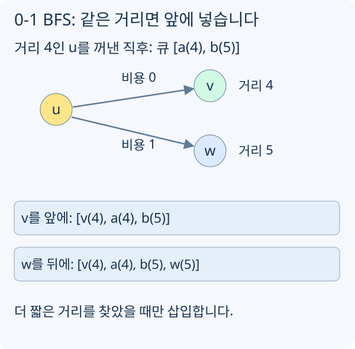

# 0-1 BFS

0-1 BFS는 간선 비용이 `0` 또는 `1`인 그래프에서 최단거리를 구하는 알고리즘입니다. 일반 BFS처럼 큐를 쓰지만, 비용이 0인 이동은 앞에 넣고 비용이 1인 이동은 뒤에 넣기 위해 `deque`를 사용합니다.

## 간선 비용이 0 또는 1일 때

일반 BFS는 모든 간선 비용이 1일 때만 최단거리를 보장합니다. 비용이 0인 간선이 섞이면, 한 번 이동했는데 거리 증가가 없을 수 있습니다.

```text
u --0--> v  거리 증가 없음
u --1--> w  거리 1 증가
```

이때 Dijkstra를 써도 됩니다. 하지만 비용이 0과 1뿐이라면 우선순위 큐 대신 deque만으로 더 간단하게 처리할 수 있습니다.

## deque를 쓰는 이유



[그림 크게 보기](https://blog.readiz.com/h-contest-lesson/lessons/zero-one-bfs/lesson-assets/structure-trace.svg)

괄호는 정점의 거리 후보입니다. 두 이웃의 기존 거리가 더 컸다고 가정하면 비용 0의 v는 현재 거리 층에, 비용 1의 w는 다음 거리 층에 들어갑니다.

현재 정점 `u`에서 이웃 `v`로 가는 비용이 `0`이면 `dist[v]`는 `dist[u]`와 같습니다. 이 정점은 지금 처리 중인 거리 그룹과 같은 우선순위이므로 deque 앞쪽에 넣습니다.

비용이 `1`이면 다음 거리 그룹이므로 뒤쪽에 넣습니다.

```text
cost 0: push_front
cost 1: push_back
```

이렇게 하면 deque의 앞쪽에는 항상 현재까지 가장 작은 거리 후보가 옵니다.

## 기본 구현

> **코드 환경: 일반 C++17 학습용.** 헤더·STL을 허용하는 로컬 예제입니다. h-contest 제출에 옮길 때는 [공통 코드](https://h.readiz.com/learn/cpp-contest-basics)와 문제의 공개 API에 맞춰 필요한 부분을 바꿉니다.

```cpp
struct Edge {
    int to;
    int cost; // 0 or 1
};

vector<int> zeroOneBfs(const vector<vector<Edge>>& graph, int start) {
    const int INF = 1e9;
    int n = (int)graph.size();
    vector<int> dist(n, INF);
    deque<int> dq;

    dist[start] = 0;
    dq.push_back(start);

    while (!dq.empty()) {
        int u = dq.front();
        dq.pop_front();

        for (const Edge& e : graph[u]) {
            int nd = dist[u] + e.cost;
            if (nd >= dist[e.to]) continue;
            dist[e.to] = nd;
            if (e.cost == 0) dq.push_front(e.to);
            else dq.push_back(e.to);
        }
    }

    return dist;
}
```

일반 BFS처럼 처음 발견한 순간 방문을 확정하지 않습니다. 더 짧은 0비용 경로가 나중에 발견될 수 있어 같은 정점이 deque에 여러 번 들어갈 수 있습니다. deque에 넣은 거리 후보는 두 인접 거리 층으로 정렬됩니다. 한 정점은 같은 층의 0비용 경로로 한 번 더 개선될 수 있지만 반복 개선이 누적되지는 않아 전체 복잡도는 `O(V + E)`입니다.

## 격자 상태 그래프 예시

방향을 바꾸는 비용이 1이고, 같은 방향으로 가는 비용이 0인 격자 문제를 생각해 봅시다. 상태는 `(r, c, dir)`이고, 이동 비용은 방향이 바뀌는지에 따라 정합니다.

이런 문제는 단순 칸 방문 배열로는 부족합니다. 같은 칸이라도 어떤 방향으로 들어왔는지에 따라 다음 비용이 달라지므로 방향까지 상태에 포함해야 합니다.

## 시간 복잡도

| 작업 | 시간 |
| --- | --- |
| 초기화 | `O(V)` |
| 간선 relax 전체 | `O(E)` |
| deque 삽입/삭제 | `O(V + E)` |
| 전체 | `O(V + E)` |
| 메모리 | `O(V + E)` |

## 로컬 연습: 무료 간선과 유료 간선

방향 그래프에서 시작점부터 모든 정점까지의 최소 비용을 구하세요. 간선 비용은 0 또는 1입니다.

**입력:** N M S 뒤 M줄의 u v w. 1 <= N <= 200000, 0 <= M <= 400000, 정점은 0-based입니다. 중복 간선과 self-loop를 허용합니다.

**출력:** 정점 번호순 최소 비용을 한 줄에 출력하고 도달 불가 정점은 -1로 표시합니다.

### 예시

```text exercise=zero-one-bfs role=input
5 6 0
0 1 1
0 2 0
2 1 0
1 3 1
2 3 1
3 2 0
```

```text exercise=zero-one-bfs role=output
0 0 0 1 -1
```

**확인 방법:** 0→2→1은 비용 0입니다. 작은 입력은 Dijkstra와 비교합니다. 비용 0의 cycle, 더 비싼 경로로 먼저 발견되는 정점, 고립 정점을 검사합니다. 최초 발견만으로 거리를 확정하지 말고 더 짧아질 때 갱신합니다.
